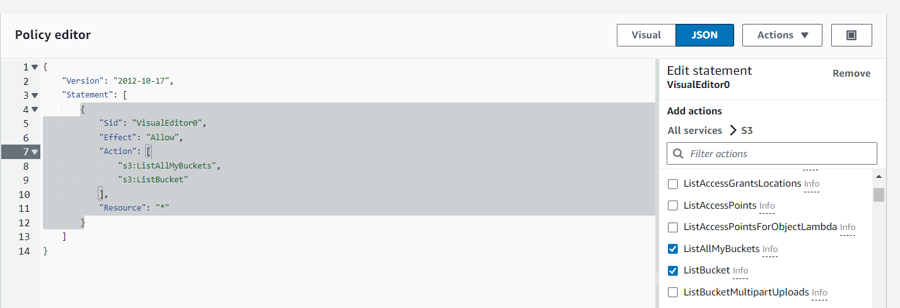
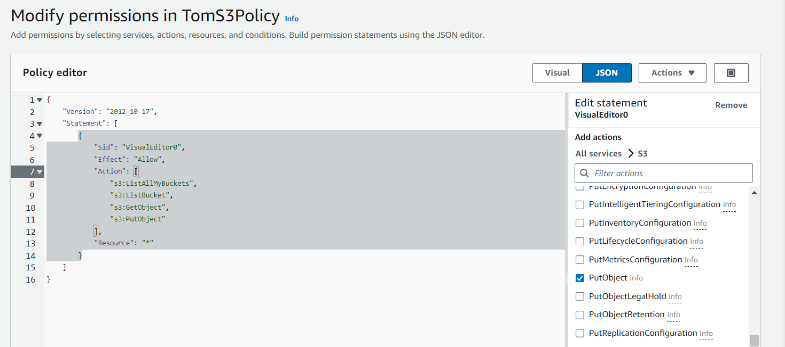
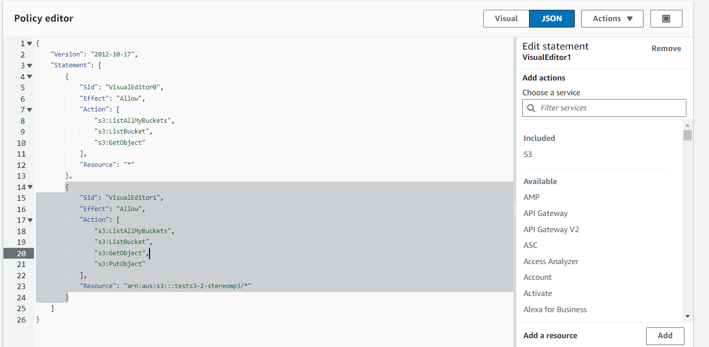
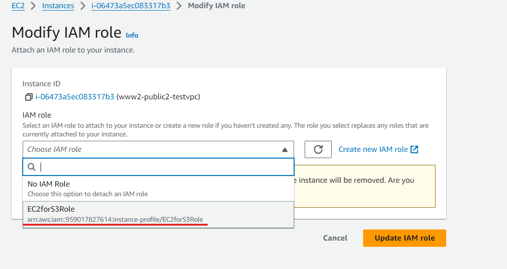

AWS 有線上自學網站，可以在上面學習 AWS 的人工智慧如何使用: https://explore.skillbuilder.aws/learn/home，如果有想要考證照，可以看 bilibili 網站的內容 https://www.bilibili.com/video/BV1hJ411U7vd?p=1&vd_source=f74a220251f63c0d2381f8c51b2cbdee

之前有建立一個帳號 Tom


# S3

儲存桶 Simple Storage Service，三個 S 所以叫做 S3

> create Bucket

Bucket 可以存放檔案，所以我們可以先建立一個


Bucket 是 global 的，所以不同區不能使用相同的名字，這邊使用 儲存桶名稱-ID 來命名：tests3-stereomp3 ，後面使用預設

* bucket policy 可以決定甚麼資源或是人可以使用它，或是可以對它進行什麼操作
* IAM 可以根據人 (user)，分配 bucket 或是其他 service (role) 的權限
* ACL(Access control list)，這個盡量不要使用，使用上面兩個就 OK 了

如果 Bucket Versioning 勾選 Enable，就會讓新的資料不會蓋掉舊的。Disable 會直接蓋掉舊資料。


可以點進去 bucket


> Upload file

裡面有 Upload 可以從電腦上傳檔案，就可以存到 bucket 裡面，然後上傳


可以點進去物件裡面，會有 Object URL，可以透過這個連結存取圖片


一開始進去會出現 AccessDeny，因為一開始 Public Acess 沒有進行設定，所以會失敗


真的想要查看可以按下 Open，查看在網路上是不是真的能夠開啟


就會出現剛剛上傳的圖片了。這是使用 presign 的技術，讓網址短暫有效，讓使用者可以暫時存取裡面的 Object


> remove Block public access

如果要讓所有人能看到，要進入 Permission>Block public access 


然後把 Block public access 打勾拿掉


> add bucket policy

再到 Permission>bucket policy 


加入下列內容 (允許(Allow)任何人(*)，存取 s3 object)，記得 Resource 要改成 Bucket policy 的 Bucket ARN

```
{
    "Version": "2012-10-17",
    "Statement": [
        {
            "Sid": "PublicReadGetObject",
            "Effect": "Allow",
            "Principal": "*",
            "Action": "s3:GetObject",
            "Resource": "arn:aws:s3:::tests3-stereomp3/*"
        }
    ]
}
```


再把物件裡面的 Object action>就可以從網址裡面看到物件了


刪除 bucket，直接選擇 bucket 然後按下 delete，經過一系列操作( Empty bucket -> delete bucket)就可以把 bucket 刪掉了


> enable Bucket Versioning

新建立一個 bucket (tests3-2-stereomp3) 把 Bucket Versioning 勾選 Enable，並放一個 txt 檔案進去


當我們修改檔案並 upload (同樣檔案名稱)，可以到 Object 裡面，會發現有多個版本，可以根據不同 URL 切到不同版本的資料


## 兩個不同地區的bucket同步

如果有兩個 bucket，可以使用 讓兩個 bucket 資料內容同步，可以當作備份


第一個 bucket 名稱: s3source-stereomp3，放在 US East us-east-1，Bucket Versioning 勾選 Enable

第二個 bucket 名稱: s3target-stereomp3，放在 Tokyo ap-northeast-1，Bucket Versioning 勾選 Enable


到第一個 source 裡面的 Management>Replication Rule>Create replication rule


名稱取名為 source_to_target，Source bucket 選擇 Apply to all object in bucket


Destination bucket name 選擇 target，IAM role 選擇 create new role，讓系統自動生成拷貝的 role，其他地方使用預設


會跳出 Replicate existing object，要不要啟動 Batch Operations(自動複製 Source 到 Target)，這個要付 0.25 美金，業界上班通常會使用，不過這裡我們勾選 No 


到 source 裡面 upload 文件


等個幾分鐘，就可以看到 target 裡面文件也傳上來了


## 利用bucket生成靜態網站

bucket 可以幫我們做一個簡單的靜態網站，先開啟一個 word 檔案，裡面輸入文字和圖片，把它存成 index.html；並存一個網頁裡面是文字內容`404 NotFound` ，存成 404.html


第一個 bucket 名稱: s3web-stereomp3，放在 US East 1，Bucket Versioning 勾選 Enable，把 Block public access 打勾拿掉，並確認

可以把這些網站上傳到剛剛建立的 bucket 裡面


再到 Permission>bucket policy 加入下列內容 (允許(Allow)任何人(*)，存取 s3 object)，記得 Resource 要改成 Bucket policy 的 Bucket ARN

```
{
    "Version": "2012-10-17",
    "Statement": [
        {
            "Sid": "PublicReadGetObject",
            "Effect": "Allow",
            "Principal": "*",
            "Action": "s3:GetObject",
            "Resource": "arn:aws:s3:::s3web-stereomp3/*"
        }
    ]
}
```


再到 Properties>Static website hosting 裡面


選擇 Enable 並輸入首頁 index.html 和錯誤的時候到 404.html


之後就可以進入 index.html，複製 URL，就可以看到我們的靜態網頁


# IAM

把上禮拜的 Permission policy 權限刪除掉，我們這禮拜要慢慢打造使用者權限

到 tom 裡面選擇 Permissions>Create Policy


> create s3 permissions

選擇 S3 權限


Effect 選擇 Allow，List 選擇 ListAllMyBuckets，然後按下 next


policy name: TomS3Policy，然後就直接建立


原本 tom 無法看到 bucket


設定完畢後，可以看到 Tom 可以看到 Bucket，但是無法存取


到權限裡面 Edit


在設定這邊加入 `s3:ListBucket`(查看 bucket 權限)、`s3:GetObject` (查看 bucket object 權限)、`s3:PutObject` (上傳文件權限)






可以針對某一個 bucket，設定只有那個 bucket (Resource 填入那個 bucket 的 ARN)可以做上傳的功能

```
{
	"Version": "2012-10-17",
	"Statement": [
		{
			"Sid": "VisualEditor0",
			"Effect": "Allow",
			"Action": [
				"s3:ListAllMyBuckets",
				"s3:ListBucket",
				"s3:GetObject"
			],
			"Resource": "*"
		},
		{
			"Sid": "VisualEditor1",
			"Effect": "Allow",
			"Action": [
				"s3:ListAllMyBuckets",
				"s3:ListBucket",
				"s3:GetObject",
				"s3:PutObject"
			],
			"Resource": "arn:aws:s3:::tests3-2-stereomp3/*"
		}
	]
}
```




> EC2 存取 S3

原本 EC2 (www2-public2-testvpc) 無法存取 S3 (`aws s3 ls`)


可以使用 EC2 使用指令的方式存取 S3，到 IAM>Role>Create Role


選擇 EC2 Service，然後點擊 next


Add permissions 選擇 AmazonS3FullAccess，可以對 S3 進行完整操作


名稱叫做：EC2forS3Role，就直接 Create Role


回到 EC2，選擇 www-testvpc 的 EC2。選擇 Action>Security>Modify IAM role


選擇剛剛創建的 EC2forS3Role



使用終端輸入 `aws s3 ls`，就可以查看 S3 的列表，`aws s3 ls s3://tests3-2-stereomp3 ` ，如果不知道要如何使用可以用 `aws s3 --help`


使用 EC2 終端上傳文字檔案到 S3

```
echo "hello" > hello.txt
aws s3 cp hello.txt s3://tests3-2-stereomp3
```


