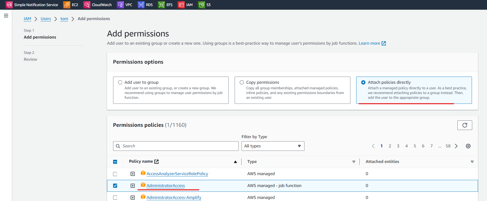
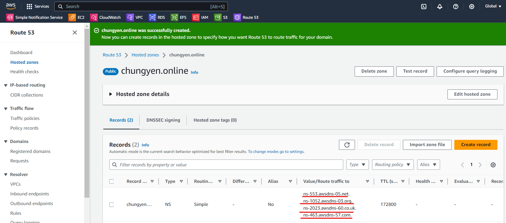
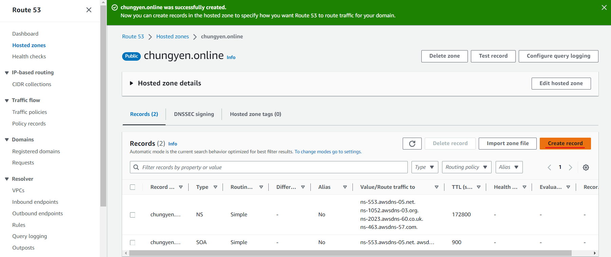
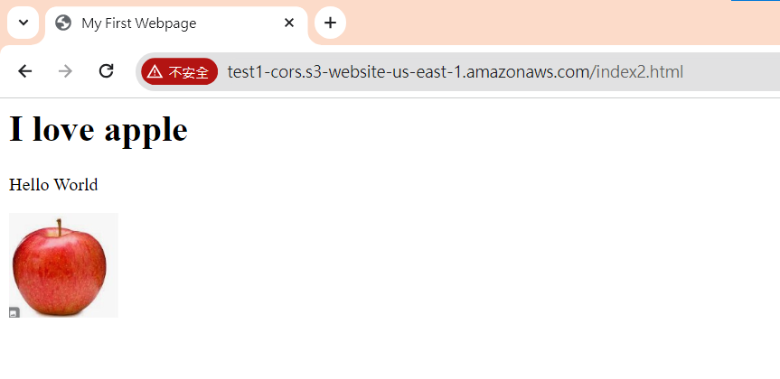

今天使用 VMware，來遠端操作，參考以下網站: https://docs.aws.amazon.com/zh_tw/cli/latest/userguide/getting-started-install.html


```
$ curl "https://awscli.amazonaws.com/awscli-exe-linux-x86_64.zip" -o "awscliv2.zip"
unzip awscliv2.zip
sudo ./aws/install
aws --version # 確認是否安裝成功
```


會使用到 access key(id) 和 secret key(password)，要使用特別的方式把他們兩個創建出來，記得在創建後會看不到 secret key，所以必須要事先紀錄 


先給 Tom Administrator Access，讓 tom 可以自由操作




按下 create Access key


選擇 Command Line Interface CLI


記得要在一開始就紀錄  access key(id) 和 secret key(password)，不然就要重做了


到 VMware 配置參數

```sh
aws configure # 會要求依序填入 access key、secret key 和 region(us-east-1) (最後一個 ouput format 不用填)
aws s3 ls # 測試是否有連線到
cat ~/.aws/credentials  # access key、secret key 會存在這裡
```


指令控制 S3 參考網頁: https://blog.gtwang.org/linux/linux-aws-command-upload-download-s3-file-tutorial-examples/#google_vignette

```sh
# 建立 bucket
aws s3 mb s3://test-stereomp3
# 複製檔案到 bucket
echo "hi" > hi.txt
aws s3 cp hi.txt s3://test-stereomp3
# 查看 bucket 內容
aws s3 ls s3://test-stereomp3

# 從雲端上在拷貝到本地端
aws s3 cp s3://test-stereomp3/hi.txt .

# 把資料夾備分到 s3，必須要在 bucket 後面加上資料夾名稱，不然就會只把 file 傳上去
mkdri testdir
cd testdir
touch {a..d}.txt
cd ..
aws s3 cp testdir s3://test-stereomp3/testdir --recursive

# 更改名稱
aws s3 mv s3://test-stereomp3/hi.txt s3://test-stereomp3/hihi.txt
# 刪除檔案
aws s3 rm s3://test-stereomp3/testdir/a.txt

# empaty bucket
aws s3 rm s3://test-stereomp3 --recursive
# 刪除 bucket
aws s3 rb s3://test-stereomp3
```


寫程式 SDK 並與 AWS 互動

安裝 python 3.7 以上版本(如果已經有以上的版本就可以跳過這步): [centos7安装python3.11完整教程（完整有效） - 知乎 (zhihu.com)](https://zhuanlan.zhihu.com/p/590965831)

```sh
cd /root
#只是將python3.11的安裝包下載到 /root目錄下
wget https://www.python.org/ftp/python/3.11.0/Python-3.11.0.tgz
#下載最新的軟體安裝包
tar -xzf Python-3.11.0.tgz
#解壓縮安裝包
yum -y install gcc zlib zlib-devel libffi libffi-devel
#安裝原始碼編譯所需的編譯環境
yum install readline-devel
#可以解決後製出現的方向鍵、刪除鍵亂碼問題，這裡提前避免。
yum install openssl-devel openssl11 openssl11-devel
#安裝openssl11，後期的pip3安裝網路相關模組需要用到ssl模組。
export CFLAGS=$(pkg-config --cflags openssl11)
export LDFLAGS=$(pkg-config --libs openssl11)
#設定編譯FLAG，以便使用最新的openssl函式庫
cd /root/Python-3.11.0
#進入剛解壓縮的目錄
./configure --prefix=/usr/python --with-ssl
#指定python3的安裝目錄為 /usr/python 並使用ssl模組，指定目錄好處是
#後期刪除此資料夾就可以完全刪除軟體了。
make
make install
#就是原始碼編譯並安裝了，時間會持續幾分鐘。
ln -s /usr/python/bin/python3 /usr/bin/python3
ln -s /usr/python/bin/pip3 /usr/bin/pip3
```


接下來使用 python 與 aws 互動，需要使用到 boto3

```sh
pip3 install boto3
vim tests3.py
```


取的 bucket 內容的 python 程式碼

```python
#!/usr/bin/python3
import boto3

s3 = boto3.resource("s3")

# 建立一個 bucket
bucket = s3.create_bucket(Bucket="test-stereomp3")

# 取得所有的 bucket, boto 會自動處理 API 的翻頁等資訊。
for bucket in s3.buckets.all():
     print(bucket.name)
```


domain name

使用這個功能需要付費，我們使用 [GoDaddy](https://tw.godaddy.com/offers/godaddy?isc=sem1year&countryview=1&currencyType=TWD&cdtl=c_20012948307.g_146146597897.k_kwd-93455629.a_655882536885.d_c.ctv_g&bnb=b&gad_source=1&gclid=Cj0KCQiAsburBhCIARIsAExmsu4MMGMKBCDAJzCsNSPAeOYylK532biHh2vWVCb53cJxfQrrD1Gn60oaAoZXEALw_wcB) 創建網域:

創建完畢會呈現以下的樣子


記得要把續約取消，不要讓它繼續續約 (chungyen.online)


// 啟動 EC2 (有網頁的)，可以使用我們網域名稱進行連線


使用 Route53，也可以在 AWS 上建立網域，但是非常貴，我們先創建一個 hosted zone(需要 0.5 美金)


在裡面輸入網域名稱


我們希望使用 AWS 接管網域，所以要到 GoDaddy 管理網域


把 AWS(Route53>Hosted zones>chungyen.online>Record) 的名稱伺服器給到 GoDaddy




create Record



名稱為: test.chungyen.online (全名會變成 test.chungyen.online.chungyen.online)，value 裡面輸入 11.22.33.44，


測試有沒有建立成功 (後來發現名稱只需要輸入 test 就好 = =)

```
nslookup test.chungyen.online.chungyen.online
```


# Cors

cross-origin(通訊協定+名稱；`http://test.a.com`)-resource-sharing

如果圖片、文字，資源放在不同的主機上，然後要從另一個地方讀取不同環境的資源，就需要使用到 Cors


先建立兩個 s3 bucket(test1-cors、test2-cors)，全部都勾選可以 public access，test1 建在 us-east-1(N. Virginia)，test2 建在 ap-northeast-1 (Tokyo)

兩個 bucket 都設定 property、policy

Properties>Static website hosting


記得在 Index document 要輸入 index.html


再到 Permission>bucket policy 加入下列內容

test1


```
{
    "Version": "2012-10-17",
    "Statement": [
        {
            "Sid": "PublicReadGetObject",
            "Effect": "Allow",
            "Principal": "*",
            "Action": "s3:GetObject",
            "Resource": "arn:aws:s3:::test1-cors/*"
        }
    ]
}
```

test2

```
{
    "Version": "2012-10-17",
    "Statement": [
        {
            "Sid": "PublicReadGetObject",
            "Effect": "Allow",
            "Principal": "*",
            "Action": "s3:GetObject",
            "Resource": "arn:aws:s3:::test2-cors/*"
        }
    ]
}
```


寫腳本讓網頁可以以讀取 html 檔案到另一個 html 裡面的 div 裡面

上傳 index.html、index2.html、extra.html、apple.jpg  到 s3 test1

上傳 extra.html 傳到 s3 test2

> index.html

index 直接讀取本地檔案，可以正常顯示

```html
<html>
  <head>
    <title>My First Webpage</title>
  </head>
  <body>
    <h1>I love apple</h1>
	<p>Hello World</p>
  <body>
  
  
  <!-- CORS demo -->
  <div id="tofetch"/>
  <script>
    var tofetch = document.getElementById("tofetch");
	
	fetch('extra.html')
	.then((response) => {
	  return response.text();
	})
	.then((html) => {
	  tofetch.innerHTML = html
	});
  </script>
</html>
```


> index02.html

index02 讀取其他網頁的資源，會無法出現 extra 的內容

```html
<html>
  <head>
    <title>My First Webpage</title>
  </head>
  <body>
    <h1>I love apple</h1>
	<p>Hello World</p>
  <body>
  
  
  <!-- CORS demo -->
  <div id="tofetch"/>
  <script>
    var tofetch = document.getElementById("tofetch");
	
	fetch('http://test2-cors.s3-website-ap-northeast-1.amazonaws.com/extra.html')
	.then((response) => {
	  return response.text();
	})
	.then((html) => {
	  tofetch.innerHTML = html
	});
  </script>
</html>
```




會發現 extra.html 無法顯示出來


需要到 test2>permission>CORS>Edit，加入配置檔案


給予 test1 能夠讀取內容的權利，需要 test1 的網址

```
[
 {
	 "AllowedHeaders": [
	   "Authorization"
	 ],
	 "AllowedMethods": [
	   "GET"
	 ],
	 "AllowedOrigins": [
	   "http://test1-cors.s3-website-us-east-1.amazonaws.com"
	 ],
	 "ExposeHeaders": [],
	 "MaxAgeSeconds": 3000
 }
]
```


