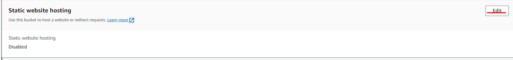
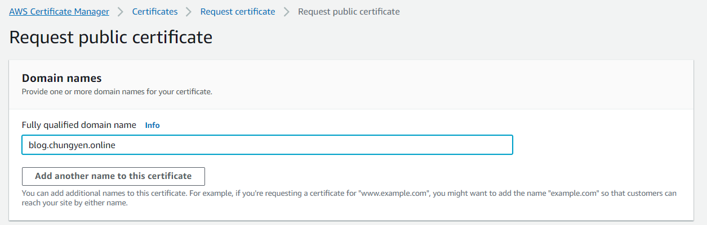
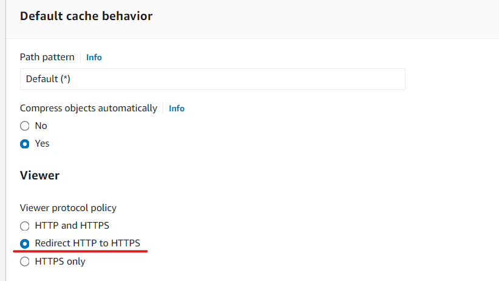

# Route_53

接續上禮拜講的 route 53，route 53 一次收費是一個月，所以可以等一個月後再刪除

先打開之前 www-public01 的 EC2 虛擬機，可以用 public IP 存取到網頁

> use Record to set EC2 HTTP IP to domain name

我們可以使用自己創造的 Record，選擇後點擊右上的 Edit


把 EC2 的 public IP 貼到上禮拜建立好的 Record 裡面的 value


就可以使用 domain name 連線到 EC2 建立的網頁了，記得我們網站都是使用 HTTP。


> Create CNAME Record

建立一個新的 Record，命名為 test2，並選擇 type 為 CNAME，這邊建立的 Record test2 其實等於前面建立的 test1。

Record 比較常用的是以下三個

* A : Value 要輸入 IPv4 位置
* AAAA : Value 要輸入 IPv6 位置
* CNAME : 給另外一個 domain name 名稱，讓不同 domain name 可以連到一樣的機器，但不同 port

TTL 指的是 DNS Server 的 IP 放在本地端的 cache 時間多久，放在本地 cache 可以減少去 DNS 查詢的時間，但如果 TTL 設定太久，會導致伺服器名稱變動讀取時間會很久，像是有特殊機制或是附載均衡，建議不要設定太久


`nslookup [DNS_name]` 指令可以查看 Domain name，而 `dig [DNS_name]` 可以查看 Domain name 詳細資訊，這邊打上 `dig test2.chungyen.online`，先解析 CNAME，連到後續的 domain name 後，根據 A，再跳轉到 IP


> S3 替換 Domain name

之前使用 S3 做靜態網站，但是網址不是我們想要的，現在再新創建一個，記得名稱要與想要的 Domain name 相同


建立一個 s3 bucket(blog.chungyen.online)，建立位置為 US East (N. Virginia)，勾選可以 public access，到 Properties>Static website hosting 設定 enable，記得在 Index document 要輸入 index.html



再到 Permission>bucket policy 加入下列內容


```
{
    "Version": "2012-10-17",
    "Statement": [
        {
            "Sid": "PublicReadGetObject",
            "Effect": "Allow",
            "Principal": "*",
            "Action": "s3:GetObject",
            "Resource": "arn:aws:s3:::blog.chungyen.online/*"
        }
    ]
}
```

把 index.html 上傳後，就可以在 Static website hosting 網址看到網站了


> Router 53

接下來我們要使用 Route 53 把網域名稱換成我們想要的，再創建一個 Record，名稱填入跟剛剛 S3 一樣的(blog)，我們勾選 Alias，endpoint 選擇 S3，Region 要和 bucket 相同(US East (N. Virginia))，Enter S3 endpoint 選擇剛剛創建的 s3 (blog.chungyen.online) ，名稱設定沒有一模一樣就會跑不出來 !


Alias 是 AWS 的特殊功能，和 Domain name 的差異是，Domain name 每創造網站時，root domain (chungyen.online) 前面一定不能是空的，Alias 可以直接使用 root domain (可以使用 root domain 再次創建一個 record)。我們期中考使用的 LB 也可以直接用 Alias。


好了就可以看到成功使用自己的 Domain name 連線到 S3 了


> use Route 53 to create easy LB

DNS 也可以用來做簡單的附載均衡器

> EC2

先開兩個有 public IP 並有網站的 EC2 (public01、public02)


> Route 53

再次建立兩個 Record 叫做 weighted(兩個名稱必須一樣)，value 對應到不同的兩個 Server IP，在 Routing policy 選擇 Weighted，這邊的 weight 是所有 weight 相加當作分母， weight 當作分子作運算

* Simple routing: 最初始的方法
* Weighted: 設定不同權重，讓 DNS 有不同的機率給到不同 Server，也就是我們現在要做的做法
* Geolocation: 地理資訊，根據不同位置，給出不同的 IP
* Latency: 延遲時間，根據延遲時間單位最小的伺服器，給出對應的 IP
* Failover: 如果 DNS 監測到的伺服器有問題，就會連線到下一個備用的 Server
* Multivalue answer: 隨機挑一個可以用的 Server
* IP-based: 根據不同 IP，給出不同 Server


使用`curl weighted.chungyen.online`，就會發現出現兩個不同的網頁內容


# CDN

cloudfront 主要是要達成 CDN (content delivery network；如下圖)，把機器部屬到 edge node


資料傳輸，我們並不想知道是從哪個 IP 過來，而是內容是什麼，CDN 重視的就是內容訊息，可以達到降低延遲和分散資料流量的作用，client 會從最近的 edge node 拿取資料，如果沒有資料，伺服器就會和各個 edge node 拿取，然後再回傳給最開始的 edge node 並存到 cache 裡面


> create distribution

到 cloudfront 創建 distribution


Origin domain 我們使用 blog 的 S3 bucket，複製 Static website hosting 裡面的 domain name 並把前面的 `https://` 刪掉，這也是 CORS(cross-origin) 的樣式


下面全部都使用預設，除了 Web Application Firewall 我們暫時關掉，和 Settings 裡面的 Default root object 要設定為 index.html (預設首頁)


等一它部屬完成以後(因為要部屬到很多區域，所以要一陣子)，就可以使用它的 Domain name 連線到 S3 的網頁 (使用 CDN 的方式)


利用指令: `nslookup d1friiy3d61gl4.cloudfront.net`，做查詢 CND IP 的動作


> check what is my ip

我們可以利用這個網站: [whatismyip](https://whatismyipaddress.com/zh-tw/index)，查看我們連線到的 Server 位置，可以發現離我們 IP 位置很近


使用 [host name to ip address](https://whatismyipaddress.com/hostname-ip)，就可以發現查出來的 IP 是不一樣的


用它的 IP 去查，會發現它在加州


最後的結果就會如下


 cloudfront 的 distribution 刪除要先 Disable，然後再 Delete


# ACM

https

> Route 53

先把前面所建立的 Route 53 Record 刪一刪 (第一個 Type A 的也可以刪掉)


> request a Certificate

使用 Certificate Manager，創建 Certificate


點擊 next


domain name 名稱取為 blog.chungyen.online，其他選項都使用預設，然後點擊 next



如果不是使用 AWS，那就把下列資訊貼到使用 DNS 的網站上 (像是 GoDaddy)


因為現在 DNS 在 AWS 設立的，所以只要點擊 Create records in Route 53，就可以創建好了


可以看到在 Route 53 裡面它自己就創建了一個 Record


現在我們已經綁定 blog.chungyen.online 與證書了


不用跟別人講 S3 裡面的網址，只要告訴其他人 HTTPS 的 Domain name 就可以連線到 S3 ，提高安全性


> Cloud front + DNS+ HTTPS

再次創建 CloudFront，全部步驟都和剛剛創的一樣(Web Application Firewall 關掉，Settings 裡面的 Default root object 要設定為 index.html)，唯一不同的是在 Default cache behavior>Viewer 裡面要改 Redirect HTTP to HTTPS，和 Setting 裡面要放入證書




然後去到 Route 53 新增 Record，名稱為 blog，使用 CNAME，Value 填入剛剛創建的 Cloud Front 的 Distribution domain name


最後就可以看到成果了 (第三個)


可以點擊查看 HTTPS 憑證


