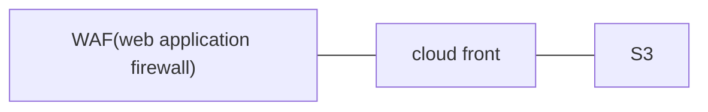

1504: cloud front + s3

1511: cloud front + waf ipset

1513: cloud front + waf rule builder

1520: DynamoDB

# CloudFront

這禮拜繼續介紹 cloud front，上禮拜做的架構可以直接連到 S3，這禮拜我們要把 S3 這邊讓他無法直接連，一定要透過 cloud front


> S3

創建一個 bucket 命名為 test-w15，放在 US East，不要讓它有 public IP

把 index.html(在 w15 資料夾裡面) 上傳到 test-w15 bucket 裡面


> Cloud front

創建一個新的 Cloud front，domain 選擇剛剛的 bucket，Origin access 要選擇第二個選項


再按下面的 Create control setting，並修改名稱後創建


除了 WAF 選擇右邊的選項；Settings 裡面的 Default root object 要設定 index.html。其他都預設，這禮拜先使用 HTTP 就好


完成後上方會出現可以複製 policy 的地方，Copy policy 後到 S3 那邊貼上 (Permission>bucket policy)


policy 大概如下，就是賦予 cloud front 有存取 S3 的權限

```
{
        "Version": "2008-10-17",
        "Id": "PolicyForCloudFrontPrivateContent",
        "Statement": [
            {
                "Sid": "AllowCloudFrontServicePrincipal",
                "Effect": "Allow",
                "Principal": {
                    "Service": "cloudfront.amazonaws.com"
                },
                "Action": "s3:GetObject",
                "Resource": "arn:aws:s3:::test-w15/*",
                "Condition": {
                    "StringEquals": {
                      "AWS:SourceArn": "arn:aws:cloudfront::959017827614:distribution/E150T1OLJ49HAD"
                    }
                }
            }
        ]
}
```

最後會呈現像是下面的樣子，外面沒辦法直接連線到 S3，但是可以透過 cloud front 連線


# WAF

Cloud front 也可以連線到 ALB+EC21 讓使用者更方便使用

Cloud front 也可以在前面放入防火牆



WAF

* rules: 拒絕黑名單攻擊者 IP，或是辨識為機器人
* count: 同一個 IP 連線太多次

接下來使用 WAF 設定，讓我們無法連線到剛剛做的 cloud front。


>  WAF & Shield


選擇 Create web ACL


選擇第一個服務，並命名為 MyWebACL


回到首頁選擇，並到 IP sets 創建一個新的


> Block IP

名稱為 MyIPSet，Region 選擇 cloud front，IP 打上自己上網的 IP 位置，後面的 `/32` 代表針對一個 IP


再次回到  web ACL ，接下按下下面的 Associated AWS resourced 右邊的選項 Add AWS resources，選擇剛剛的 cloud front，然後按下下一步


Add managed rule，可以選擇別人創建好的規則或是自定義的，但用別人的規則有一些需要付費， Capacity WAF最高到 5000 (累加)，超過了會要多付費 (soft limit)。我們選擇使用自定義的 rule，IP set，Rule 取名為 MyRule，選擇之前創建的 MyIPSet，規則可以有很多，現在我們先創建一個


接下來一直按下 Next 最後創建，最後當我們連線到剛剛的 cloud front 就會出現下面的樣子


接下來把我們剛剛建立的 WebACL 刪除，要先到創建的 WebACL 裡面的 Associated AWS resources 裡面取消關聯，最後才能成功刪除，IP sets 也可以刪掉


> Block IP with count

接下來是判斷使用者存取過多，就封掉那個 IP 位置

一開始一樣創建一個 web ACL，選擇第一個服務，並命名為 MyWebACL，接下按下下面的 Associated AWS resourced 右邊的選項 Add AWS resources，選擇剛剛的 cloud front，然後按下下一步


接下來，Add managed rule，一樣自己定義 rule，我們選擇中間的 rule builder，給名稱為 MyRateBaseRule，下面的 Rate-limiting criteria 代表在 5 分鐘內超過多少次存取代表攻擊。


接下來一直按下 next，然後創建


在虛擬機裡面寫一個腳本存取網頁 110 次

```
vim test.sh
```

```sh
for i in {1..110}
do
  echo $i
  result=`curl -o /dev/null -s -w %{http_code} https://d34pi3u3fne19v.cloudfront.net/`
  if [[ "$result" == "200" ]] ; then
    echo "ok"
  else
    echo "fail"
  fi
done
```

```
chmod +x test.sh
```


存取網頁的命令

```
# -o /dev/null 把網頁抓回來並丟到垃圾桶
# %{http_code} 拿取網頁狀態碼 (開頭為 1:資訊類、2:成功、3:導向、4:客戶端有問題、5:伺服器有問題)
curl -o /dev/null -s -w %{http_code} https://d34pi3u3fne19v.cloudfront.net/
```

最後呈現結果


可以到 WebACL 裡面的 Sample request 裡面看到存取次數


這個做完 cloud front 和 WebACL 都可以刪掉了，如果沒有刪掉會計費


# DynamoDB

no SQL  的 DB

Relation Data Base 每一筆資料都是要完成或是不完成，像是 mariadb 或是 mysql

DynamoDB 處理速度很快，但是它資料處裡比較不嚴謹

> create table

到 DynamoDB 創建 table


name 命名為 addrbook，Partition key 為 name


其他都使用預設，然後直接創建

> add item

可以在 table 裡面加入 item


這裡新增一筆資料


非關係型資料庫可以有些資料有，有些資料沒有


使用之前 Tom 的帳號，輸入 Console sign-in URL(https://959017827614.signin.aws.amazon.com/console)，帳號輸入 tom、密碼輸入 Centos12345#


給 tom administrator access

> use IAM user to access DynamoDB

使用 Linux 虛擬機，運用 tom 帳號，存取 DynamoDB

```
vim test.py
```

```python
import boto3
import os
os.environ['AWS_DEFAULT_REGION'] = 'us-east-1'

_TableName_ = "addrbook"
client = boto3.client('dynamodb')
DB = boto3.resource('dynamodb')
table = DB.Table(_TableName_)

response = table.get_item(
	Key={
        'name': "tom"
    }
)
response["Item"]

print(response["Item"])
```

```
python3 test.py
```

最後結果會如下


Lambda function，主要用於 server less computing，讓我們不用管硬體配置和細緻操作，Lambda function 也可以寫程式，開關 EC2，或是紀錄 EC2 資料到 DynamoDB，下禮拜會詳細介紹


> create IAM role

這禮拜最後建立一個用於 Lambda function 的 Role


 加入 AmazonDynamoDBFullAccess、AWSLambdaBasicExecutionRole


名稱取為 LambdaRole


