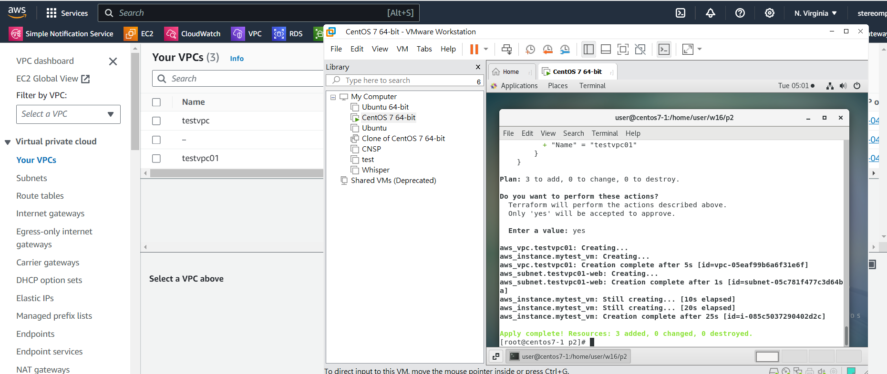

# Lambda

lambda 主要是處裡 service less computing，讓我們可以透過程式碼控制服務，下面是 Lambda 主要在裡面運作的位置，使用者可以透過手機或是其他觸發 API，然後觸發 Lambda function，執行對應的動作。


> Attach Role policy

上禮拜建立的 Role 不夠多，我們 Attach 新的規則上去


多加入兩個權限: AWSLambdaSQSQueueExecutionRole、AWSLambdaVPCAccessExecutionRole


> create Lambda function

建立 Lambda function


使用內建的程式碼 (選中間)，並給名稱 testLambda，下方的 Execution role 選擇第二個，並選我們創建的 LambdaRole，然後直接創建


創建後往下滑，可以按下 test 測試這個 function


> testing Lambda  function

名稱取做 test_function，創建後就可以執行了


執行結果


完成後把測試的 Lambda function 刪除


> use Lambda to read、write、modify DynamoDB

接下來我們自己建立一個 Lambda，可以讀取上禮拜建立的 DynamoDB，名稱一樣叫做 testLambda，python 記得要 3.7 以上，下方選擇我們之前創建的 LambdaRole


按下 lambda_function.py 後把裡面的程式碼刪掉


然後貼入下面的 python 程式碼 (有改程式碼就要重新 deploy)

```python
import json
import boto3

client = boto3.client('dynamodb')

def lambda_handler(event, context):
    data = client.get_item(
        TableName='addrbook',
        Key={
            'name': {
                'S': 'tom'
            }
        }
    )
    print(data['Item'])
    response = {
        'statusCode': 200,
        'body': json.dumps(data['Item']),
        'headers': {
            'Content-Type': 'application/json',
            'Access-Control-Allow-Origin': '*'
        },
    }
    return response
```


測試的一樣取名稱就OK，然後按下測試


接下來修改程式碼，這是寫入 dynamodb 的程式碼，我們加入一個使用者 john

```python
import json
import boto3
client = boto3.client('dynamodb')
def lambda_handler(event, context):
    PutItem = client.put_item(
        TableName='addrbook',
        Item={
            'name': {
              'S': 'john'
            },
            'phone': {
              'S': '0931987654'
            }
        }
      )
    response = {
      'statusCode': 200,
      'body': json.dumps(PutItem)
    }
    return response
```

可以看到 DB 裡面多了一個資料


建立一個 Lambda，作用是顯示所有資料庫裏面的內容，名稱為 LambdaDynamoDB ，python 記得要 3.7 以上，並選擇我們創建的 LambdaRole，接下來修改程式碼，寫入到 lambda_function.py

```python
import json
import boto3
import logging

logger = logging.getLogger()
logger.setLevel(logging.INFO)

dynamodb = boto3.resource('dynamodb',region_name='us-east-1')

def lambda_handler(event, context):
    print(event)
    data = {
        'Items' : "Bad Request"
    }
    statusCode = 200
    path = event["path"]
    httpMethod = event["httpMethod"]
        table = dynamodb.Table('addrbook')
    if httpMethod == 'GET' and path == '/addrbook':
        data = table.scan()
    elif httpMethod == 'POST' and path == '/add_addrbook':
        if event['body'] is not None :
            body = json.loads(event['body'])
    
            table.put_item(
                Item={
                    'name': body['name'],
                    'phone': body['phone']
                },
            )
    
            data = {
                'Items' : "addrbook created statusCodeuccessfully"
            }
        else:
            data = {
                'Items' : "Invalid Payload"
            }
            statusCode = 400
    else:
        statusCode = 400

    print(data['Items'])
    response = {
        'statusCode': statusCode,
        'body': json.dumps(data['Items']),
        'headers': {
            'Content-Type': 'application/json',
        },
    }

    return response
```


# API_GW

> create REST API

到 API Gateway 選擇 REST API，並創建


選擇New API，名稱為 testAPI ，下面選擇 Regional


> Create resouce


加入 path(/) 和 name(addrbook)


到 Create method

 

選擇 GET，Integration type 選擇 Lambda function，並打開下面的 Lambda proxy integration，並選擇剛剛的建立的 LambdaDynamoDB Lambda function


可以到 test 做一個簡單的測試，不用做任何輸入直接按下 test


最後會顯示所有資料庫裏面的內容


接下來按下 deploy


選擇 NewStage，名稱 test


部屬成功後可以在 Stage 裡面看到 URL


> testing with postman

到 Google 的擴充功能選擇 Tabbed Postman Rest Client 加入到 google 裡面


就可以使用 post man 測試，方法選擇 GET，打入網址(剛剛創建拿到的，後面加上 /addrbook) `https://n3q1onduq6.execute-api.us-east-1.amazonaws.com/test/addrbook`，指定 Content-Type application/json，就可以拿到資料庫裡面的內容了


完成後就可以把 API Gateway 和 Lambda function 刪除了


# Terraform

官方網站: https://www.terraform.io/

Terraform 主要是使用程式碼 AWS 裡面的功能，可以不用網頁一個一個點，直接微調配置檔就可以建立。我們使用 Linux 虛擬機，用以下指令安裝 Terraform

> install Terraform

```sh
$ sudo yum install -y yum-utils
$ sudo yum-config-manager --add-repo https://rpm.releases.hashicorp.com/RHEL/hashicorp.repo
$ sudo yum -y install terraform
$ aws # 測試可不可以使用 AWS，如果不行，回去看前面的筆記
```


創建測試區域

```
mkdir test_terraform; cd test_terraform
```


> use Terraform to deploy EC2 instance、VPC、Subnet

> project01: 有兩個主要檔案， variable.tf 和 main.tf，這個主要是可以部屬 EC2 instance

建立檔案

```sh
mkdir p1; cd p1
vim variables.tf
vim main.tf
```

variables.tf: 設定創建物件的區域、EC2 硬體類型、使用的 AMI (EC2 鏡像)

```json
variable "region" {
    type = string
    default = "us-east-1"
    description="aws region"
}

variable "amis" {
    type=map
    default = {
        us-east-1 = "ami-079db87dc4c10ac91"
    }
    description = "ami id"
}

variable "instance_type" {
    type=string
    default = "t2.micro"
    description = "EC2 instance type"
}
```

使用 AMI 鏡像，AMI 需要做修改 (下面的地方)

```json
default = {
    us-east-1 = "ami-079db87dc4c10ac91"
}
```

到 EC2>AMI Catalog 複製 Amazon Linux 2023 AMI 下方的值


main.tf: 建立 EC2 instance

```json
provider "aws" {
  region = var.region
}

resource "aws_instance" "mytest_vm" {
  ami = lookup(var.amis, var.region)
  instance_type=var.instance_type
  
  tags = {
   # Name = "mytest",
 }
}
```

可以在 resource 下面再次創建一樣的物件 (aws_instance 代表建立物件)，但修改名稱為 "mytest_vm2"，這樣 AWS 就會直接建立兩個 EC2


terraform 指令

```sh
terraform init # 初始化 terraform
terraform plan # 讀取 main.tf 並看有沒又錯誤，不會真的跑 (debug)，可以執行也可以不執行
terraform apply # 執行檔案
terraform destroy # 刪除由 terraform 創建的所有 EC2
```

執行 `terraform apply`，會要求輸入 yes，然後就成功部屬機器了


> project02: 有一個主要檔案， variable.tf 和 main.tf，這個主要是

建立檔案

```
mkdir p2; cd p2
vim variables.tf
vim main.tf
```


variables.tf: 設定創建物件的區域

```json
variable "region" {
    type = string
    default = "us-east-1"
    description="aws region"
}

variable "amis" {
    type=map
    default = {
        us-east-1 = "ami-079db87dc4c10ac91"
    }
    description = "ami id"
}

variable "instance_type" {
    type=string
    default = "t2.micro"
    description = "EC2 instance type"
}
```


main.tf: 建立 VPC 和 subnet，並用在 EC2 裡面

```json
provider "aws" {
  region = var.region
}

resource "aws_instance" "mytest_vm" {
  ami = lookup(var.amis, var.region)
  instance_type=var.instance_type
  
  tags = {
   # Name = "mytest",
 }
}

resource "aws_vpc" "testvpc01"{
    cidr_block="192.168.0.0/16"
    tags = {
        Name = "testvpc01"
    }
}

resource "aws_subnet" "testvpc01-web" {
    vpc_id = "${aws_vpc.testvpc01.id}"
    cidr_block = "192.168.1.0/24"
    tags = {
        Name = "testvpc01-web"
    }
}
```


run

```sh
terraform init 
terraform apply
terraform destroy 
```





> 
