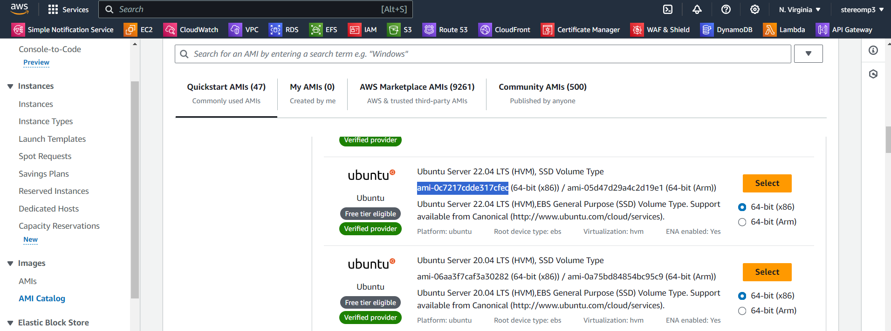

# Terraform

Terraform 官方網站，可以查到各種 Terraform 的使用方法: https://registry.terraform.io/providers/hashicorp/aws/latest/docs/resources/instance

Spot instance: 閒置的資源，可以用比較低的價格使用


接下來我們先使用 terraform 建立 VPC

```
vim main.tf
```


```python
provider "aws" {
  region = "us-east-1" # 設定區域
}

resource "aws_vpc" "myvpc"{
    cidr_block="192.168.0.0/16" 
    tags = {
        Name = "myvpc" # 設定名稱
    }
}
```


terraform run

```sh
terraform init 
terraform apply
```

terraform delete

```
terraform destroy 
```


建立子網路，上面 VPC 已經被創建，所以 myvpc 已經不會再次被執行

```python
provider "aws" {
  region = "us-east-1" # 設定區域
}

resource "aws_vpc" "myvpc"{ # myvpc 代表 ID
    cidr_block="192.168.0.0/16" 
    tags = {
        Name = "myvpc" # 設定名稱
    }
}

resource "aws_subnet" "myvpc-web" {
    vpc_id = "${aws_vpc.myvpc.id}" # VPC 的名稱
    cidr_block = "192.168.1.0/24"
    availability_zone = "us-east-1a"
    tags = {
        Name = "myvpc-web"
    }
}
```


建立 internet gateway 讓 VPC 可以連上網路，貼在上面程式碼的下方

```python
resource "aws_internet_gateway" "igw" {
    vpc_id="${aws_vpc.myvpc.id}"
    tags = {
        Name = "myvpc-igw"
    }
}
```


建立 route table，讓路由器可以連線到 IGW

```python
resource "aws_route_table" "myrt" {
    vpc_id="${aws_vpc.myvpc.id}"

    route {
        # defualt route # 新增內定路由
        cidr_block="0.0.0.0/0" # 連線到 igw
        gateway_id = "${aws_internet_gateway.igw.id}"
    }

    tags = {
        Name = "myvpc-rt"
    }
}
```


把剛剛創建的 route table，連線到 subnet myvpc-web

```python
resource "aws_route_table_association" "myrt_assoc" {
    subnet_id = aws_subnet.myvpc-web.id
    route_table_id = aws_route_table.myrt.id
}
```


建立 VPC 的 SG，允許使用 HTTPS 和 HTTP

```python
resource "aws_security_group" "sg_myvpc" {
    name = "sg_myvpc"
    description="security group for myvpc"
    vpc_id="${aws_vpc.myvpc.id}"

    ingress {
       description = "HTTPS traffic"
       from_port = 443
       to_port = 443
       protocol ="tcp"
       cidr_blocks = ["0.0.0.0/0"]   # 指任何地方都可以連線進來 
    }

    ingress {
       description = "HTTP traffic"
       from_port = 80
       to_port = 80
       protocol ="tcp"
       cidr_blocks = ["0.0.0.0/0"]   
    }

    ingress {
       description = "SSH traffic"
       from_port = 22
       to_port = 22
       protocol ="tcp"
       cidr_blocks = ["0.0.0.0/0"]   
    }

    egress {   #  don't care，不管出去的資料
        from_port = 0
        to_port = 0
        protocol ="-1"
        cidr_blocks= ["0.0.0.0/0"]  
    }

    tags = {
        Name = "sg_myvpc"
    }
}
```


使用付費的 elastic IP，讓網址固定 (申請網路卡和 IP)

```python
resource "aws_network_interface" "webserver-nic" {
    subnet_id = aws_subnet.myvpc-web.id
    private_ips=["192.168.1.100"]
    security_groups = ["${aws_security_group.sg_myvpc.id}"]  
}

resource "aws_eip" "web-eip" {
    vpc = true
    network_interface = aws_network_interface.webserver-nic.id
    associate_with_private_ip = "192.168.1.100" # 申請完的 IP 會和 192.168.1.100 綁定
    depends_on = [aws_internet_gateway.igw] # 運用 IGW 連線到外網
}
```


最後放入 EC2，我們使用 ubuntu 的 AMI



```python
resource "aws_instance" "webserver" { 
  ami="ami-0c7217cdde317cfec" # 放入 AMI
  instance_type = "t2.micro"
  availability_zone = "us-east-1a"
  key_name = "testkey" # 要放在同一個資料夾裡面 (test.pem)

  network_interface {
    device_index = 0
    network_interface_id = aws_network_interface.webserver-nic.id
  }
  # 腳本內容為安裝 apache，然後建立一個簡單的網頁
  user_data = <<-EOF  
              #!/bin/bash
              sudo apt update -y
              sudo apt install apache2 -y
              sudo systemctl start apache2
              sudo bash -c 'echo your very first web server > /var/www/html/index.html'
              EOF   
  tags ={
    Name = "web-server"
  }
}
```


最後使用 ssh 連線看看

```
ssh -i "testkey.pem" ubuntu@34.194.125.17
```


完整程式碼

```python
provider "aws" {
  region = "us-east-1" 
}

resource "aws_vpc" "myvpc"{
    cidr_block="192.168.0.0/16" 
    tags = {
        Name = "myvpc"
    }
}

resource "aws_subnet" "myvpc-web" {
    vpc_id = "${aws_vpc.myvpc.id}"
    cidr_block = "192.168.1.0/24"
    availability_zone = "us-east-1a"
    tags = {
        Name = "myvpc-web"
    }   
}

resource "aws_internet_gateway" "igw" {
    vpc_id="${aws_vpc.myvpc.id}"
    tags = {
        Name = "myvpc-igw"
    }
}

resource "aws_route_table" "myrt" {
    vpc_id="${aws_vpc.myvpc.id}"

    route {
        cidr_block="0.0.0.0/0"
        gateway_id = "${aws_internet_gateway.igw.id}"
    }

    tags = {
        Name = "myvpc-rt"
    }
}

resource "aws_route_table_association" "myrt_assoc" {
    subnet_id = aws_subnet.myvpc-web.id
    route_table_id = aws_route_table.myrt.id
}

resource "aws_security_group" "sg_myvpc" {
    name = "sg_myvpc"
    description="security group for myvpc"
    vpc_id="${aws_vpc.myvpc.id}"

    ingress {
       description = "HTTPS traffic"
       from_port = 443
       to_port = 443
       protocol ="tcp"
       cidr_blocks = ["0.0.0.0/0"]
    }

    ingress {
       description = "HTTP traffic"
       from_port = 80
       to_port = 80
       protocol ="tcp"
       cidr_blocks = ["0.0.0.0/0"]   
    }

    ingress {
       description = "SSH traffic"
       from_port = 22
       to_port = 22
       protocol ="tcp"
       cidr_blocks = ["0.0.0.0/0"]   
    }

    egress { 
        from_port = 0
        to_port = 0
        protocol ="-1"
        cidr_blocks= ["0.0.0.0/0"]  
    }

    tags = {
        Name = "sg_myvpc"
    }
}

resource "aws_network_interface" "webserver-nic" {
    subnet_id = aws_subnet.myvpc-web.id
    private_ips=["192.168.1.100"]
    security_groups = ["${aws_security_group.sg_myvpc.id}"]  
}

resource "aws_eip" "web-eip" {
    vpc = true
    network_interface = aws_network_interface.webserver-nic.id
    associate_with_private_ip = "192.168.1.100"
    depends_on = [aws_internet_gateway.igw] 
}

resource "aws_instance" "webserver" { 
  ami="ami-0c7217cdde317cfec"
  instance_type = "t2.micro"
  availability_zone = "us-east-1a"
  key_name = "testkey"

  network_interface {
    device_index = 0
    network_interface_id = aws_network_interface.webserver-nic.id
  }
  user_data = <<-EOF
              #!/bin/bash
              sudo apt update -y
              sudo apt install apache2 -y
              sudo systemctl start apache2
              sudo bash -c 'echo your very first web server > /var/www/html/index.html'
              EOF   
  tags ={
    Name = "web-server"
  }
}
```


terraform delete

```
terraform destroy 
```


> 加分題: 使用 terraform 實作 ALB 連線到兩台 EC2 (需要自己配置 ALB)

參考超級完整網站: https://antonputra.com/amazon/create-alb-terraform/#secure-alb-with-tls-certificate

```python
provider "aws" {
  region = "us-east-1" 
}

resource "aws_vpc" "myvpc"{
    cidr_block="192.168.0.0/16" 
    tags = {
        Name = "myvpc"
    }
}

resource "aws_subnet" "myvpc-web-a" {
    vpc_id = "${aws_vpc.myvpc.id}"
    cidr_block = "192.168.1.0/24"
    availability_zone = "us-east-1a"
    tags = {
        Name = "myvpc-web-a"
    }   
}
resource "aws_subnet" "myvpc-web-b" {
    vpc_id = "${aws_vpc.myvpc.id}"
    cidr_block = "192.168.2.0/24"
    availability_zone = "us-east-1b"
    tags = {
        Name = "myvpc-web-b"
    }   
}
resource "aws_internet_gateway" "igw" {
    vpc_id="${aws_vpc.myvpc.id}"
    tags = {
        Name = "myvpc-igw"
    }
}

resource "aws_route_table" "myrt" {
    vpc_id="${aws_vpc.myvpc.id}"

    route {
        cidr_block="0.0.0.0/0"
        gateway_id = "${aws_internet_gateway.igw.id}"
    }

    tags = {
        Name = "myvpc-rt"
    }
}

resource "aws_route_table_association" "myrt_assoc-a" {
    subnet_id = aws_subnet.myvpc-web-a.id
    route_table_id = aws_route_table.myrt.id
}
resource "aws_route_table_association" "myrt_assoc-b" {
    subnet_id = aws_subnet.myvpc-web-b.id
    route_table_id = aws_route_table.myrt.id
}

resource "aws_security_group" "sg_myvpc" {
    name = "sg_myvpc"
    description="security group for myvpc"
    vpc_id="${aws_vpc.myvpc.id}"

    ingress {
       description = "HTTPS traffic"
       from_port = 443
       to_port = 443
       protocol ="tcp"
       cidr_blocks = ["0.0.0.0/0"]
    }

    ingress {
       description = "HTTP traffic"
       from_port = 80
       to_port = 80
       protocol ="tcp"
       cidr_blocks = ["0.0.0.0/0"]   
    }

    ingress {
       description = "SSH traffic"
       from_port = 22
       to_port = 22
       protocol ="tcp"
       cidr_blocks = ["0.0.0.0/0"]   
    }

    egress { 
        from_port = 0
        to_port = 0
        protocol ="-1"
        cidr_blocks= ["0.0.0.0/0"]  
    }

    tags = {
        Name = "sg_myvpc"
    }
}

resource "aws_instance" "web-server-a" { 
  ami="ami-0c7217cdde317cfec"
  instance_type = "t2.micro"
  availability_zone = "us-east-1a"
  key_name = "testkey"
  # 沒有 interface elastic IP 需要加上下列三個參數設定
  associate_public_ip_address = "true"
  subnet_id = aws_subnet.myvpc-web-a.id
  security_groups = ["${aws_security_group.sg_myvpc.id}"]
    
  user_data = <<-EOF
              #!/bin/bash
              sudo apt update -y
              sudo apt install apache2 -y
              sudo systemctl start apache2
              sudo bash -c 'echo web server a> /var/www/html/index.html'
              EOF   
  tags ={
    Name = "web-server-a"
  }
}

resource "aws_instance" "web-server-b" { 
  ami="ami-0c7217cdde317cfec"
  instance_type = "t2.micro"
  availability_zone = "us-east-1b"
  key_name = "testkey"
  # 沒有 interface elastic IP 需要加上下列三個參數設定
  associate_public_ip_address = "true"
  subnet_id = aws_subnet.myvpc-web-b.id 
  security_groups = ["${aws_security_group.sg_myvpc.id}"]
    
  user_data = <<-EOF
              #!/bin/bash
              sudo apt update -y
              sudo apt install apache2 -y
              sudo systemctl start apache2
              sudo bash -c 'echo web server b > /var/www/html/index.html'
              EOF   
  tags ={
    Name = "web-server-b"
  }
}

resource "aws_lb_target_group" "aws_lb_tg" {
  name     = "tf-example-lb-tg"
  port     = 80
  protocol = "HTTP"
  vpc_id   = aws_vpc.myvpc.id
}

# 把 EC2 連結 target group
resource "aws_lb_target_group_attachment" "aws_lb_tg_at_a" {  
  target_group_arn = aws_lb_target_group.aws_lb_tg.arn
  target_id        = aws_instance.web-server-a.id
  port             = 80
}
resource "aws_lb_target_group_attachment" "aws_lb_tg_at_b" {  
  target_group_arn = aws_lb_target_group.aws_lb_tg.arn
  target_id        = aws_instance.web-server-b.id
  port             = 80
}

resource "aws_lb" "my_app_eg1" {
  name               = "my-app-eg1"
  internal           = false
  load_balancer_type = "application"
  security_groups    = [aws_security_group.sg_myvpc.id]

  # access_logs {
  #   bucket  = "my-logs"
  #   prefix  = "my-app-lb"
  #   enabled = true
  # }

  subnets = [
    aws_subnet.myvpc-web-a.id,
    aws_subnet.myvpc-web-b.id
  ]
}

resource "aws_lb_listener" "my_app_eg1_listener" {
  load_balancer_arn = aws_lb.my_app_eg1.id
  port     = 80
  protocol = "HTTP"
  default_action {
    target_group_arn = aws_lb_target_group.aws_lb_tg.id
    type             = "forward"
  }
}
```

terraform run

```sh
terraform init 
terraform apply
```

terraform delete

```
terraform destroy 
```


最後執行結果


