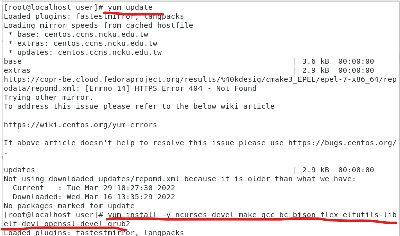
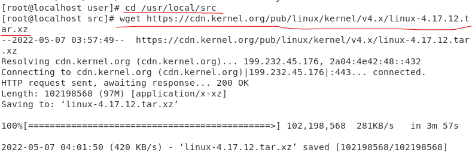
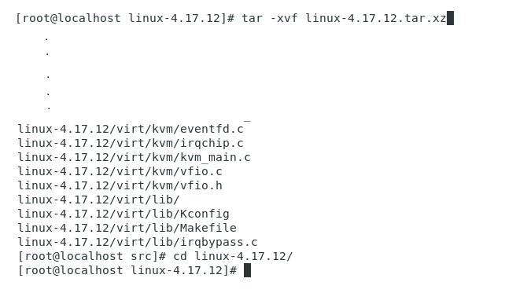
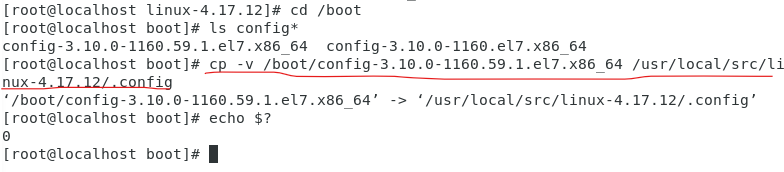
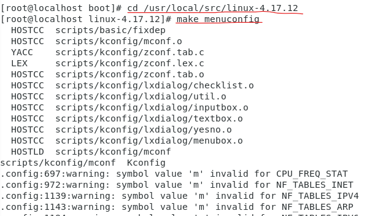
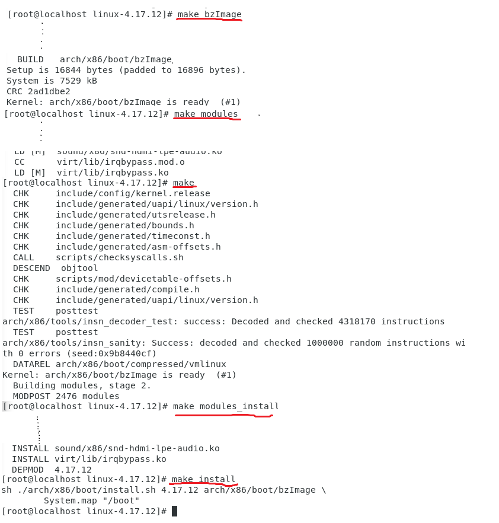
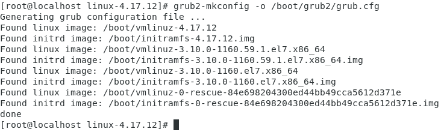

#### step01: install necessary tools

```
yum update
yum install -y ncurses-devel make gcc bc bison flex elfutils-libelf-devel openssl-devel grub2
```




#### step02: install kernel

```
cd /usr/local/src
wget https://cdn.kernel.org/pub/linux/kernel/v4.x/linux-4.17.12.tar.xz
```




#### step03: unzip kernel



```
tar -xvf linux-4.17.12.tar.xz
cd linux-4.17.12/
```


#### step04: copy current config to new kernel



```
cp -v /boot/config-3.10.0-862.6.3.el7.x86_64 /usr/local/src/linux-4.17.12/.config
```


#### step05: make menuconfig



```
cd /usr/local/src/linux-4.17.12/
make menuconfig
```


#### step06: compiler kernel



```
make bzImage 
make modules
make
make modules_install
make install
```


#### step07: refresh GRUB



```
grub2-mkconfig -o /boot/grub2/grub.cfg
```

