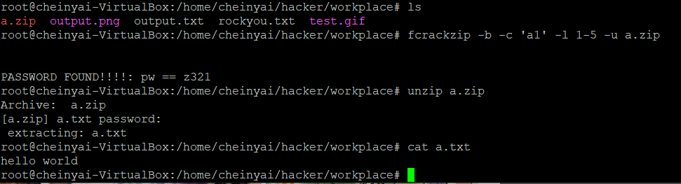

使用`fcrackzip`來破解zip密碼。裡面的內容為 `hello world`

```
sudo apt install fcrackzip
fcrackzip -D -u -p rockyou.txt test.zip

## -b 是暴力破解，-c 為指定字串指定A為大寫A-Z，1為數字0-9， -l 指定位數， -u 僅顯示破解出來的密碼
fcrackzip -b -c 'a1' -l 1-5 -u a.zip 
```

