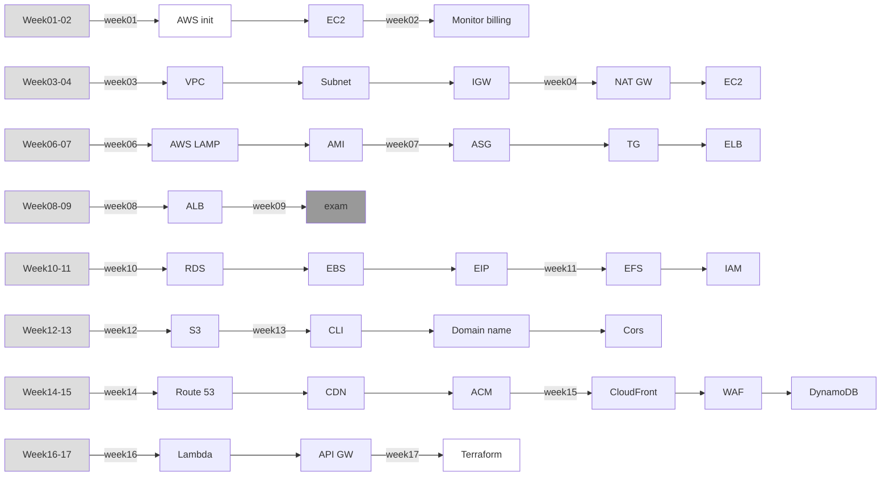

* 110學年度下學期: [Linux作業系統實務](#Linux作業系統實務)、[Linux加分題筆記](#Linux加分題筆記)

* 111學年度上學期: [伺服器架設](#伺服器架設)

* 111學年度下學期: [Linux系統自動化運維](#Linux系統自動化運維)

* 112學年度上學期: [雲端通訊整合實務 ](#雲端通訊整合實務)

  

# Linux作業系統實務

使用 Centos 作業系統，和 Visual Box 虛擬機

|               week                | content                                                      | date       |
| :-------------------------------: | :----------------------------------------------------------- | ---------- |
|   [week01](110semester02/01.md)   | [Centos7環境設定](110semester02/01.md#Centos7環境設定) <ul><li>[使用Centos的好處](110semester02/01.md#使用Centos的好處)</li><li> [virtulBox安裝教學](110semester02/01.md#virtulBox安裝教學)</li></ul> | 2022/02/15 |
|   [week02](110semester02/02.md)   | [Network](110semester02/02.md#Network)<ul><li>NAT</li><li>Bridged AdapterInternal </li><li>Network</li></ul>[遠端操作](110semester02/02.md#遠端操作) [export env](110semester02/02.md#export-env) [Linux指令](110semester02/02.md#Linux指令)<ul><li>開關機指令</li><li>查看編輯檔案內容</li></ul> | 2022/02/22 |
|   [week03](110semester02/03.md)   | [架設簡單伺服器](110semester02/03.md#架設簡單伺服器) [Linux指令](110semester02/03.md#Linux指令)<ul><li>關閉防火牆</li><li>mv、echo、cat、curl</li></ul> | 2022/03/01 |
|   [week04](110semester02/04.md)   | [Linux 發行版本](110semester02/04.md#Linux-發行版本) [shell programming](110semester02/04.md#shell-programming) [Linux 指令](110semester02/04.md#Linux-指令) <ul><li>查看Linux 版本</li><li>查看變數</li><li>修改密碼新</li><li>增使用者</li></ul>[重制root密碼](110semester02/04.md#重制root密碼) | 2022/03/08 |
| **[week05](110semester02/05.md)** | [file system](110semester02/05.md#file-system) <ul><li>[磁碟分割(hard disk partition)](110semester02/05.md#磁碟分割(hard-disk-partition))</li><li>[Linux系統載入](110semester02/05.md#Linux系統載入)[Linux指令](110semester02/05.md#Linux指令)<ul><li>ping</li><li>ifconfig</li><li>關機指令</li><li>重啟指令</li><li>系統操作指令</li></ul></li></ul> | 2022/03/15 |
|   [week06](110semester02/06.md)   | [Linux指令格式](110semester02/06.md#Linux指令格式) [Linux檔案](110semester02/06.md#Linux檔案) [使用遠端破解密碼](110semester02/06.md#使用遠端破解密碼) [Linux指令](110semester02/06.md#Linux指令)<ul><li>顯示使用者指令</li><li>ctrl指令</li><li>`pwd; cd ~; echo; $SHELL、man`</li></ul> | 2022/03/22 |
|   [week07](110semester02/07.md)   | [specific file](110semester02/07.md#specific-file) [Command](110semester02/07.md#Command) <ul><li>[ls</li>](110semester02/07.md#ls)<li>[man](110semester02/07.md#man)</li><li>[tree](110semester02/07.md#tree)</li></ul>[Linux指令](110semester02/06.md#Linux指令)<ul><li>查看帳號文件</li><li>column分割指令</li><li>創建連結指令</li><li>`netstat; touch; kill; stat; ls; cp; cat; tail; head; mkdir; rmdir`</li></ul> | 2022/03/29 |
|              week08               | 放假!                                                        | 2022/04/05 |
|   [week09](110semester02/09.md)   | [切換kernal使用特定版本的功能](110semester02/09.md#切換kernal使用特定版本的功能) [提權](110semester02/09.md#提權) [Linux指令](110semester02/09.md#Linux指令)<ul><li>查看Linux 版本</li><li>判斷前一個指令是否成功</li><li>網路資料抓取</li><li>快速清除文件內容</li><li>`cd; sed; tail; mkdir; cat; mkdir; rmdir`</li></ul> | 2022/04/12 |
|              week10               | 期中考!                                                      | 2022/04/19 |
|   [week11](110semester02/11.md)   | [專有名詞介紹](110semester02/11.md#專有名詞介紹)<ul><li>集縮比</li><li>PT test</li><li>stacking</li></ul>[Linux指令](110semester02/11.md#Linux指令)<ul><li>檔案權限改變、查看檔案權限</li><li>改變Linux預設指令結果</li><li>查看檔案位置</li><li>查看資料使用量</li><li>stdin、stdout、stderr應用操作</li></ul> | 2022/04/26 |
|   [week12](110semester02/12.md)   | [命令管道](110semester02/12.md#命令管道) [撰寫系統腳本](110semester02/12.md#撰寫系統腳本) [搜尋檔案(find)](110semester02/12.md#搜尋檔案(find)) [增量備份](110semester02/12.md#增量備份) [Linux指令](110semester02/12.md#Linux指令)<ul><li>檔案權限數字操作</li><li>清空指令輸出到螢幕上的內容</li><li>一次創建多個檔案</li></ul> | 2022/05/03 |
| **[week13](110semester02/13.md)** | [grep](110semester02/13.md#grep) <ul><li>[grep參數](110semester02/13.md#grep參數)</li><li>[正規表達式規則</li>](110semester02/13.md#正規表達式規則)<li>[Linux指令](110semester02/13.md#Linux指令)</li></ul>[vim](110semester02/13.md#vim)<ul><li>[Vi 底行命令](110semester02/13.md#Vi-底行命令)</li></ul>[硬體設備](110semester02/13.md#硬體設備)<ul><li>[mount](110semester02/13.md#mount)</li><li>[Linux指令](110semester02/13.md#Linux指令)<ul><li>查看硬體設備</li><li>查看目前使用的終端信息</li></ul></li></ul> | 2022/05/10 |
| **[week14](110semester02/14.md)** | [掛載格式硬碟](110semester02/14.md#掛載格式硬碟) [掛載磁碟](110semester02/14.md#掛載磁碟) [群組](110semester02/14.md#群組) [Shell](110semester02/14.md#Shell) [Linux指令](110semester02/14.md#Linux指令)<ul><li>echo 高級使用方法</li><li>`xargs; awk`</li></ul> | 2022/05/17 |
|   [week15](110semester02/15.md)   | [使用者權限](110semester02/15.md#使用者權限) [crach](110semester02/15.md#crach) [Linux指令](110semester02/15.md#Linux指令)<ul><li>查看有多少使用者在線上</li><li>新增使用者</li><li>取出`/etc/passwd`文件的用戶名和系統名稱</li><li>查看、改變權限</li></ul> | 2022/05/24 |
|   [week16](110semester02/16.md)   | [process](110semester02/16.md#process) [driver](110semester02/16.md#driver) [Linux指令](110semester02/16.md#Linux指令)<ul><li>查看行程樹、查看記憶體和行程資訊</li><li></li><li>ps指令詳細用法、nice</li><li>`kill; pkill; job; fg; bg; sleep; !!`</li></ul> | 2022/05/31 |
|   [week17](110semester02/17.md)   | [內部指令與外部指令](110semester02/17.md#內部指令與外部指令) [Linux特殊符號](110semester02/17.md#Linux特殊符號) [zombie process](110semester02/17.md#zombie-process) [orphan process](110semester02/17.md#orphan-process) [firework](110semester02/17.md#firework) [Linux指令](110semester02/17.md#Linux指令)<ul><li>`&&`  和 `||` 的應用</li><li></li><li>`set; env`</li><li>`su` vs `su-`</li></ul> | 2022/06/07 |
|              week18               | none                                                         | 2022/06/14 |

# 伺服器架設 

使用 Centos 作業系統，和 Visual Box 虛擬機

全伺服器解析: [week16~week18](111semester01/final.md)

|                    week                     | content                                                      | date                |
| :-----------------------------------------: | :----------------------------------------------------------- | ------------------- |
|        [week01](111semester01/1-.md)        | [SSH server](111semester01/1-.md#SSH-server) <ul><li>set host name</li><li>no password login</li></ul> | 2022/09/05          |
|      [week02](111semester01/2-NFS.md)       | [NFS](111semester01/2-NFS.md#NFS)<ul><li>server setup</li><li>client setup </li><li>查看已安裝軟體</li></ul> [檔案壓縮](111semester01/2-NFS.md#檔案壓縮)<ul><li>tar</li><li>zip</li></ul> [設定系統時間](111semester01/2-NFS.md#設定系統時間) [排程](111semester01/2-NFS.md#排程) [reference](111semester01/2-NFS.md#reference) | 2022/09/12          |
|   **[week03](111semester01/3-SAMBA.md)**    | [SAMBA](111semester01/3-SAMBA.md#SAMBA)<ul><li>install SAMBA </li><li>edit SAMBA config</li><li>[加入使用者權限](111semester01/3-SAMBA.md#加入使用者權限)</li></ul> [磁碟配額設定](111semester01/3-SAMBA.md#磁碟配額設定)<ul><li>進入單人模式</li></ul> | 2022/09/19          |
|        [week04](111semester01/4-.md)        | [磁碟配額設定(續)](111semester01/4-.md#磁碟配額設定)<ul><li>set quota</li><li>set quota hard limit</li></ul> [套件管理](111semester01/4-.md#套件管理)<ul><li>[rpm](111semester01/4-.md#rpm)</li><li>[yum](111semester01/4-.md#yum)</li><li>進入單人模式02</li></ul> | 2022/09/26          |
|        [week05](111semester01/5-.md)        | [ngrok](111semester01/5-.md#ngrok)<ul><li>install ngrok</li><li>get certification</li><li>add ngrok config</li></ul> [好用的指令](111semester01/5-.md#好用的指令)<ul><li>[du](111semester01/5-.md#du)</li><li>[df](111semester01/5-.md#df)</li><li>[dd](111semester01/5-.md#dd)</li><li>[wc](111semester01/5-.md#wc)</li><li>[tr](111semester01/5-.md#tr)</li></ul> [error (yum lock)](111semester01/5-.md#error) [reference](111semester01/5-.md#reference) | 2022/10/3           |
|      [week06](111semester01/6-國慶.md)      | 國慶日!                                                      | 2022/10/10          |
|    **[week07](111semester01/7-VPN.md)**     | [pptpd](111semester01/7-VPN.md#pptpd)<ul><li>install</li><li>setpu</li><li>set DNS server</li><li>set password and account</li><li>windows client connect</li></ul> [L2TP VPN](111semester01/7-VPN.md#L2TP-VPN)<ul><li>install</li><li>setpu</li><li>set PSK public key</li><li>set ppp connection</li><li>set password and account</li><li>windows client connect</li></ul> [好用的指令(續)](111semester01/7-VPN.md#好用的指令)<ul><li>[ssh](111semester01/7-VPN.md#ssh)</li><li>[scp](111semester01/7-VPN.md#scp)</li><li>[seq](111semester01/7-VPN.md#seq)</li><li>[sort](111semester01/7-VPN.md#sort)</li><li>[uniq](111semester01/7-VPN.md#uniq)</li><li>[cut](111semester01/7-VPN.md#cut)</li></ul> [error](111semester01/7-VPN.md#error) [Reference](111semester01/7-VPN.md#Reference) | 2022/10/17          |
|        [week08](111semester01/8-.md)        | 放假!                                                        | 2022/10/24          |
|     [week09](111semester01/9-期中考.md)     | [期中考](111semester01/9-期中考.md#期中考)<ul><li>[crontab](111semester01/9-期中考.md#第九章)</li><li>[rpm](111semester01/9-期中考.md#第十章)</li><li>[Linux command](111semester01/9-期中考.md#十一章)</li><li>[command testing](111semester01/9-期中考.md#十二章)</li></ul> | 2022/10/31          |
|      [week10](111semester01/10-NAT.md)      | [NAT Server](111semester01/10-NAT.md#NAT-Server)<ul><li>set IP manually</li><li>set router</li><li>test with tcpdump</li></ul> [shell](111semester01/10-NAT.md#shell)<ul><li>string comparing</li><li>read parameters</li><li>show the certain type of file in dir</li><li>rename certain type of file</li></ul> | 2022/11/7           |
|    [week11](111semester01/11-Network.md)    | [網路指令與管理](111semester01/11-Network.md#網路指令與管理)<ul><li>network and NetworkManager</li><li>Set network config</li><li>set virtual interface</li></ul> [network command](111semester01/11-Network.md#常用指令)<ul><li>change MAC </li><li>set default router</li><li>ping</li></ul> [important port](111semester01/11-Network.md#important) [read update and download speed](111semester01/11-Network.md#讀取介面卡傳送速率) | 2022/11/14          |
|       [week12](111semester01/12-.md)        | [系統服務與排程](111semester01/12-.md#系統服務與排程)<ul><li>[Unit](111semester01/12-.md#Unit)</li><li>[target](111semester01/12-.md#target)</li><li>[init_runlevel](111semester01/12-.md#init_runlevel)</li><li>[systemd_Target ](111semester01/12-.md#systemd_Target )</li><li>[systemctl](111semester01/12-.md#systemctl常用服務)</li></ul> [TCP/IP server](111semester01/12-.md#架設伺服器練習) [Install_Talnet](111semester01/12-.md#Install_Talnet) [Linux command](111semester01/12-.md#Linux指令) | 2022/11/21          |
|     **[week13](111semester01/13-.md)**      | [LAMP](111semester01/13-.md#LAMP)<ul><li>[Apache](111semester01/13-.md#Apache)</li><li>[MYSQL](111semester01/13-.md#MYSQL)</li><li>[PHP](111semester01/13-.md#PHP)</li><li>[ApacheSetup](111semester01/13-.md#ApacheSetup)</li></ul><ul> [Linux command](111semester01/13-.md#Linux指令) | 2022/11/28          |
|     **[week14](111semester01/14-.md)**      | [ApacheSetup(續)](111semester01/14-.md#ApacheSetup)<ul><li>[important Apache file](111semester01/14-.md#重要Apache目錄)</li><li>[virtual host](111semester01/14-.md#virtual-host)</li><li>[httpd.conf](111semester01/14-.md#httpd.conf)</li><li>[link to www/html](111semester01/14-.md#網站位置連接)</li></ul> [Linux command](111semester01/14-.md#Linux指令) | 2022/12/05          |
|       [week15](111semester01/15-.md)        | [virtual host(續)](111semester01/15-.md#virtual host) [Access Control](111semester01/15-.md#Access-Control)<ul><li>dir security</li><li>set dir config</li></ul> [FTP](111semester01/15-.md#FTP)<ul><li>setup</li><li>connect with anonymous</li></ul> [Linux command](111semester01/15-.md#Linux指令) | 2022/12/12          |
| **[week16~week18](111semester01/final.md)** | [basic](111semester01/16-.md#basic)<ul><li>[network and NetworkManager](111semester01/16-.md#network-and-NetworkManager)</li><li>[SSH](111semester01/16-.md#SSH)</li><li>[FTP](111semester01/16-.md#FTP)</li><li>[SAMBA](111semester01/16-.md#SAMBA)</li><li>[NFS](111semester01/16-.md#NFS)</li><li>[talnet](111semester01/16-.md#talnet)</li><li>[TCP/IP server](111semester01/16-.md#TCP/IP-server)</li><li>[LAMP](111semester01/16-.md#LAMP)</li><li>[Apache user](111semester01/16-.md#Apache-user)</li><li>[virtual host](111semester01/16-.md#virtual-host)</li><li>[ngrok](111semester01/16-.md#ngrok)</li></ul> [advance](111semester01/16-.md#advance)<ul><li>[VPN](111semester01/16-.md#VPN)</li><li>[NAT](111semester01/16-.md#NAT)</li></ul> | 2022/12/19~2023/1/2 |

# Linux系統自動化運維

使用 Centos 作業系統，和 VMware 虛擬機

|               week                | content                                                      | date       |
| :-------------------------------: | :----------------------------------------------------------- | ---------- |
|              week01               | none                                                         | 2023/02/15 |
|   [week02](111semester02/01.md)   | [server concept](111semester02/01.md#server_concept) [IPv6 network](111semester02/01.md#IPv6_network)  | 2023/02/22 |
|   [week03](111semester02/02.md)   | [HTTPS connect](111semester02/02.md#HTTPS_connect) <ul><li>申請IPV6的憑證</li><li>自動更新憑證</li><li>錯誤排解</li></ul> | 2023/03/01 |
|   [week04](111semester02/03.md)   | [WebDAV](111semester02/03.md#WebDAV) <ul><li>建立網路磁碟資料夾</li><li>編輯webdav設定檔</li><li>windows connection</li></ul> [破解gpedit.msc](111semester02/03.md#破解gpedit.msc) [sed](111semester02/03.md#sed) <ul><li>利用sed生成文件</li><li>sed互動用法</li><li>sed取代功能</li></ul> [正規表達式](111semester02/03.md#正規表達式)  | 2023/03/08 |
|   [week05](111semester02/04.md)   | [Line+ChatGPT](111semester02/04.md#Line+ChatGPT) <ul><li>設定安全性</li><li>設定金鑰</li></ul> [自動產生字幕](111semester02/04.md#自動產生字幕) <ul><li>anaconda basic command</li><li>set bash </li><li>install whisper </li><li>use vlc to play vedio</li></ul>  | 2023/03/15 |
|   [week06](111semester02/05.md)   | [DNS server](111semester02/05.md#DNS_server) <ul><li>DNS紀錄類型</li><li>DNN use in windows<li>Linux名稱查詢工具</li><ul><li>dig</li><li>host<ul><li>man</li></ul></ul> [管理DnsServer](111semester02/05.md#管理DnsServer) <ul><li>[正向解析](111semester02/05.md#正向解析)<ul><li>新增DNN網域</li><li>編輯配置檔案<li>檢查參數並重啟</li></li></ul><li>[反向解析](111semester02/05.md#反向解析)<ul><li>編輯配置檔案</li><li>檢查參數並重啟</li></li></ul></ul> | 2023/03/22 |
| **[week07](111semester02/06.md)** | [docker](111semester02/06.md#docker) <ul><li>docker introduction</li><li>docker install</li><li>image and container</li><li>docker simple command</li></ul> [ip_forward](111semester02/06.md#else)  | 2023/03/29 |
|   [week08](111semester02/07.md)   | [docker](111semester02/07.md#docker) <ul><li>test local port<li>build web in container</li><li>web load balancing</li><li>virtual IP</li></ul> [docker backup](111semester02/07.md#docker_backup) [docker usefull command](111semester02/07.md#else)  | 2023/04/05 |
| **[week09](111semester02/08.md)** | [Docker file](111semester02/08.md#Docker_file) <ul><li>create Dockerfile</li><li>docker httpd structure</li></ul> [Docker compose](111semester02/08.md#Docker_compose) <ul><li>docker compose install</li></ul> [jumpServer](111semester02/08.md#jumpServer) <ul><li>check up http port</li><li>create user</li><li>create asset</li><li>create ssh connection</li><li>create sudo root asset</li><li>add asset authorization</li><li>check up asset</li></ul>  | 2023/04/12 |
|   [week10](111semester02/09.md)   | [jumpServer](111semester02/09.md#jumpServer) <ul><li>check up web connection</li><li>check up user operation video</li><li>command filter</li></ul>  | 2023/04/19 |
| **[week11](111semester02/10.md)** | [monitor](111semester02/10.md#monitor) [set up email server](111semester02/10.md#架設伺服器端)<ul><li>edit mail.rc</li></ul> [Zabbix server setup](111semester02/10.md#Zabbix)<ul><li>set up database</li><li>install zabbix</li><li>add new db user and passwd</li><li>set up time zone</li><li>set up zabbix website</li></ul> [Zabbix client setup](111semester02/10.md#架設客戶端)<ul><li>install zabbix client</li><li>[設定伺服器端的客戶端連線](111semester02/10.md#設定伺服器端的客戶端連線)<ul><li>use template</li><li>test client</li></ul></li></ul>  | 2023/04/26 |
| **[week12](111semester02/11.md)** | [zabbix](111semester02/11.md#zabbix) <ul><li>custom item</li><li>setup monitor options</li><li>setting param for item</li><li>create trigger</li><li>use hash to test</li><li>lookup warning with graph</li><li>send email</li><li>set up event</li><li>test for all operation</li></ul> | 2023/05/03 |
| **[week13](111semester02/12.md)** | [Zabbix notify with line](111semester02/12.md#Zabbix) <ul><li>set up line config</li><li>set up zabbix alert script</li><li>test with cmd</li><li>create media types</li><li>set up notification</li><li>create action</li><li>set up operations</li><li>test for all operation</ul> [custom parameter](111semester02/12.md#custom_parameter) <ul><li>look up httpd server with cmd </li><li>set up zabbix agent conf</li><li>custom item</li><li>test for item function</li></ul> [waring with connection over 3](111semester02/12.md#加分題) <ul><li>edit zabbix agent config</li><li>custom item</li><li>add trigger</li><li>use ssh or putty connect for test</li></ul>  | 2023/05/10 |
| **[week14](111semester02/13.md)** | [charttr](111semester02/13.md#charttr) [ACL](111semester02/13.md#ACL) <ul><li>查看ACL權限</li><li>修改ACL權限</li></ul> [Ansible](111semester02/13.md#Ansible) <ul><li>no passwd login</li><li>set up ansible hosts</li><li>ansible test</li></ul>  | 2023/05/17 |
| **[week15](111semester02/14.md)** | [Ansible](111semester02/14.md#Ansible) <ul><li>command module</li><li>shell module</li><li>script module</li><li>yum module</li><li>copy module</li><li>fetch module</li><li>file module</li><li>service module</li><li>group module</li><li>user module</li></ul> [link_command](111semester02/14.md#link_command)  | 2023/05/24 |
|   [week16](111semester02/15.md)   | [Asinble playbook](111semester02/15.md#Asinble_playbook) <ul><li>send message to all connector</li><li>set up httpd with ansible</li><li>ignore error stdout</li><li>copy config to remote</li><li>3 way to setup param</li><li>install muti package</li><li>store param in other file</li><li>install throught the file</li><li>show the log to screen</li><li>use template for different server</li></ul>  | 2023/05/31 |
|              week17               | final exam                                                   | 2023/06/07 |
|              week18               | presentation                                                 | 2023/06/14 |

# Linux加分題筆記

| title                                      | content                                                      |
| ------------------------------------------ | ------------------------------------------------------------ |
| [changKernel](BonuschangeKernel)           | 切換Linux的Kernel，可以使用其他版本的功能!                   |
| [decrption .txt](Bonus/decryption_txt)     | 把被加密過的文字進行還原                                     |
| [find word in png](Bonus/find_word_in_png) | 找到藏在圖片中的文字                                         |
| [gif crack](Bonus/gif_crack)               | 抓出gif文件的文字                                            |
| [zip crack](Bonus/zip_crack)               | 破解zip壓縮檔案的密碼                                        |
| [group sort](Bonus/Group.md)               | 課本第七章習題，裡面一共三題                                 |
| [other note](Bonus/hacker.md)              | [暴力破解](Bonus/hacker.md#暴力破解) [hydra](Bonus/hacker.md#hydra) [Medusa](Bonus/hacker.md#Medusa) [John the Ripper(JTR)](Bonus/hacker.md#John-the-Ripper(JTR)) [使用遠端破解密碼](Bonus/hacker.md#使用遠端破解密碼) [msfconsole](Bonus/hacker.md#msfconsole) [關閉防火牆和保護裝置](Bonus/hacker.md#關閉防火牆和保護裝置) [破解壓縮檔案密碼](Bonus/hacker.md#破解壓縮檔案密碼) [查看圖片文字](Bonus/hacker.md#查看圖片文字) [else](Bonus/hacker.md#else)<ul><li>重製、修改root 密碼</li><li>修改putty 裡面的vim註釋顏色</li><li>密碼破解法</li></ul> |

# 雲端通訊整合實務

使用 AWS 網頁版雲端服務，和 VMware 虛擬機指令控制雲端服務

因為教的東西較多，下面有課程教學的總覽圖

|               week                | content                                                      | date       |
| :-------------------------------: | :----------------------------------------------------------- | ---------- |
|   [week01](112semester01/01.md)   | [課程簡介](112semester01/01.md#課程簡介) <ul><li>為甚麼要學AWS?</li><li> 雲端資源簡述</li><li> 課程內容</li></ul>[AWS 註冊](112semester01/01.md#AWS註冊) 注: 需要有信用卡才可以註冊 [建立EC2](112semester01/01.md#建立EC2) <ul><li>Select resources</li><li> setting Key pair</li><li> setting VPC and Network</li><li>setting security group</li><li> testing ICMP</li></ul> | 2023/09/12 |
|   [week02](112semester01/02.md)   | [監控帳單](112semester01/02.md#監控帳單) <ul><li>Create SNS topic</li><li> Create Subscription</li><li> CloudWatch Alarm </li></ul>[EC2、VPC架構簡述](112semester01/02.md#EC2、VPC架構簡述) <ul><li>VPC、ACL、EC2、SG</li><li> EC2 Security Group</li></ul>[Linux To AWS](112semester01/02.md#LinuxToAWS) <ul><li>使用 Linux 連線到 AWS</li><li> 在本地創建檔案並丟到雲端 (AWS)</li></ul> | 2023/09/19 |
|   [week03](112semester01/03.md)   | [雲端架構介紹](112semester01/03.md#雲端架構介紹) <ul><li>VPC & subnet & IGW & EC2 & NAT GW</li><li>elastic network interface</li><li>EBS</li><li>ELB & ASG</li></ul>[VPC & subnet & IGW  & EC2 & NAT GW](112semester01/03.md#VPC&subnet&IGW) <ul><li>[VPC](112semester01/03.md#VPC)<ul><li>setting VPC name and IPv4 CIDR</li></ul><li>[Subnet](112semester01/03.md#Subnet)</li><ul><li>set region and IPv4 CIDR</li></ul></li><li>[IGW](112semester01/03.md#IGW)<ul><li>setting name</li><li>Attach to a VPC</li></ul></li><li>[RT](112semester01/03.md#RT)<ul><li>Edit routes</li><li>Subnet association</li></ul></li><li>[EC2](112semester01/03.md#EC2)</li></ul>[LinuxToAWS](112semester01/03.md#LinuxToAWS) <ul><li>centos7 登入到 AWS EC2</li><li>建立網站 HTML 文件</li><li>創建包含圖片的 HTML</li></ul> | 2023/09/26 |
|   [week04](112semester01/04.md)   | [VPC & subnet & IGW & EC2 & NAT GW](112semester01/04.md#VPC&subnet&IGW&EC2&NAT_GW) <ul><li>enable auto-assign public IP</li><li>Create Private instance</li><li>[NAT GateWay](112semester01/04.md#NAT_GateWay)<ul><li>create NAT GateWay</li><li>Allowcate Elastic IP</li></ul></li><li>[RT](112semester01/04.md#RT)<ul><li>Edit routes</li><li>Subnet association</li></ul></li><li>[Mariadb](112semester01/04.md#Mariadb)<ul><li>install mariadb</li><li>create user</li><li>connect to private db (EC2)</li></ul></li></ul> | 2023/10/03 |
|   [week05](112semester01/05.md)   | 國慶日放假 !                                                 | 2023/10/10 |
| **[week06](112semester01/06.md)** | [AWS LAMP](112semester01/06.md#AWS_LAMP) <ul><li>create db</li><li>build php website</li></ul>[ELB](112semester01/06.md#ELB) <ul><li>[Subnet](112semester01/06.md#Subnet)</li><li>[RT](112semester01/06.md#RT)</li></ul>[AMI](112semester01/06.md#AMI) <ul><li>create image</li><li>create EC2 by AMI</li></ul> | 2023/10/17 |
|   [week07](112semester01/07.md)   | [ASG](112semester01/07.md#ASG) <ul><li>[實驗1: 簡單的 ASG](112semester01/07.md#簡單的ASG)<ul><li>create template</li><li>setting network</li><li>setting configuration</li><li>testing</li></ul></li><li>[實驗2: 根據使用效能調整虛擬機數量的 ASG](112semester01/07.md#根據使用效能調整虛擬機數量的ASG)<ul><li>create template</li><li>setting scaling policies</li><li>testing</li></ul></li></ul>[ELB](112semester01/07.md#ELB) <ul><li>[TG](112semester01/07.md#TG)<ul><li>setting name and vpc</li><li>Register targets</li></ul></li><li>[ALB](112semester01/07.md#ALB)<ul><li>setting name and network</li><li>setting vpc and subnet</li><li>setting security group</li><li>testing</li></ul></li></ul> | 2023/10/24 |
|   [week08](112semester01/08.md)   | [商業型網頁雲端架構](112semester01/08.md#商業型網頁雲端架構) [ALB](112semester01/08.md#ALB) <ul><li>create 4 EC2</li><li>create 2 target group</li><li>associate with load balancer</li><li>[ALB weight](112semester01/08.md#ALB_weight)<ul><li>add target group</li><li>setting weight</li></ul></li><li>[ALB_HTTP_Header](112semester01/08.md#ALB HTTP Header)<ul><li>Add condition</li><li>set http header</li><li>add target group</li><li>Query string</li><li>setting priority</li></ul></li><li>[ALB page forbidden](112semester01/08.md#ALB_page_forbidden)<ul><li>add condition</li><li>setting action</li></ul></li></ul>[ALB & ASG](112semester01/08.md#ALB&ASG)  | 2023/10/31 |
|   [week09](112semester01/09.md)   | [期中考題目架構圖](112semester01/09.md#期中考題目架構圖) [建立網路環境](112semester01/09.md#建立網路環境) <ul><li>網路處裡</li><li>連線處裡</li><li>建立 router</li></ul>[建立虛擬機](112semester01/09.md#建立虛擬機) <ul><li>創建虛擬機</li></ul>[private setting](112semester01/09.md#private_setting) <ul><li>建立 NAT GateWay 讓 private 可以連上網路</li><li>建立 router</li><li>加入資料庫</li></ul>[public_setting](112semester01/09.md#public_setting) <ul><li>創建網頁</li></ul>[Load Balancer](112semester01/09.md#Load_Balancer) <ul><li>create TG</li><li>create ALB</li></ul> | 2023/11/7  |
|   [week10](112semester01/10.md)   | [RDS](112semester01/10.md#RDS) <ul><li>Create DB</li><li>setting VPC</li><li>login DB with EC2</li><li>create website to connect DB</li></ul>[EBS](112semester01/10.md#EBS) <ul><li>setting volume and AZ</li><li>Attach volume</li><li>use EC2 to mount the EBC</li><li>detach volume</li></ul>[EIP](112semester01/10.md#EIP) <ul><li>create Elastic IP</li><li>Associate Elastic IP address</li></ul> | 2023/11/14 |
|   [week11](112semester01/11.md)   | [EFS](112semester01/11.md#EFS) <ul><li>Enable VPC dns hostname</li><li>create File System</li><li>Add SG</li><li>create Access point</li><li>create 2 EC2</li><li>EC2 Shared folder</li></ul>[IAM](112semester01/11.md#IAM) <ul><li>[IAM 觀念](112semester01/11.md#IAM觀念)<ul><li>permission policy</li><li>user and role</li><li>Management Console & CLI & SDK </li></ul></li><li>[IAM 實作](112semester01/11.md#IAM實作)<ul><li>create user </li><li>add permissions</li><li>view billing</li></ul></li></ul> | 2023/11/21 |
|   [week12](112semester01/12.md)   | [S3](112semester01/12.md#S3) <ul><li>create Bucket</li><li>Upload file</li><li>remove Block public access</li><li>add bucket policy</li><li>enable Bucket Versioning</li><li>[兩個不同地區的 bucket 同步](112semester01/12.md#兩個不同地區的bucket同步)</li><li>[利用 bucket 生成靜態網站](112semester01/12.md#利用bucket生成靜態網站)</li></ul>[IAM](112semester01/12.md#IAM) <ul><li>create s3 permissions</li><li>EC2 存取 S3</li></ul> | 2023/11/28 |
|   [week13](112semester01/13.md)   | [CLI](112semester01/13.md#CLI) <ul><li>create Access key</li><li>install AWS linux package</li><li>setting Linux aws config</li><li>install python 3.11</li></ul>[Domain name](112semester01/13.md#Domain_name) <ul><li>use GoDaddy to create domain name</li><li>create hosted zone</li><li>AWS Domain name takeover</li><li>create Record</li></ul>[Cors](112semester01/13.md#Cors) <ul><li>create 2 s3 buckets</li><li>add bucket policy</li><li>upload website files</li><li>Cross-origin resource sharing</li></ul> | 2023/12/05 |
| **[week14](112semester01/14.md)** | [Route_53](112semester01/14.md#Route_53) <ul><li>use Record to set EC2 HTTP IP to domain name</li><li>Create CNAME Record</li><li>S3 替換 Domain name</li><li>use Route 53 to create easy LB</li></ul>[CDN](112semester01/14.md#CDN) <ul><li>create distribution</li><li>check what is my ip</li></ul>[ACM](112semester01/14.md#ACM) <ul><li>request a Certificate</li><li>Cloud front + DNS+ HTTPS</li></ul> | 2023/12/12 |
| **[week15](112semester01/15.md)** | [CloudFront](112semester01/15.md#CloudFront) [WAF](112semester01/15.md#WAF) <ul><li>WAF & Shield</li><li>Block IP</li><li>Block IP with count</li></ul>[DynamoDB](112semester01/15.md#DynamoDB) <ul><li>create table</li><li>add item</li><li>use IAM user to access DynamoDB</li><li>create IAM role</li></ul> | 2023/12/19 |
|   [week16](112semester01/16.md)   | [Lambda](112semester01/16.md#Lambda) <ul><li>Attach Role policy</li><li>create Lambda function</li><li>testing Lambda  function</li><li>use Lambda to read、write and modify DynamoDB</li></ul>[API_GW](112semester01/16.md#API GW) <ul><li>create REST API</li><li>Create resouce</li><li>testing with postman</li></ul>[Terraform](112semester01/16.md#Terraform) <ul><li>install Terraform</li><li>use Terraform to deploy EC2 instance、VPC、Subnet</li></ul> | 2023/12/26 |
|   [week17](112semester01/17.md)   | [Terraform](112semester01/17.md#Terraform) <ul><li>[使用 terraform 實作可以用外網連線的 EC2 網頁](112semester01/17.md#使用terraform實作可以用外網連線的EC2網頁)</li><li>[加分題: 使用 terraform 實作 ALB 連線到兩台EC2](112semester01/17.md#使用terraform實作ALB連線到兩台EC2)</li> | 2024/01/02 |
|   [week18](112semester01/18.md)   |                                                              | 2024/01/09 |

