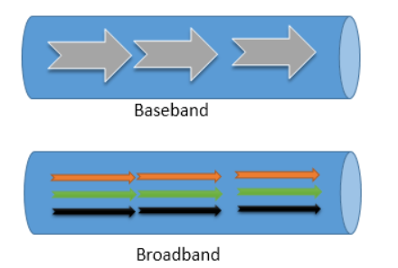

## 簡介

* 通訊(communication)就是信號(signal)在大氣，電纜(cable)，光纖(fiber)中傳輸的過程。 <br>
可大致分為3種: <br>
```
simplex:
單工-->只能單向傳
half-duplex:
半雙工-->可以雙向傳，但一次只能傳一向
full-duplex:
全雙工-->可以雙向傳，沒限制
```

* 傳輸信號可以分成兩種: <br>
   1. 類比訊號(Analog Signal): 連續，真正訊號源。　<br>
   2. 數位訊號(Digital Signal): 不連續，好傳輸，不易被竊聽。 <br> <br>

* 訊號的特徵有以下三點: <br>
   1. 大小(Magnitude) <br>
   2. 頻率(Frequency) <br>
   3. 相位(Phase) <br>
    <br>

```
S(t)=m(t)cos(2 pi f(t)+θ(t))  //θ(t)是相位
```

 <br> <br>

* 訊號傳輸距離: <br>
   * c = f * λ(波長) <br>
   * λ越大，訊號含括範圍越大，但f相對低，傳送速度慢(網速慢) <br>
   * 一般信號傳輸是用**微波**(λ: 1mm 至 1m,f: 300GHz 至 300MHz)或**紅外線**(λ: 760nm 至 1mm,f: 400THz 至 300GHz) <br>

<hr>

## 調變(Modulation)處理

* 名詞介紹: <br>
1. 調變(Modulation): 訊號搬動到高頻率 <br>
2. 解調變(Demodulation): 從高頻率還原成原本的訊號 <br> <br>
   * 調變方式: <br>
      1. AM(Amplitude Modulation; 調變幅度): 改振幅 <br>
      2. FM(Frequency Modulation; 調變頻率): 改頻率 <br>
      3. PM(Phase Modulation; 調變相位): 改相位 <br> <br>

* 數位調變處理: <br>

1. ASK(Amplitude Shift Keying; 振幅位移鍵): <br>
   * 通過載波的振幅變化來表示數位訊號的一種振幅調變方式。 <br>
   * 當訊號為1，振幅變大(c) <br> <br>

2. FSK(Frequrncy Shift Keying; 頻率位移鍵):  <br>
   * 利用頻率差異的訊號來傳送資料的調變方式。 <br>
   * 當訊號為1，頻率變大(d) <br> <br>

3. PSK(Phase Shift Keying; 相位位移鍵):  <br>
   * 相位差異的訊號來傳送資料的調變方式。 <br>
   * 當訊號為變化，相位保持不變(e) <br>

 <br>

```
C(t)=A.cos(2 pi ft+θ)
```

 <br> <br>

* 數位系統傳輸對類比訊號的處理過程: <br>
   * Analog singal -> 取樣 -> 量化 -> PCM(Pluse Code Modulation) -> Digital transmission <br> <br>

* baseband -> 一般傳輸， broadband ->先調變(modulation)再傳輸
 <br>

<hr>

## 編碼(Encodeing)處理 

下面介紹5種編碼方法: <br>

 <br>

1. NRZ-L <br>
   * (1 = v, 0 = -v) <br>
   * 有2V的差距，抗干擾性佳。 <br> <br>

2. NRZ-I <br>
   * (1 = inverse, 0 = keep) <br>
   * 這模式要設inital value(-v, picture), 對於全是1的信號不會出錯，但全是0的訊號出錯率較高。 <br> <br>

3. Manchester <br>
   * (1 = 左下右上, 0 = 右下左上) <br> <br>

4. Differential Manchester <br>
   * (1 = inverse, 0 = keep) <br>
   * 微分編碼。 <br> <br>

5. MLT-3 <br>
   * (0 -> -v -> +v -> 0 ->..) <br>
   * 目前還會用的編碼，上面幾個都太舊。 <br> <br>

<hr>

## 多工處理

介紹3種分工方式 <br>

 <br>

1. 分頻多工(FDM) <br>
   * 訊號間不會互相干擾，因為彼此的頻率範圍不相同，可以在單一通道達到多工。 <br> <br>

2. 分時多工(TDM) <br>
   * 時間軸上切成很多時間間格[時槽(time slot)]給多人使用。 <br> <br>

3. 分碼多工(CDM) <br>
   * 具備很好的抗雜訊特性，每個使用者的信號轉成的長串數碼具有互不干擾性，在同個頻帶中，就像是背景雜音，聽不懂，不會收入。 <br> <br>

<hr>

## 通訊交換方式

介紹3種通訊交換方式 <br>

1. 電路交換(Circuit Switching) <br>
   * 優點: 建立專屬點路，品質好。 <br>
   * 缺點: 價格高，資源使用效率低。 <br> <br>

2. 分封交換(Packing Switching) <br>
   * 優點: 誰搶到資源，誰就可以用，使用效率高。 <br>
   * 缺點: 人多時，傳送會碰撞導致傳送失敗，品質較差。 <br> <br>

3. 訊息交換(Message Switching) <br>
   * 特色: 用在傳統e-mail，訊息交換跟分封一樣，都不是專屬通訊電路。 <br>
   * 缺點: 不適合即時性傳輸(instant message)。 <br> <br>


* ADSL(Asymmetric Digital Subsriber Line) <br>
   * 上傳速度和下載不一樣，離機房(communication office)越遠速度越慢。 <br> <br>

* VDSL <br>
   * 光纖傳輸，在xDSL裡面速度最快。 <br> <br>