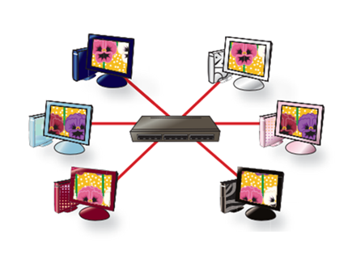
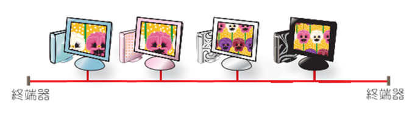
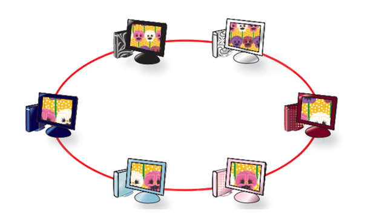
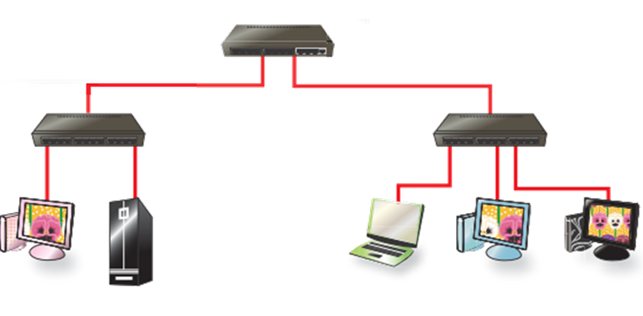
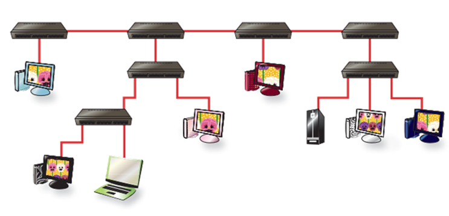

## 網路類型
網路類型大致可分為4種: <br>
* BAN(BodyArea Network) <br>
  * 範圍~5m，像是助聽器就適用於這個網域，這個其實和LAN差距不大，所以課本其實沒有介紹 <br> <br>
* PAN(PersonalArea Network) <br>
  * 範圍5~10m，這個適用於個人物品，耳機，智慧手環，**藍芽(802.15)**...  <br> <br>
* LAN(LocalArea Network) <br>
  * 範圍~2km，一般在家裡上網，課堂上網，都適用這個  <br> <br>
* ~MAN(MetropolitanArea Network)~ <br>
  * 範圍2~10km，因為基地台要設在住家旁邊，所以反彈很大，最後漸漸被LAN取代 <br> <br>
* WAN(WideArea Network) <br>
  * 範圍10km~，通常都是由電信公司處理，範圍很大，分成有線和無線 <br>
  * wired(ADSL, cable, fiber) <br>
  * wiredless(4G, 5G) 

<hr>

## 網路演進
* 1G <br>
  * 代表: 黑金剛，這時候的信號還是類比(anolog)很容易被別人竊取信號內容 <br> <br>
* 2G <br>
  * 代表: motorla(海豚)，這時候的信號從類比(anolog)轉成數位(digital) <br>
  * 多了兩個系統: GSM(Global System for Mobile Communication) & SMS(Show message Service) <br>
  * 能傳圖片了，但還是沒辦法利用網路看影片 <br> <br>
* 2.5G <br>
  * 多了一個系統 GPRS(General Packet Message Service) <br>
  * 上傳速度: 64Kbps <br> <br>
* 3G <br>
  * 代表: WCDMA，CDMA2000，MMS(Mutimedia Message Service) <br>
  * 上傳速度: 64Kbps <br>
  * 下載速度: 384Kbps <br> <br>
* 3.5G <br>
  * 代表: HSDPA，在3.5G，可以開始看影片，因為上傳速度來到了354Kbps <br>
  * 上傳速度: 354Kbps <br>
  * 下載速度: 14.40Mbps <br> <br>
* 3.9G <br>
  * WIMAX, LTE。這是3G到4G的過渡期(最後WIMAX被LTE打敗) <br> <br>
* 4G <br>
  * 代表: LTE_A(這個A是advance)
  * 多了許多功能: CA(Carrier Aggregation載波聚合)-->讓不同的頻寬(bandwidth)可以邏輯整合，VOLTE-->可以讓在講電話時，網路速度不會從4G降到3G 
  * 上傳速度: 50Mbps <br>
  * 下載速度: 100Mbps <br> <br>
* 5G <br>
  1. Extreme Mobile Broadband -> 提供>10Gbps的網速。 <br>
  2. Massive machine communication -> 可以讓更多設備連上網路，設備也更省能源。 <br>
  3. Critical machine Communication -> radio latency(無限電等待時間)<1m，遠程手術變得可行。 <br>
   <br>
  * 可以做到更細微的控制，和減少傳輸延遲，使用更全面!!

<hr>

## 網路拓樸(Topology)
共有5種類型: <br>
1. 星型網路(star) <br>
 <br>
  * 優點: 其中一個連線斷了，不會有影響，系統好維護 <br>
  * 缺點: 節點故障會導致系統全面癱瘓 <br> <br>
2. 直線型網路(bus) <br>
 <br>
  * 優點: 廣播特性，不會因為節點故障而導致全面癱瘓 <br>
  * 缺點: 其中一個連線斷了，全部斷線QQ <br> <br>
3. 環狀網路(ring) <br>
 <br>
  * 特色: token ring，誰有token誰可以傳
  * 優點: Contention free，速度快 <br>
  * 缺點: 貴，所以現在也消失得差不多了 <br> <br>
4. 樹狀網路(tree) <br>
 <br>
  * 特色: 點到點只有一條道路，各點可以互通(mesh) <br> <br>
5. 混合式網路(hybrid) <br>
 <br>
  * 特色: 把所有都上面的都用一用，提供多元網路連線環境 <br> <br>

<hr>

## 網路作業環境&OSI參考型 <br>
網路關係分為兩種 <br>
1. 主從式架構(Client-Server) <br>
   * 把客戶端（Client）與伺服器（Server）區分開來。每一個客戶端軟體的實例都可以向一個伺服器或應用程式伺服器發出請求。 <br>
   * 像大型遊戲伺服器，檔案伺服器...  <br> <br>
2. 對等式架構(Peer-to-Peer) <br>
   * 是無中心伺服器、依靠使用者群（peers）交換資訊的網際網路體系，它的作用在於，減低以往網路傳輸中的節點，以降低資料遺失的風險。與有中心伺服器的中央網路系統不同， <br>
   * 對等網路的每個使用者端既是一個節點，也有伺服器的功能 <br>
   * 像雲端分享，比特幣...  <br> <br>

OSI(Open System Interconnection Model)模型總共分7層 <br>
下層是硬體(1 to 3)，中間是韌體(2 to 5)，上面是軟體(3 to 7) <br>
 <br>
 <br>
**應用層不等於應用程式** <br>

<hr>

## 補充介紹
Ethernet frame(乙太網路訊框)

```
| Ethernet header | IP header | TCP header | Application data(user) | FCS |
                                           |    message             |        (application layer)
                              |           segment                   |        (transport   layer)
                  |           packet                                |        (network     layer)
|                      frame                                              |  (DataLink    layer)
```
 <br> <br>

* Network mask(網路遮罩)作用是跟IP位置行運算  <br>
 只要是192.68.10.xxx的網路位置經過mask就會到一樣的區域網路(可以直接傳) <br>
  如果IP位置不同就必須要用路由器(router)來連接 <br>


   1.	Controlize : have a good control to system(安全性高，控制性佳)，but is easy to crash <br>

   2.	Distribute : 跟controlize相反，節點跟節點之間互相連結，roburst(強壯的) <br> <br>

* 通訊協定(protocol) <br>
IP最主要的倆的目的 : 定址(adressing)，路由(rounting) <br>
   1.	TCP : 確保送出去的東西100%會到定址/*1~3都在傳輸層*/ <br>
   2.	UDP (User Datagram Protocol) : 越快越好的傳輸，不論是否傳到位 <br>
   3.	DNS(Domain Name System) : www.. ，是網際網路的一項服務。它作為將域名和IP位址相互對映的一個分散式資料庫，能夠使人更方便地存取網際網路。DNS使用TCP和UDP埠53。 <br>當前，對於每一級域名長度的限制是63個字元，域名總長度則不能超過253個字元。 <br>
/*IP 在網路層*/

 <br> <br>

* Address 
1.	MAC Adress(physical adress)實體位置 : 在ethernet(乙太網路)運作，網路卡卡號 <br>


     * Case1. src(source),dst(destination) at the same network <br>
     
     * Case2. src,dst at the different network <br>

2.	IP Adress(logical Adress) : 在IP運作，通訊位置，在不同地方會有不同位置 <br>
3.	Port number : 在TCP/UDP運作，寄件者，收件者，丟到指定位置 <br>
     * SMPT : 用來幫助之前的email通訊協定，outlook express, pop3，不過現在大多用web mail <br> <br>

* 遠端使用(Remote Login) : 可以透過電腦控制遠端電腦(要有另一台的IP位置) <br> <br>

```
(Telnet (port=23), SSH (port=22))，SSH有加密，較安全// (server=port)?
//(http (server=80))，(FTP(server=21))，(https(server=443))
```

* 檔案傳輸(FTP ; Flie Transfer Protocol) : 用在大型檔案傳輸等……

* Bluetooth4.0(802.15) <br>
  * 分成high speed和low energy(BLE) <br>
  * BLE用在室內定位，用在阻擋物較多，信號不好的地方

```
simplex:
單工-->只能單向傳
half-duplex:
半雙工-->可以雙向傳，但一次只能傳一向
full-duplex:
全雙工-->可以雙向傳，沒限制
```