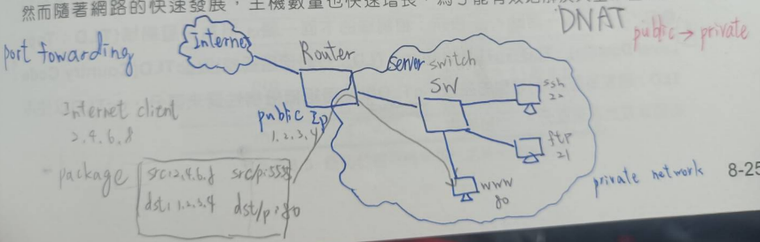
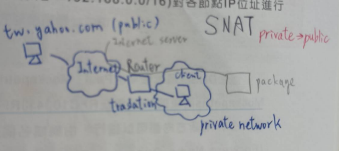
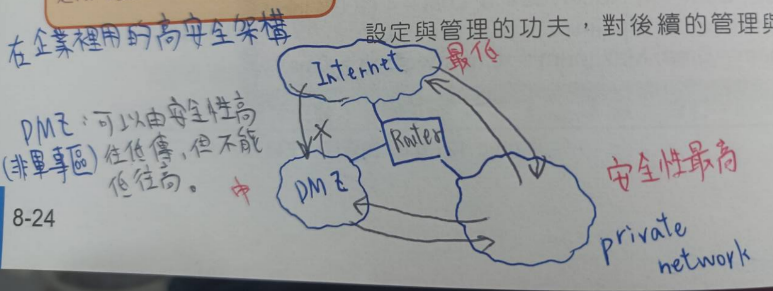
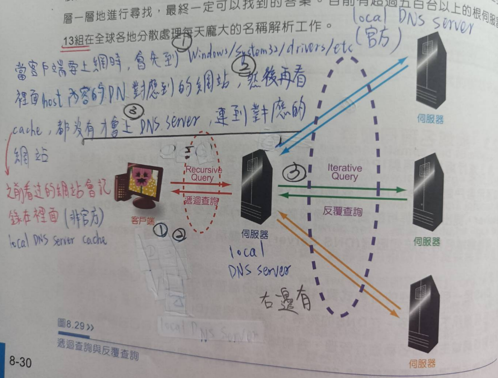

## NAT (**N**etwork **A**ddress **T**ranslation)

> 分為DNAT和SNAT

* 將內部網路轉外部網路需要用到 --> NAT技術，可以提供IP使用率，很多地方都可以用相同IP，不會打架，因為都使用內部網路
  一個內部IP(192.168.1.1) --> private  對應一個要轉的外部IP(12.1.1.1) --> public
* 因為要一個對一個不方便，所以產生新技術 --> NAPT，p是port的意思


* DNAT(轉換 network adress & port )，公有網路連到私有網路




* SNAT(轉換 network adress & port ): 私有網路連到公有網路




* DMZ: 高安全架構，可以讓駭客不能用跳板進攻



## DNS  (domain name system)

>  Domain NAME --> DNS server --> IP 

In the Internet, only "IP address" can be used for communication.
IP address is hard to remember.So we will use a hierarchical address. That is domain name. 
For example,  www.nqu.edu.tw, easy to remember and easy to communicate with "human beings"
	

	Domain name 指的就是IP位置，比較好記，nqu.edu就是負責教育的網站
	DNS運作方式是用Domain name 交給 DNS Server 轉換 IP 位置，才能進行網路操作(連到其他網站)
	DNS 是使用 UDP進行運作的，DNS Server的port是53
	DNS 有 cache可以存取訪問過他的網站(未經授權)
	
	Server可以藉由DNS Server(台灣:8.8.8.8, 中國:114.114.114)的位置得知你是從哪個國家連線


    UDP比較容易被攔截(因為資料沒reliable)，成為hacker做壞事的地方
    hacker可以在使用者和DNS Server中間攔截，讓你收到假消息，去錯誤的網站竊取資料(使用者輸入的話，向銀行帳密...)
    這種攻擊手法稱做: Man in the Middle (note04)


	www.nqu.edu.tw --> 203.72.226.40 (正向解析(正解)) domain name --> IP     forward DNS lookup
	203.72.226.40 --> www.nqu.edu.tw (反向解析(反解)) IP --> domain name

* C:\Windows\System32\drivers\etc\ **host.txt**，可以把重要的網站 IP位置寫在這裡面(192.168....  www.kkjff....)，可以讓DNS不會被騙(僅限有存的網站)，這是早期網路環境單純，主機數量少的時候用的，優先級高

* nslookup 可以看 網域位置，IP位置，可以正解反解

* ipconfig/displaydns 可以查詢 cache 裡面的資訊，ipconfig/flushdns  (flush the dns records in your cache)


  > Q: Why the nslookup gives two IPv4 addresses for tw.yahoo.com ? If you know the answer, write it down.
  > A: load balancing(附載均衡)


* 完整網域名稱(Fully Qualified Domain Name)

	一個FQDN大致分為三部分:
	    主機名稱(Host Name)
	    網域名稱(Domain Name)
	    . (root 根 表示是整個架構的最上層)
	www.nqu.edu.tw (這不是FQDN)
	www.nqu.edu.tw. (FQDN format)  
	網域名稱 + 主機名稱 + . (FQDN) domain name + hostname + 

​                                                                

> Q: 192.168.3.10/22, 192.168.4.10/22，資料可不可以直接傳輸 ?

```
不能，因為經過網路遮罩後，變成 --> 192.168.0.0，192.168.4.0。

速解法: 透過網路遮罩得知有4個網域，所以是可以從4整除的地方開始算(0, 4, 8, 16, ...0)
所以， 192.168.3.10/22 在 0~3， 192.168.4.10/22 在 4~7，在不同的區域網路內。

* 求IP host: 2^10(32-22) - 2 = 1022。
```


## DNS(Domain Name Server):  

> 分散在世界各地的Server，用的是Client-Server架構

	開在port: 53， 使用的是UDP協定，網路上主要通訊的是IP位置，DNS只是轉換(Domain name --> IP)而已
	
	* DNS attack (man in the middle):
	    截斷使用者和DNS之間的封包，回應假消息，準備假的伺服器，竊取別人的帳密 (note02)。
	
	* reflect attack(反射式攻擊)  DOS
	    駭客使用被害人的IP寄封包給DNS，讓資料由DNS傳給被害人，駭客可以連續傳送資料
	    讓被害人的頻寬爆掉。
	
	* distributed attack
	    反射式攻擊進化版，使用多個DNS，再把資料傳輸給DNS，灌爆被害人的頻寬。
	
	## 使用python Scapy 可以做到用假的IP傳送封包，竄改封包...


* 全世界只有13台root DNS Server


* 傳統DNS: IP位置固定，Domain name 固定

* 動態DNS(DDNS): IP位置不固定，Domain name 固定

    使用時機:
    如果IP位置不過定(撥號..)，然後還想建立伺服器，就很適合用DDNS
    因為如果使用傳統IP固定，斷線重連線時，會因為IP找不到(modern)而無法上網
    而DDNS本身就有網址，可以利用本地資料和DDNS互傳，而找到IP modern
    
    

> DNS運作圖片:




## 補充

* 重要port: www(80)、 ssh(22(遠端遙控機器))、 ftp(21)
* switch不用設定，router要設定。
* 如果連接switch的設備要進行通訊，就要設定IP位置
* DHCP is Dynamic Host configuration Protocol.(動態主機設定(自動取得ip位置))

* 使用一台路由器(12.1.1.0)連接private的多個點(192...)，再用這路由器連到外面的另一個public IP (12.1.1.2)
  用路由器將private的每個點的port記錄在router上，寄封包時，會標明封包的port(src)和目的位置(router,dst)
  使用NAPT技術，只需要一個對外的IP和port 
  
* 一般客戶端在傳輸層使用的port，都在1024以上的port，1~1024的port通常都是給server端做使用，WWW(80)

* DHCP is based on client/server. 
  DHCP is used to help our computer get the IP address and some network settings.
  Therefore, we don't need to set the network setting by ourself.
  DHCP server: IP pool, default gateway, network mask, dns server...
  DHCP 可以自動設定IP

* DHCP在進行配置時,基本上對於客戶端,有兩種配置方式,
  第一種:隨機挑選IP Pool中可以用的IP ;  
  第二種:綁定客戶端的MAC address,也就是相同的客戶,永遠得到固定的IP

  DHCP Cinet --> Discover(廣播的封包，尋找DHCP Server存在) --> DHCP Server
  DHCP Server --> Offer() --> DHCP Cinet
  DHCP Cinet --> Request(廣播的封包，決定接受Server的Offer，看哪個Server快) --> DHCP Server
  DHCP Server --> Acknowledge() --> DHCP Cinet
    DHCP運作流程簡稱DORA

* hacker 可以製造一個fake AP，DHCP Server，只要hacker離被害者比較近，就可以取得被害者的資料(得到Request)


#### Linus 設定路由器

1. 新增Ip 位置: ip addr add 19.168.1.2/24 brd dev eth0
2. 新增內定路由器 : ip router add e:ethernet  fa:fast ethernet   g:gigabit ethernet

Router可以做很多事，可以加VPN可以，加DHCP Server...
第三層的switch只能路由和定址