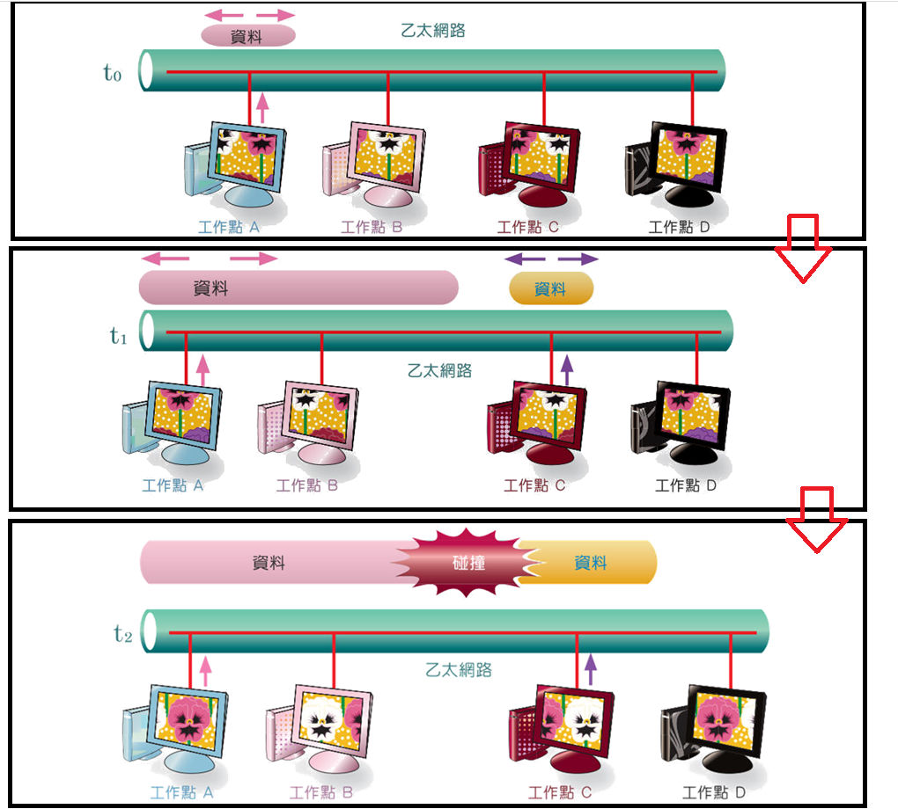
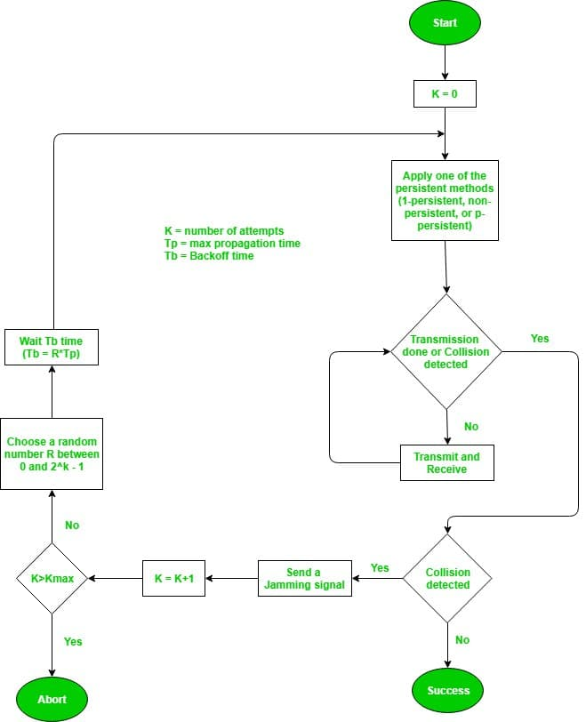
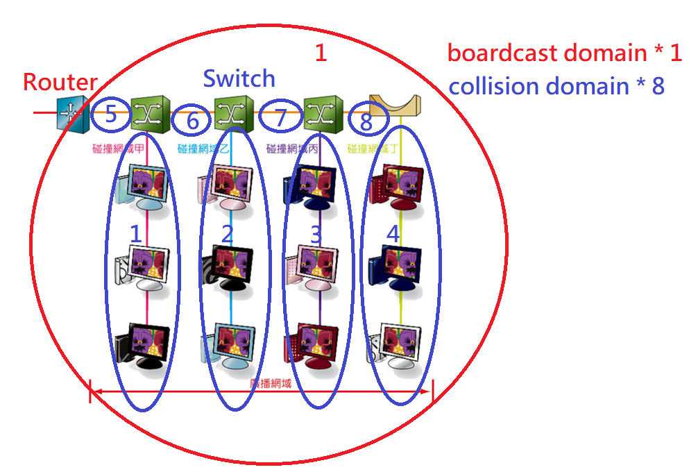
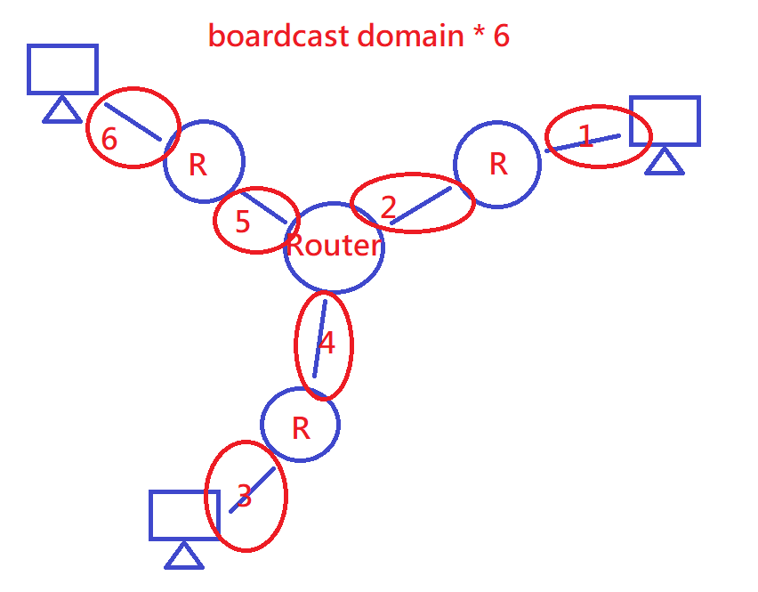
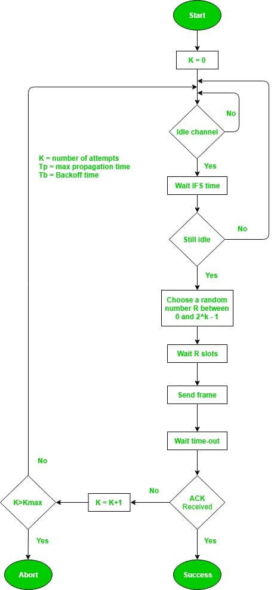

## 簡介
* IEEE標準，裡面有規範很多標準，OSI實體層與資料連接層、LAN...。以下圖片詳細說明
 <br>
裡面沒有802.13，本來就沒有。

* 代表性網路架構
   * CSMA/CD(Carrier Sense Multiple Access/ Collison Detection; 載波感測多重存取/ 碰撞偵測): 乙太網路(Ethernet; 802.3)
   * CSMA/CA(Carrier Sense Multiple Access/ Collison Avoidance; 載波感測多重存取/ 碰撞避免): 無線網路(Wi-Fi; 802.11)

<hr>

## 乙太網路(Ethernet; 802.3)協定
* CSMA/CD主要是依循"先聽(CS)再送、送完再聽"，下面先分成3部分說明。
   * CS(Carrier Sense; 載波感測): 感測有沒有在工作，沒工作就可以傳資料，有工作就讓設備知道，持續到工作停為止。 <br>
     感測方式如下:
      * 基頻(Baseband): 感測傳輸線上是否有脈波變化，有就是在工作。
      * 寬頻(Broadband): 以調變載波訊號來感測是否在工作。 <br> <br>
   * MA(Mutiple Access; 多重存取): 各個工作點都可以對傳輸線進行存取，會有同一時間有多台設備同時傳輸資料的情況，所以CD就誕生了。 <br> <br>
   * CD(Collision Detection; 碰撞偵測): 發生在監聽(CS)後，檢測有沒有碰撞
      * Case1: 同一時間對無訊號的傳輸線傳輸，導致碰撞
      * Case2: 訊號有延遲(Propagation Delay; 大約200m/μs)，導致碰撞，如下圖
       <br>
      * 可以用Binary Exponentail Backoff(BEB)演算法來檢測碰撞
         * 發生碰撞送出壅塞信號(Jamming Signal)
         * 發生碰撞的所有工作點必須等待一段時間(Backoff; 這段時間發生退讓) 
         * 等待退讓時間(Backoff Time)採隨機方式產生
         * 亂數數字如果再次相同，就是再發生碰撞，次數加一，16次後，直接丟棄訊框。
          <br> <br>
   * CSMA/CD整體流程圖如下
    <br> <br>

* 乙太網路訊框格式
   * Preamble(前序) :
      * 由8 bytes組成的欄位，負責調整時脈。(Ethernet2.0)。
      * 前面7 bytes是由10101010組成，最後1 bytes則是10101011。      
      * IEEE802.3把最後1 bytes獨立出來稱為SFD(Start Frame Delimiter; 起始訊框分界元)，但功能其實差不多。 <br> <br>
   * Destination MAC Adress& Soure MAC Adress : 
      * MAC是實體位置(網卡卡號; 不變; layer2)，IP是邏輯位置(隨者位置變動; layer3)。
      * MAC有6 bytes，前面3 bytes是顯示哪個製作廠商，後面3 bytes是顯示卡號。
      * MAC是橋接器或交換器判別封包是屬於某個網段的依據。
      * 如果不知道dst MAC的話，通常會以廣播位置(1111....; 48個1)做通訊工作。 <br> <br>
   * Etype(上層類型或資料長度)
      * 這個欄位只有2 bytes，用來判定不同協議。
      * 協定編號/協定名稱: 0800/IP ; 0806/ARP; 0600/XNS; 0835/RARP; 6003/DECNet。 <br> <br>
   * Data(資料欄位)
      * 這用來放資料訊息，包含網路層以上的標頭資料。
      * 資料長度必須在46~1500(bytes)之間，不足46時，填入0(Padding)，超過1500，資料切分。 <br> <br>
   * 802.2欄位
      * Ethernet 2.0 裡它屬於OSI模型layer1和layer2。
      * IEEE802.3 屬於layer1和layer2下半(MAC)，上半的LLC才屬於802.2。
      * 802.2有DSAP(目的端服務存取點)、SSAP(來源端服務存取點)和SAP(服務存取點)。
         1. DSAP(Destination Service Access Point): 占用1 bytes。
         2. SSAP(Source Service Access Point): 占用1 bytes。
         3. 控制欄位: 控制欄位要用占用1 bytes還2 bytes(用0、1控制)。
         4. 網路層透過SAP進行資料處理的工作。 <br> <br>
   * FCS(Frame Check Sequence; 訊框檢查序列)欄位。
      * 負責除錯。 <br> <br>
```
Ethernet 2.0:
| Preamble | dst MAC |  src MAC | Etype  |  Data   | FCS  |
|   7+1   |   6   |    6    |   2   | 46~1500  |  4  |(bytes)
          | Ethernet frame Min is 64 bytes (6+6+2+46+4)    |   
| Ethernet frame Min is 64 bytes (6+6+2+1500+4)            |   


IEEE802.3:                                 |DSAP|SSAP|CRTL|
| Preamble| SFD| dst MAC |  src MAC | Etype  |802.2/Data| FCS  |
|   7     |  1 |   6     |    6     |   2    | 46~1500  |  4   |(bytes)
          | Ethernet frame Min is 64 bytes (6+6+2+46+4)        |   
| Ethernet frame Min is 64 bytes (6+6+2+1500+4)                |  

max = 1518

```

 <br> <br>

* 訊框的解析
   * Ethernet 2.0
    <br> <br>
   * IEEE802.2/802.3
    <br>
   LLC有SSAP、DSAP與控制欄位，各佔1 bytes <br> <br>

* 碰撞網域(Collision Domain)和廣播網域(Boardcast Domain)
   * broadcast domain: 廣播域中的節點可以在layer2通過廣播的方式到達任意一個節點，節點共享相同的通訊頻寬，也可能會發生碰撞，訊號也可能外洩。
   * collision domain: 用CSMA/CD進行節點運輸，同區域網路內有多台主機傳送資料時就有機率發生碰撞，發生碰撞會傳出壅塞信號(Jamming Signal)，隨後就會給亂數，亂數相同就再次給亂數，當碰撞超過16次時，就會對網路進行切割。
   * 每個Router(不同網域)下就是一個廣播網域
   * 每個Switch(同網域)下就是一個碰撞網域
    <br>
    <br> <br>

* 交換機(Switch)運作
   * Adress Learing
   * 資料不會永久保存，一段時間就會更新(設備切換到其他位置會有錯誤)
   * 可以把資料塞爆它的儲存空間，讓它暫時變成hub(安全性低，可竊取資料) <br> <br>

<hr>

## 無限區域(Wi-Fi; 802.11)網路協定
* 為了避免傳送延遲(Propagation Delay)，傳送端會等待訊框間隔(IFS; Inter-Frame Space; layer2 MAC)
* 免競爭傳輸模式(PCF; Point Cootdination Function;現在沒人用)
   * 只是用在Infracture無線環境中，由協調者(通常是AP)決定個主機是否要發言
   * 訊框間隔(PIFS; PCF Inter-Frame Space)，contention-free(CF-End; Contention Free End) <br> <br>
* CSMA/CA(DCF; Distributed Coordination Function)
   * 無線網路不像有線網路可以對碰撞進行偵測，所以改採碰撞避免(Collision Avoidance)
   * 可以用在Ad Hoc或Infractructure環境，主機要互相爭取發送權
   * 訊框間隔(DIFS; DCF Inter-Frame Space)，contention
   * 運用亂數產生退讓時間(Backoff Time)，退讓時間的計算以"時槽時間(slot time)"為單位 <br> <br>
   slot time相同就重傳，重傳次數越多，代表網路越壅塞，亂數範圍也越大，下圖是亂數範圍和重傳次數的關係
    <br>
   * CSMA/CD整體流程圖如下
    <br> <br>

*資料傳輸過程
```
                                              DATA         ACK
Case1 (Packet size < RTS threshold(臨界值)): A ----> B ， B ----> A
ACK代表B確實收到信號了

                                               RTS          CTS          DATA         ACK
Case2 (Packet size > RTS threshold(臨界值)): A ----> B ， B ----> A ， A ----> B ， B ----> A

其他人要傳無法插入，在傳送大檔案時用，RTS就像是先放出偵查兵看目的地有沒有人，確定沒人後，在放出DATA

RTS: Request to send
CTS: Clear to send
RTS和CTS包含了持續時間(Duration)告知要多久才可以傳完資料
當其他主機看到別人的RTS和CTS，會將這個Duration記錄在自己的NAV(Net Allocation Vector)裡面
NAV就好像CSMA/CD裡面的CS(Carrier Sense)，所以又叫做Virtual Carrier sense(虛擬載波偵測)

```
* Hidden terminal problem(隱藏節點問題): 當A和C要傳資料給B時(AC互相看不到)，會發生碰撞。
 <br>
這時如果使用RTS/CTS，A會傳RTS給B，B會同時送CTS給A和C，就可以**降低**Hidden terminal problem。 <br> <br>
* 無線網路封包最大值: 2346 bytes
* 基地台
   * RTS threshold(臨界值)預設 2347 bytes, 就是所有封包都使用Case1去傳
   * Packet fragmention(切割)，如果環境有干擾，小封包傳送效率高