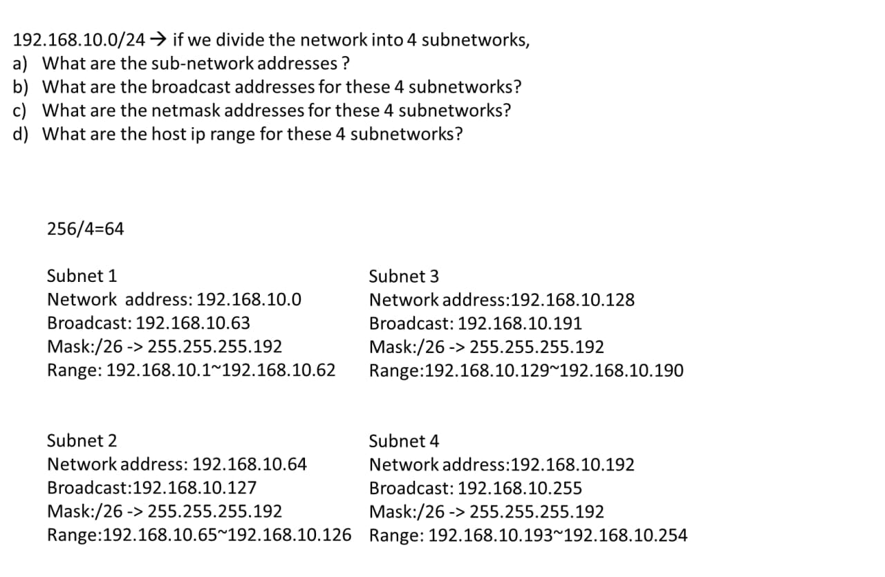
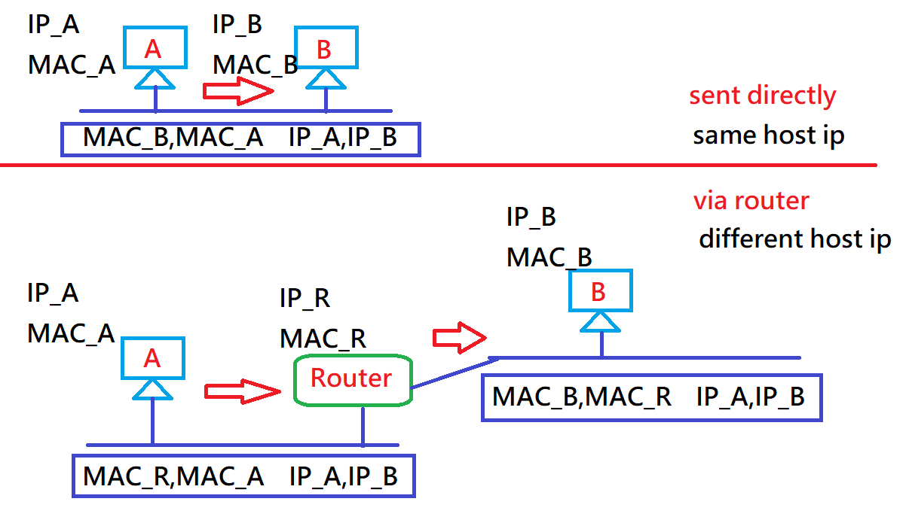

## IPv4 <br>

IP位置需要向ICANN(Internet Corporation for Assigned Names and Numbers; 網際網路名稱與數字位址分配機構)申請才能拿到 <br>
**需要IP, Network mask(網路遮罩), Default Gateway(Router; 預設路由器), DNS(8.8.8.8||8.8.4.4...)以上4種條件，才可以連上網路** <br>

* Addressing: 地址有分成以下4種:
   * Physical Adress (MAC): 不會變動。
   * Logical Adress (IP): 隨著地方不同會變動。
   * Port number: 在TCP/UDP運作，寄件者，收件者，丟到指定位置 //Telnet(port=23), SSH(port=22)，SSH有加密，較安全http(port=80)，FTP(port=21)，https(server=443)。
   * Virtual host: 僅用在www、FTP或特殊應用。  <br> <br>
   * 而定址方法又分2種:
      * hierarchial(階層式) adressing: 分類找(more manageable)。
      * flat(平坦式) adressing: 直接找。

* IPv4地址有5類: A、B、C、D、E類地址
   <br>
   * A類地址: A類一共有2^7 network(網路位元)，一個ClassA底下有2^24**-2(network adress& boardcast adress)**個IP(主機位元)可用。
   * B類地址: B類一共有2^14 network，一個ClassB底下有2^16**-2**個IP可用。
   * C類地址: C類一共有2^21 network，一個ClassC底下有2^8**-2**個IP可用。
   * IP位址主要就是上面這3種(A、B、C)類型。
   * D類地址: D類一共有2^28 Multicast(多點群播)的設定位元，它並不指向特定的網絡，供特殊協議向選定的節點發送信息時用。
   * E類地址: E類一共有2^28 Reserved bit (保留位元)，保留未來實驗用。 <br> <br>

<hr>

## Adress
* 網路遮罩(network mask): 將網路位元設為1，主機位元設為0，由左(network; 1)至右(host; 0)，不會出現1、0交錯。
* 網域位置(network adress): 進行網域(Network Domain)辨識用的，將主機(host)位元值全設為0。
* 廣播位置(boardcast adress): 對某網域所有節點(node)執行廣播運用的位置，將主機(host)位元值全設為0。
* 主機位置(host ip): 原本網域經過network mask後的位置 (=network adress)。
* host ip range: 從網域位置+1到廣播位置-1。
   * 以192.168.100/26(/26代表是網路遮罩; 26個1)舉例:
```
network mask: 11111111.11111111.11111111.11000000 -> 255.255.255.192 #
host ip: 192.168. 10.01100010(這是100)
         255.255.255.11000000(這是192)
    AND)-------------------------------
         192.168. 10.01000000 -> 192.168.10.64 #

                  |   network(26bits) | host(6bits)|
network adress:   |192.168.00001010.01|000000      | = 192.168.10. 64 #
boardcast adress: |192.168.00001010.01|111111      | = 192.168.10.127 #

host ip range: 2^6(host)-2 = 62 host #
                           = 192.168.10.65~192.168.10.126 #
```

<hr>

## 網路切割與合併
* subnetting(子網路切割): divide the network into smaller network size
   * RULE
   1. divide into 2, 4, 8, 16... sub-network(只能切成2^n子網域 ; n∈Z+) <br> <br>
   * 192.168.10.0/24 if we divide the network into 2 subnetwork
```
| network(24bits)|  | host(7bits)|
|192.168.00001010|.0|xxxxxxx     | -> subnet1
|192.168.00001010|.1|xxxxxxx     | -> subnet2

network mask: 11111111.11111111.11111111.1000000 -> 255.255.255.128 #
                      subnet1                      subnet2
network adress:     192.168.10.0 0000000 (0)     192.168.10.1 0000000 (128)
boardcast adress:   192.168.10.0 1111111 (127)   192.168.10.1 1111111 (255) 
host IP range(126): 192.168.10.1~192.168.10.126  192.168.10.129~192.168.10.254
```
   *
      * 速算法: 設要切的等分為x，把網路分成x分(256/x)，網域位置從0開始，之後就接在上一個廣播位置的後面一位，廣播位置就是網域位置+(256/x-1)
 <br>


* Supernetting(超網化): combine two network into bigger network (當需要host: 500時用2個ClassC(254*2)組合，才不會浪費)
   * RULE
   1. combine 2, 4, 8, 16... network(只能合併2^n個網域 ; n∈Z+)
   2. continuous(網域必須連續) 
   e.g: <br>
   `192.168.10.0/24, 192.168.11.0/24 can combine` <br>
   `192.168.10.0/24, 192.168.13.0/24 cannot combine` <br>
   3. The first network adress should be dividable by number of combined network(第一個網域要可以被總共要合併的數目整除)
   e.g: <br>
   `192.168.10.0/24, 192.168.11.0/24 can combine (10%2 == 0)` <br>
   `192.168.10.0/24, 192.168.11.0/24, 192.168.12.0/24, 192.168.13.0/24 cannot combine (10%4 != 0)` <br> <br>
   * 192.168.10.0/24 & 192.168.11.0/24 are combined into a bigger network
```
|network(23bits)|host(9bits)|
|192.168.0000101|0.00000000 |
|192.168.0000101|1.01111111 |

這個合併網域其實就等於192.168.10.0/23
所以就回到了一開始的求法

network mask: 11111111.11111111.11111110.00000000 -> 255.255.254.0 #
host ip: 192.168.0000101|0 ( 10).0001010 (10)
         255.255.1111111|0 (254).00000000 (0)
    AND)-------------------------------
         192.168.10.00000000 -> 192.168.10.0 #

                  |network(23bits)|host(9bits)|
network adress:   |192.168.0000101|0.00000000 | = 192.168.10.0 #
boardcast adress: |192.168.0000101|1.11111111 | = 192.168.11.255 #                 

host ip range: 2^9(host)-2 = 510 host #
                           = 192.168.10.1~192.168.11.254 #
```

<hr>

## 補充
* 判斷目的端和來源端是否在同一個區域網路，如果不是，就要用router傳送
`A: 192.168.1.1/24  -> 192.168.1.0`
`B: 192.168.1.10/24 -> 192.168.1.0`
`C: 192.168.2.10/24 -> 192.168.2.0`
   * A -> B sent directly(sent data throught network)
   * A -> C sent data via router
   * 以下是傳送情形:
 <br>