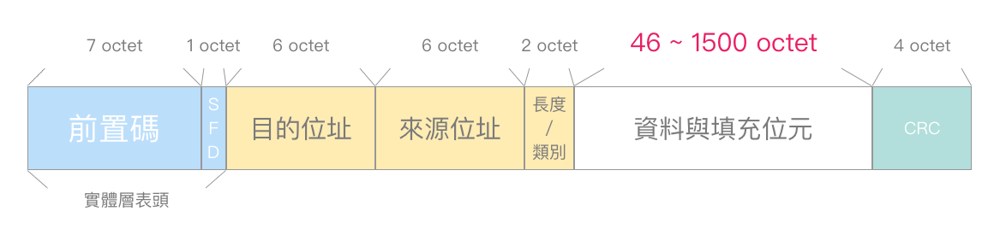

# IP封包

	|	Ethernetfram	    |
	       	   |   IP frame	    |
	| Ethernet | IP |IP payload |

## IP封包

	|	Ethernetfram	    |
	       	   |   IP frame	    |
	| Ethernet | IP |IP payload |


	Ver(Version; 4bytes): 
		    紀錄版本類型
	
	IHL(Internet Header Lenth; 4bytes): 
		    紀錄是否有選項(IP header length 1個單位為4bytes)
		    no option --> IHL = 5 (如果IHL<5 就是封包錯誤)
	
	TOS or DS(Type of Service or Differentiated Service; 8bytes):
		    定義IP 封包傳送服務類型


    * 路由器傳輸基本上是採用 queue(first in first out(Scheduling))，
    如果queue滿了，就會 Droptail(後面進來的直接丟棄(Queue Management))
    
    * scheduling 
    Round Robin(RR): 通常只在實驗室或小區域網路用，一個一個輪流傳輸
    weighted Round Robin(WRR): 可以決定其中幾個可以多送一點資料，讓每個用戶傳輸速度不同
    high priority queue: 優先服務高優先權的人，低優先的就等八
    
    * Queue Management: 決定甚麼時候丟封包，怎麼丟封包 (when & how)
    Random Drop: 在列隊滿時，隨機丟棄封包
    Drop front: 在列隊滿時丟掉第一個，通常用在時間傳遞差要很小的地方(電話...)


* ipconfig/displaydns --> 可以知道DNS的資料(local DNS Server cache)
* 如果在windows 系統不知道指令，可以用 指令 **/?**，可以顯示指令如何用
* linux 系統是用 指令 **-h**


## Ethernet裡面有 14個bytes 

    6個是dst MAC
    6個是src MAC
    最後兩個bytes是表示協定，看最後4位數
    0806 表示 ARP
    0800 表示 IPv4
    8600 表示 IPv6

## IP封包裡面正常有20bytes(IHL=5) -> only header

  	(IHL>5) -> have header option


** Network Traffic Type: 針對不同傳輸，用不同的方法提供服務
   	1. voice:
	    (delay): 對頻寬要求不高(語音可以被壓縮)，但是對不延遲很要求(流暢度，傳輸快速)

	2. video   :
	    (delay): video的資料量比voice更高，所以對頻寬很要求，如果頻寬過低，封包會被丟棄
	    (bandwidth): video對delay的要求比voice低，但還是有要求
	
	3. Best Effort:
	    (www): 互動式的，網站respond越快越好(傳輸速度越快越好)
	
	4. Background Traffic:
	    (Email): 傳輸需求不高，可以在背景慢慢做 


> TOS or DS 
> 發送端設定，不具強制性，僅做尋徑參考

   ## TOS(Type of Service; 服務類型):

```
         3         1   1   1   1   1   (bit)
    | Precedence | D | T | R | C | 0 |
```


	* D代表封包延遲性(Delay): 1為低延遲，0為一般延遲
	* T代表封包傳輸流通量(Throughout): 1為高傳輸量，0為一般傳輸量
	* R代表封包可靠度(Relliability): 1為高可靠度傳送，0為低可靠度傳送
	* C代表封包路徑成本(Cost): 1為最小成本路徑，0為一般成本路徑   
	 			// 一般成本路徑通常可以享有較好服務，不用排隊
	* 封包最後的0 --> 保留位元

  ## DS(Differentiated Service; 差異服務)

```
               6                2       (bit)
    |          DSCP          |  ECN  |
```


	* DSCP(Differentiated Service Codepoint; 差異服務代碼點):
	    DSCP左邊3個跟TOS Precedence(優先權)相同，達到與TOS相容
	        右邊是定義類別(class)和層級
	
	* ECN(Explicit Congestion Notification; 壅塞通知):
	    路由器的出口通常會有駐列(queue)，如果有queue，就稱之為 heavy loaded，如果沒有，就稱之為 light loaded
	    偵測到queue之後會把封包丟到Ack再傳到TCP那裏，讓對面知道現在是 heavy loaded 必須 降速
	
	data
	TCP ---> user
	
	ACK
	TCP <-- user
	
	    !! 這個是傳統發展出來的，沒有加密，所以hacker可以假冒ACK，一直傳給TCP讓被害者的網路被降速
	
	* Intergrated Service (IS) --> 要知道速度詳細值再比較 (早期)
	* Diffrentiated Service (DS) --> 只要速度比較快就優先


####  TL(total Length; 16bit): 封包總長度

> IP標頭加上IP所帶的資料(IP payload)一共 65535 (2**6-1) 個bytes 

> **位元裡面放元組，使用16進位**


#### fragmentation & Ressemably(分割與重組)


> * ID(Identifiaction; 16bit): 識別代碼
>   在切割封包時，同個封包的ID會相同


	* FO(Fragment Offset; 13bit): 分片位移    (1 unit == 8 bits)
	    在切割封包時，紀錄封包的位置，以便重組封包時可以還原
	    !!重組工作在目的端 作!!	    	   
	
	* FL(Flag; 3bit): 旗幟識別
	    0表示封包可被切割，1表示不可被切割，所以封包會一直切直到出現0為止


	!!!在IPv6裡面，封包不可以被切割，切割的動作是在來源端操作
	
	   PATH MTU(Maximum Transmision Unit)，不同網路會有不同的MTU
	   在IPv6送封包，他會提醒你封包大小不能超過MTU，不然封包會送回


####  TTL(Time to Live; 8bit): 存活時間  Hop count

> 每經過一段路，會消耗裡面的時間，時間沒了就丟棄封包
> 可以增測來源是哪一個作業系統


####   PROT(Protocol; 8bit): 網路協定

> 1  --> ICMP(後面接的標頭)
> 6  --> TCP
> 17 --> UDP


####  HC(Header Checcksum; 16bit): 檢查標頭碼

> 用來保護標頭


####    SA(Source IP Address; 32bit): 來源端IP位置

> 來源主機IP


####  DA(Destination IP Address; 32 bit): 目的端位置

> 目的端主機IP位置v 


####  OPT(Option; 長度不定): 選擇項

> 路由器可記紀錄路徑，時間...


    匹配destination mask ，如果結果相同，跳過去
    Mask 1 比較多會優先使用，跳到對應的destination
    
    0.0.0.0是default route，匹配一定成功，但優先度低

> PAD(Padding; 長度不定): 填充
> 讓IP標頭在總長度32位元的整數倍


> **乙太網路的MTU只有15000**
> **default route --> 0.0.0.0**


## IP封包 - 續

* IPv4負責分割與重組的是
  1. ID
  2. flags
  3. fragment offset

#### OPT(Option; 長度不定): 選擇項

> 作用測試與除錯之用

   * 來源端路徑(Source Route)

   * 路徑紀錄(Route Record)

   * 時間標記(Time Stamp)

   * 安全標誌(Security Label)

     

> 選擇性欄位，非絕對必要

   * 造成欄位長度不確定

`IPv4的安全性是patch(補丁)上去的，加在選擇裡面`


#### HC 運算

> 利用1的補數去運算，可以保護標頭資料
>
> 在傳輸層也有一個checksum，可以保護標頭和payload


## 常見IP選擇項

1. 紀錄路徑(Record Route)

   * 經過一個位置就記錄下來，在目的端可以看到所有路徑資訊。

     ```
     				       | CBA |
        | A |      | BA |	 o(C)   | DCBA |  |EDCBA|
          o(A) ----- o(B)             o(D) ----- o(E) 
         src                 o(F)			    dst 
     ```

     

2. 源路行徑(Source Routing)

   * 傳統來說，會去路由器查表，以決定路徑。

   * 在來源端可以指定要如何傳送資料(EDFBA)，可以細分為兩類:

     * 嚴格源路徑
     * 鬆散源路徑

     ```
     	| A |      | BA |	 o(C)   | FCBA |  |EFCBA|
          o(A) ----- o(B)             o(D) ----- o(E) 
         src                  o(F)			    dst 
         				   | FBA |
     ```

     

3. 時間戳記(Timestamp)

   * 紀錄時間，可以搭配路徑紀錄，知道點到點的經過時間。

   * 網管人員可以藉由這些資訊，知道點到點的網速如何，就可以調整頻寬。

     ```
        | A.0 |    | A.0 |  | A.0 |  | A.0 |    | A.0 |
        |     |    | B.1 |  | B.1 |  | B.1 |    | B.1 |			       
        |     |    |     |  | C.3 |  | C.3 |    | C.3 |					       
        |     |    |     |  |     |  | D.4 |    | D.4 |					       
        |     |    |     |	 o(C)   |     |    | E.6 |
          o(A) ----- o(B)             o(D) ----- o(E) 
         src                 o(F)			    dst 
     ```

   * 從上面這些指標，就可以推斷出網路有甚麼問題。


## ARP協定(Adress Resolution Protocal)

> 在IPv4的協定，用廣播，所以在IPv6被丟掉了

* 當A點要傳送資料到B點，但是A不知道B的MAC，這時候ARP協定會丟廣播問B他的IP和MAC，得知後再傳送回A點

  ```
    ethernet    IP
  |   MAC A  | IP A |
  |   MAC B  | IP B |
  
  A傳送資訊到B需要的資料，如果A不知道B的資料就要ARP協定
  A --> B fail
  ARP --> B request MAC B IP B
  ARP --> A get MAC B IP B
  A --> B success!
  ```

> DHCP 自動設定IP Adress

## 為甚麼要把IPv4升到IPv6?

* 有很多人想維持現況所以利用NAT(**Network Address Translation** ; 私有網路 192.168....)，讓IPv4存活至今(讓IP變多)。
* 可是物聯網時代，所以東西都需要連網，所以IP位置需求暴增，IPv6就出來了，IPv6正在慢慢取代IPv4。
* 安全性考量: IPv4要轉IP，在過程中很容易被竊取資料，而IPv6不用轉，所有IP都是public。
* 處理速度快: IPv4的header通常是20bytes，但如果有選擇項就會多，而IPv6的header都是固定40bytes，所以處裡效能會比IPv4好。
* IPv4 只有32 bits 的位置空間，而 IPv6有128 bits 個位置空間。


#### 物聯網

* 可以讓所有物品都可以上網，這讓物品有智慧。
* 物聯網搭配AI可以讓很多東西有更多延伸應用( 專題可以做! )
* 登山時遇難可以找電線杆上面的編號，報給別人就可以很快被找到


## IPv6傳播方式

IPv6沒有boardcast

1.  單點傳播(Unicast; 1-to-1)
    * 最常用的傳播
2.  多點群播(Multicast; 1-to-many)
    * 傳送給特定群體
3.  任點傳播(Anycast; 1-to-any)
    * 一般人不會用(不會用在主機，一般都放在router)，只要傳到最近的就好


* IPv6自動產生IP位置 
  1.  Statefall:  DHCPv6
  2.  Stateless: IPv6路由器送出封包訊息(`|  prefix(provide by router)  |  網路卡(MAC provide by pc )  |`)，兩個拼接成IP，


* IPv6合法位置有8個區塊(每個區塊4bit，用:隔開)，每個區塊16個位元，以16進位表示。

  0可以省略，但有4個0要用1個0代替，可以用::代替連續(很多連著的0)的0但只能出現一次。

* 0:0:0:0:0:0:0:0 (可以縮寫為::) 

  1.  尚未取得IP
  2.  在伺服器上代表任何界面(從任一個介面進來都可以)

* 0:0:0:0:0:0:0:1 (可以縮寫為::1) -->

  1. 代表迴路位置，送封包過去他會回傳給你


#### IPv4 compatible adress

```
A     IPV4                IPV6                         IPv4    B
	| IPv4A |      | 0...0 IPv4A (變128bits) |      | IPv4A | 
	| IPv4B |      | 0...0 IPv4B (變128bits) |      | IPv4B | 
```


> IPv4 --> unicast , multicast, boardcast

>  prefix裡面紀錄傳播方式


## IPv6

>  IPv6轉IPv4可以用tunneling(把東西包在裡面傳輸; 披者羊皮的狼)的技術

```
in IPv6          | IPv6 | TCP | payloads |
in IPv4   | IPv4 | IPv6 | TCP | payloads |
```


* VPN也是tunneling的操作，讓我們可以偽裝成不同國家的使用者


* IPv6標頭(40bytes):
  * 主標頭(固定8個)+延伸標頭(代替IPv4的選項)


* [**MTU(Maximum Transmission unit) 資料的最大傳輸單元(資料與填充位元)**](https://notfalse.net/23/mtu)

  


### IPv6標頭


1. version: 版本(4bit)
2. Traffic Class: 訊務等級(8bit)
3. Flow Label: 流量標籤(20bit)
4. Payload Length: 承載資料長度(16bit)
5. Next Header: 下一個標頭(8bit)
6. Hop Limit: 最大節點數(8bit)
7. Source IPv6 Address: 來源端IPv6位置(128bit)
8. Destination IPv6 Address: 目的端IPv6位置(128bit)


# 傳輸層

> 傳輸層負責處理網路傳輸上面的問題
>
> 1.  lost(封包遺失)
> 2.  out-of-order(失序: 先傳後到)
> 3.  duplicated(重複傳輸: 因為傳輸速度過慢，認定封包遺失，所以再傳一個)


> **網路位置有三種: physical address、 MAC address、 port**

```
| 資料連接層標頭 | 網路層標頭 | 傳輸層標頭 | 資料訊息 |
| Ethernet 標頭 |  IP 標頭  | 傳輸層標頭 | 資料訊息 |
                  TCP: PROT = 6
                  UTP: PROT = 17 
                  ..........
```

* OTA(over the air) : 可以直接在網路上更新韌體(In tftp protocal)
