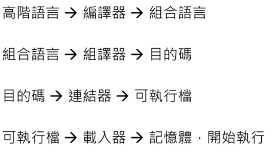

## 環境設定

安裝 gcc (codeblock有)、MSYS2、WSL

硬體空間不夠可以先不裝WSL (裝WSL電腦可能會變沒有授權，所以最好先設定還原點)

MSYS2和WSL都是用window模擬Linux功能，WSL會高度類似Linux，不過空間較大

課程到後面有些會不能用，WSL可以用到最後，不過他沒辦法寫視窗: WSL > MSYS2 > Visual Studio Code


這門課主要使用 gcc 和 C 語言 !


* 產生.exe檔(可執行檔)的順序





## 使用GCC執行C

```
gcc hello.c -o hello   # 會編譯成exe檔
./hello   # 執行檔案

# 編譯、主譯、連結，一起做
gcc main.c sum.c -o run   # 使用到兩個c檔案，主程式必須要 #include "sum.h"

# 組合語言和C語言可以一起處理
gcc main.c sum.s -o run
```


> sum.h

```c
int sum(int n);  // 定義函式
```


## 使用GCC產生組合語言

```
gcc -S hello.c -o hello.s   # 會編譯成組合語言檔

gcc -S main.c -o main.s

# 使用 -c 會把 組合語言 轉成 目的檔(16進位，一種特殊格式) 
gcc -c hello.s -o hello.o   
```


## 使用g++執行C++

> gcc裡面編譯C++的寫法跟gcc編譯C一樣，不過前面的命令變成g++

```
g++ hello.cpp -o hello
```


## 反組譯目的碼

> 目的碼翻譯成組合語言

```
objdump -d sum.o
```


## 使用GDB進行Debug

```
$ gcc -g fact.c -o fact.o   
$ gdb fact.o   # 打完之後會進入gdb模式

.....
....
(gdb)  	# 這裡可以輸入命令 r(run; 全部執行) 或是 n(next; 一步一步執行)
		# 可以加上中斷點 b(break)  後面可以加上數字或是文字(斷點位置)
		# 如果要進去其他函式，可以使用 s
		# p: print (p r 會印出r的變量，p x=1 會把 x 設成 1 後再印出)
		# p 是 single assignment 會出現$
		# c(continue): 可以用在p完，讓程式碼繼續走
		# 如果有加上中斷點，可以使用 n(next) 進行下一步
```


* gcc指令集: https://gcc.gnu.org/onlinedocs/gcc-11.2.0/gcc/Option-Summary.html#Option-Summary

系統軟體: 給工程師用得軟體(虛擬機、編譯器

應用軟體: 給一般人用的軟體(瀏覽器、遊戲


