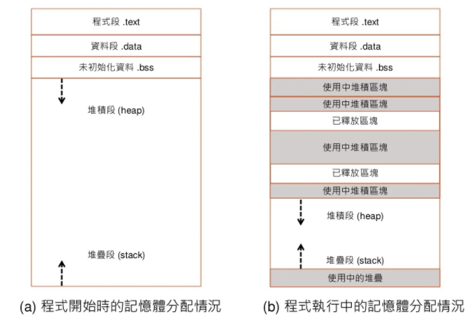

筆記參考網址: 

* [系統程式 -- 第 7 章 高階語言](https://www.slideshare.net/ccckmit/7-73472909)
* [系統程式 -- 第 8 章 編譯器](https://www.slideshare.net/ccckmit/8-73472916)


## 語法理論

* 高階語言的核心式 " 語法理論 "
  * 利用生成規則 BNF、EBNF描述程式的語法，生成的是一顆樹
  * 對語法樹進行 編譯 或是 解譯(直譯) 的動作，編譯比直譯還要快
  * 詞彙層次: 使用正規表達式(RE: Regular Expression)
  * 語句層次: 使用Context-free Grammar(CFG)




* 宣告變數有給初始值放在data段
* 宣告變數沒有給初始值放在bss段
* malloc動態矩陣放在heap
* 區域變數，函數返回點放在stack


## 正規表達式

`[0-9]+(\.[0-9]*)?`: 可以出來 3.72、32、245.7191

* `[0-9]+`: 0到9選擇一個數，選擇1次以上
* `(\.[0-9]*)? `: (. + 0到9選擇一個數，選擇0次以上)，可以選擇不執行(執行1次或是0次)
* 在正規表達式.有特殊涵意(代表所有字元)，要用.字符需要在前面加\
* `[a-zA-Z]`: 代表所有字母


```
BNF語法(以生成數學式為例)

E = N | E [+-*/] E
N = [0-9]+
這樣寫會有歧義，所以需要改成下面的寫法

E = T | E [+-] T
T = F | T [*/] F
F = N | '(' E ')'  // 加減就()起來先做
N = [0-9]+
BNF 會有左遞迴，所以把他改成EBNF，就不會陷入無窮迴圈


E = T ([+-] T)*
T = F ([*/] F)*
F = N | '(' E ')'
N = [0-9]+

下面是生成樹的樣子
(3+5)*8-6

1. BNF                        2. EBNF

           E                              E
      E    -     T                  T     -     T
      T          F               F  *  F        F
   T  * F        N              (E)    N        N
   F   (E)       6             T + T   8        6
   N  E + T                    F   F
   8  T   F                    N   N
      F   N                    3   5
      N   5
      3
```


## C0語言

> [系統程式 -- 第 8 章 編譯器](https://www.slideshare.net/ccckmit/8-73472916)

> 很像C但是很簡單的程式語言


編譯器的六大階段

1. 詞彙掃描(Scan | Lexical Analysis)

   * 將整個程式碼分成一個一個的基本詞彙 (token)

2. 語法剖析(Parsing | Syntax Analysis) 

   * 剖析器利用語法規則進行比對，逐步建立語法樹

   * 研究所會考，這邊只講LL的遞迴下降法，就是上面寫的EBNF

3. 語意分析(Semantic Analysis)

   * 為語法數加註節點型態，並檢查型態是否相容，然後輸出語意樹，告訴系統誰先做誰後做

4. 中間碼產生(Pcode Generator)

   * 語意樹被轉換成中間碼

5. 最佳化(Optimization)

   * 考慮暫存器的配置問題，降低指令數，增加效率，但有時候增加速度代碼反而變多
   * 這個是每個工程師最需要投入的地方，很多東西都需要提升效能

6. 組合語言產生(Assembly Code Generator)

   * 將中間碼轉換為組合語言輸出


# 程式碼解說 03-compiler

`gcc genEnlish.c rlib.c` : 生成執行檔案 a.exe

`./a.exe`: 執行檔案


## 00-gen

> genEnglish.c: 產生英文句子

```c
#include "rlib.h"

// === EBNF Grammar =====  //  生成語法
// S = NP VP               //  代表一個句子
// NP = DET N              //  量詞+名詞
// VP = V NP               //  動詞+量詞+名詞
// N = dog | cat           //  名詞
// V = chase | eat         //  動詞
// DET = a | the           //  量詞

char* n[] = {"dog", "cat"};
char* v[] = {"chase", "eat"};
char* det[] = {"a", "the"};

void N() {
  printf("%s", randSelect(n, 2));  // 從n陣列隨機選一個列出，後面代表陣列大小
}

void V() {
  printf("%s", randSelect(v, 2));
}

void DET() {
  printf("%s", randSelect(det, 2));
}

void NP() {
  DET();
  printf(" ");
  N();
}

void VP() {
  V();
  printf(" ");
  NP();
}

void S() {
  NP();
  printf(" ");
  VP();
  printf("\n");
}

int main() {
  timeSeed();  // 讓每次產生的數字不一樣，用時間當作亂數種子
  S();
}
```


> genExp.c: 產生數學隨機運算式

```c
#include "rlib.h" // 引用不是系統路徑的函式庫要用 ""

void E();
void T();
void F();

// === EBNF Grammar ===== 
// E=T ([+-] T)*          // [+-]: 選擇+或- 、 ()*: (內容可以重複一次以上)
// T=F ([*/] F)? 
// F=[0-9] | (E)          // [0到9選擇一個] 或是 呼叫上面的E，這有遞迴

// argc 和 argv[] 接收到終端機的字元，帶到main裡面
int main(int argc, char * argv[]) {  
    timeSeed();
    // E();
    int i;
    for (i=0; i<10; i++) {
        E();
        printf("\n");
    }
}

// E=T ([+-] T)*
void E() {
    T();
    while (randInt(10) < 3) {
       printf("%c", randChar("+-"));
       T();
    }
}

// T=F ([*/] F)?
void T() {
    F();
    if (randInt(10) < 7) {
        printf("%c", randChar("*/"));
        F();
    }
}

// F=[0-9] | (E)
void F() {
    if (randInt(10) < 8) {
        printf("%c", randChar("0123456789"));
    } else {
        printf("(");
        E();
        printf(")");
    }
}

```


> rlib.c

```c
#include "rlib.h"

// int randInt(int n):隨機傳回一個小於 n 的整數 (0,1,2..., n-1)
// 用法:randInt(5) 會傳回 0, 1, 2, 3, 4 其中之一
int randInt(int n) { // 隨機傳回一個小於 n 的整數 (0,1,2..., n-1)
  return rand() % n;
}

// int randChar(char *set):隨機傳回 set 中的一個字元
// 用法:randChar("0123456789") 會傳回一個隨機的數字
int randChar(char *set) { // 隨機傳回 set 中的一個字元
  int len = strlen(set);  // string.h
  int i = rand()%len;
  return set[i];
}

// int randSelect(char* array, int size):隨機傳回 array 中的一個字串
// 用法:randSelect({"dog", "cat"}, 2) 會傳回二選一的字串
char *randSelect(char* array[], int size) {
  int i = rand()%size;
  return array[i];
}

void timeSeed() {  // 產生亂數種子
  long ltime = time(NULL);  // long = long int
  // printf("ltime=%ld\n", ltime);
  int stime = (unsigned) ltime/2; // 轉型態，這行可以省
  srand(stime);  // srand(time(NULL))  // int long有些會平台相容有些不會
}
```


> rlib.h，.h檔可以讓其他.c檔案引用，需要把函式型態宣告在裡面

```c
#include <stdio.h>
#include <string.h>
#include <stdlib.h>
#include <time.h>

int randInt(int n);
int randChar(char *set);
char *randSelect(char* array[], int size);
void timeSeed();
```


## 01-exp0

> 運算式編譯器


> EE.c

```c
#include <stdio.h>
void F();

// E = F
void E() {
  printf("E started\n");
  // E();
  F();
  printf("E finished\n");
}

// F = 'F'
void F() {
  printf("  F started\n");
  printf("    F\n");
  printf("  F finished\n");
}

int main() {
  E();
}
```


> exp0.c: 編譯器程式碼(把過程打印在終端機)，這個程式碼只能處理單字元 3+1 不能 30+1，不能處理變數

```c
#include <stdio.h>
#include <assert.h>
#include <string.h>
#include <ctype.h>

int tokenIdx = 0;
char *tokens; // 紀錄容器位置(argv[1])

int E();
int F();

void error(char *msg) {
  printf("%s", msg);
  assert(0);
}

// 取得目前字元
char ch() {
  char c = tokens[tokenIdx];
  return c;
}

// 取得目前字元，同時進到下一格
char next() {
  char c = ch();
  tokenIdx++;
  return c;
}

// ex: isNext("+-") 用來判斷下一個字元是不是 + 或 -
int isNext(char *set) {
  char c = ch();
  return (c!='\0' && strchr(set, c)!=NULL);
}

// 產生下一個臨時變數的代號， ex: 3 代表 t3。
int nextTemp() {
  static int tempIdx = 0; // 會一直存在裡面，值不會改變(放在bss段)
  return tempIdx++;
}

// F =  Number | '(' E ')'
int F() { // Factor
  int f;
  char c = ch();
  if (isdigit(c)) {  // 確認是不是單一數字
    next(); // skip c
    f = nextTemp();
    printf("t%d=%c\n", f, c);
  } else if (c=='(') { // '(' E ')'
    next(); // 把誇號去掉
    f = E();
    assert(ch()==')'); // 如果誇號的後面還是誇號就跳出程式
    next();
  } else { // 不是數字也不是誇號就報錯
    error("F = (E) | Number fail!");
  }
  return f; 
}

// E = F ([+-] F)*
int E() {  
  int i1 = F();
  while (isNext("+-")) {
    char op=next();
    int i2 = F();
    int i = nextTemp();
    printf("t%d=t%d%ct%d\n", i, i1, op, i2);
    i1 = i;
  }
  return i1;
}

void parse(char *str) {
  tokens = str;
  E();
}

int main(int argc, char * argv[]) {
  printf("argv[0]=%s argv[1]=%s\n", argv[0], argv[1]);
  printf("=== EBNF Grammar =====\n");
  printf("E=F ([+-] F)*\n");
  printf("F=Number | '(' E ')'\n");
  printf("==== parse:%s ========\n", argv[1]);
  parse(argv[1]);
}
```


