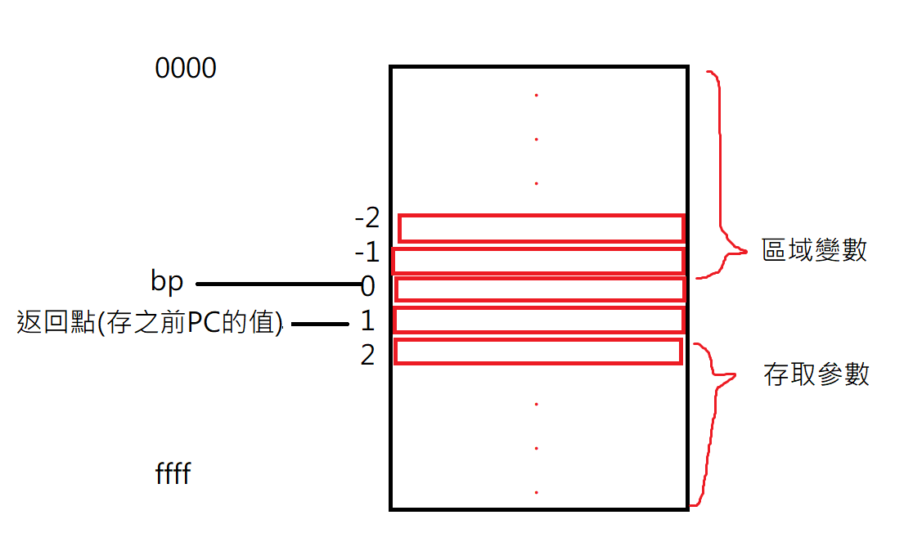

# C6

> https://github.com/ccc-c/c6

`gcc -w c6.c -o c6`: gcc -w 代表忽視警告， -W 代表出現警告

使用` ./c6 -d test/hello.c` 會顯示執行詳細訊息

```
指令   意義                                                    實作
PSH : push               推入堆疊                              *--sp = a;
## 代表先取值，再把堆疊減一，堆疊從下(大ffff)疊到上(小0000)

JMP : jump               跳躍指令                              pc = (int *)*pc;
## 把JMP後面接的數值填入PC裡面

BZ  : branch if zero     if (a==0) goto m[pc]                 pc = a ? pc + 1 : (int *)*pc;
## 如果a為0就執行下一個指令，否則就跳躍到指定位置


```

虛擬機喜歡用堆疊機


## 自我編譯

c6.c程式碼裡面有一段，是讓程式可以自我編譯的關鍵

```c
int vm(int argc, char **argv) {
  int *t;
  // 虛擬機: setup stack
  bp = sp = (int *)((int)sp + poolsz);
  *--sp = EXIT;     // call exit if main returns
  *--sp = PSH; t = sp;
  *--sp = argc;     // 把 argc,argv 放入堆疊，這樣 main(argc,argv) 才能取得到
  *--sp = (int)argv; 
  *--sp = (int)t;   // 推入返回點，於是最後 RET 時會跳回 t=sp 指定的位址，接著呼叫 EXIT 離開。
  return run(pc, bp, sp);
}
```

> ./c6 c6.c test/sum.c   


> bp是紀錄點，他的後面一位是返回地址




## asm

> sum

```
$ ./c6 test/sum.c
sum(10)=55
exit(0) cycle = 303
$ ./c6 -s test/sum.c
1: #include <stdio.h>
2: 
3: // sum(n) = 1+2+...+n
4: int sum(int n) {
5:   int s;
6:   int i;
7:   s=0;
    1:660098     ENT  2
    3:6600A8     LEA  -1   ## LEA是負的代表區域變數，-1代表第一個區域變數
    5:6600B8     PSH    
    6:6600C0     IMM  0
    8:6600D0     SI
8:   i=1;
    9:6600D8     LEA  -2
    B:6600E8     PSH
    C:6600F0     IMM  1
    E:660100     SI
9:   while (i <= n) {
    F:660108     LEA  -2
   11:660118     LI
   12:660120     PSH
   13:660128     LEA  2
   15:660138     LI
   16:660140     LE
   17:660148     BZ  0?
10:     s = s + i;
   19:660158     LEA  -1
   1B:660168     PSH
   1C:660170     LEA  -1
   1E:660180     LI
   1F:660188     PSH
   20:660190     LEA  -2
   22:6601A0     LI
   23:6601A8     ADD
   24:6601B0     SI
11:     i ++;
   25:6601B8     LEA  -2
   27:6601C8     PSH
   28:6601D0     LI
   29:6601D8     PSH
   2A:6601E0     IMM  1
   2C:6601F0     ADD
   2D:6601F8     SI
   2E:660200     PSH
   2F:660208     IMM  1
   31:660218     SUB
12:   }
13:   return s;
   32:660220     JMP  F:660108
   34:660230     LEA  -1  
   36:660240     LI
   37:660248     LEV
14: }
   38:660250     LEV    ## 離開副程式，回到呼叫點的下一個位置(43)
15:
16: int main() {
17:   printf("sum(10)=%d\n", sum(10));  ## 這裡呼叫副程式sum
   39:660258     ENT  0      ## 進入程式碼
   3B:660268     ADDR 0:6A00A0   ## ADDR 代表資料段第0個位置，6A00A0代表地址
   3D:660278     PSH         ## 推到堆疊...
   3E:660280     IMM  10     ## 載入立即值 n
   40:660290     PSH
   41:660298     JSR  1:660098  ## 前面代表回到第幾個指令，回到660098
   43:6602A8     ADJ  1      ## 調整堆疊，還原成呼叫sum之前的狀態
   45:6602B8     PSH         ## 推入 55
   46:6602C0     PRTF        ## 印出 55 # sum(10)，並拿出印出的數
   47:6602C8     ADJ  2		 ## 拿掉印出的內容，調整堆疊
18:   return 0;
   49:6602D8     IMM  0      ## 讓立即值 n = 0(return 0)
   4B:6602E8     LEV         ## 離開程式碼 return
19: }
   4C:6602F0     LEV
```


> fib

```asm
$ ./c6 test/fib.c
f(7)=13
exit(8) cycle = 920

$ ./c6 -s test/fib.c
1: #include <stdio.h>
2: 
3: int f(int n) {
4:   if (n<=0) return 0;
    1:930098     ENT  0
    3:9300A8     LEA  2
    5:9300B8     LI
    6:9300C0     PSH
    7:9300C8     IMM  0
    9:9300D8     LE
    A:9300E0     BZ  0?
    C:9300F0     IMM  0
    E:930100     LEV
5:   if (n==1) return 1;
    F:930108     LEA  2
   11:930118     LI
   12:930120     PSH
   13:930128     IMM  1
   15:930138     EQ
   16:930140     BZ  0?
   18:930150     IMM  1
   1A:930160     LEV
6:   return f(n-1) + f(n-2);
   1B:930168     LEA  2  ## 載入區域變數，做n-1，0和1已經被用掉了，用在返回點和存儲bp
   1D:930178     LI      ## 載入整數n
   1E:930180     PSH     ## 推入2
   1F:930188     IMM  1  ## 做n-1
   21:930198     SUB
   22:9301A0     PSH
   23:9301A8     JSR  1:930098  ## 遞迴
   25:9301B8     ADJ  1
   27:9301C8     PSH     ## 為了做加法
   28:9301D0     LEA  2  ## 載入區域變數，做n-2
   2A:9301E0     LI
   2B:9301E8     PSH
   2C:9301F0     IMM  2  ## a = 2
   2E:930200     SUB     ## n-2  # n-a
   2F:930208     PSH 
   30:930210     JSR  1:930098  ## 遞迴
   32:930220     ADJ  1
   34:930230     ADD
   35:930238     LEV
7: }
   36:930240     LEV
8:
9: int main() {
10:   printf("f(7)=%d\n", f(7));
   37:930248     ENT  0
   39:930258     ADDR 0:9700A0
   3B:930268     PSH
   3C:930270     IMM  7
   3E:930280     PSH
   3F:930288     JSR  1:930098
   41:930298     ADJ  1
   43:9302A8     PSH
   44:9302B0     PRTF
   45:9302B8     ADJ  2
11: }
   47:9302C8     LEV
```

這題可以當專案，可以寫一個 JIT(Just In Time) 編譯引擎(虛擬機)，可以直接執行


## 遞迴下降

高級編譯器寫法

```c
void stmt() {
  int *a, *b;
  // 陳述 statement
  if (tk == If) { // if 語句
    next();
    if (tk == '(') next(); else { printf("%d: open paren expected\n", line); exit(-1); }
    expr(Assign);
    if (tk == ')') next(); else { printf("%d: close paren expected\n", line); exit(-1); }
    *++e = BZ; b = ++e;
    stmt();
    if (tk == Else) { // else 語句
      *b = (int)(e + 3); *++e = JMP; b = ++e;
      next();
      stmt();
    }
    *b = (int)(e + 1);
  }
  else if (tk == While) { // while 語句
    next();
    a = e + 1;  // 記住位置
    if (tk == '(') next(); else { printf("%d: open paren expected\n", line); exit(-1); }
    expr(Assign);  // 執行運算式
    if (tk == ')') next(); else { printf("%d: close paren expected\n", line); exit(-1); }
    *++e = BZ; b = ++e;  // 記住下一個機器碼位置  // BZ是代表 0 的時候跳，這裡是跳出迴圈
    stmt();
    *++e = JMP; *++e = (int)a;  // 跳到a記住的位置
    *b = (int)(e + 1);   // exp失敗，跳離開
  }
  else if (tk == Do){
    next();
    a = e + 1;
    stmt();
    if (tk == While) next(); else { printf("%d: open while expected\n", line); exit(-1); }
    if (tk == '(') next(); else { printf("%d: open paren expected\n", line); exit(-1); }
    expr(Assign);
    if (tk == ')') next(); else { printf("%d: close paren expected\n", line); exit(-1); }
    if (tk == ';') next(); else { printf("%d: close ; expected\n", line); exit(-1); }
    *++e = BNZ; *++e = (int)a; // BNZ是代表不是 0 的時候跳，這裡是跳入迴圈
  }
  else if (tk == Return) { // return 語句
    next();
    if (tk != ';') expr(Assign);
    *++e = LEV;
    if (tk == ';') next(); else { printf("%d: semicolon expected\n", line); exit(-1); }
  }
  else if (tk == '{') { // 區塊 {...}
    next();
    while (tk != '}') stmt();
    next();
  }
  else if (tk == ';') { // ; 空陳述
    next();
  }
  else { // 指定 assign
    expr(Assign);
    if (tk == ';') next(); else { printf("%d: semicolon expected\n", line); exit(-1); }
  }
}
```


如果要新增for和do while 功能，需要在 enum 加上代號 和 int compile 加上字串


c6 程式碼看懂了之後，就可以創造自己的語言了，可以自己編譯，自己做虛擬機...


我的dowhile做完，測試檔案會顯示do指令找不到!??
