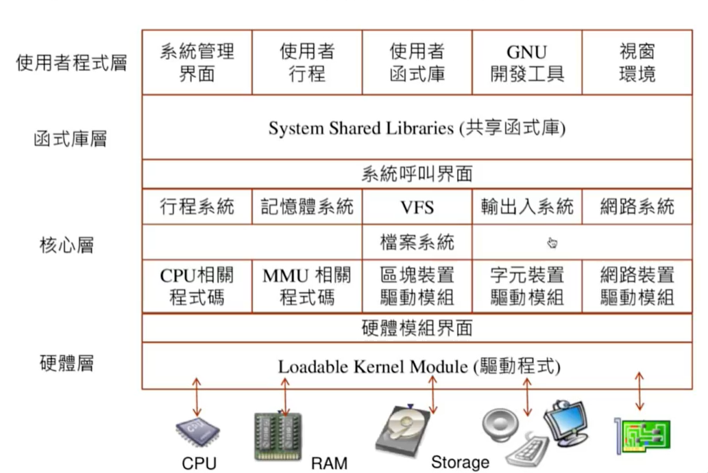

> 參考書: [系統程式 -- 第 10 章、作業系統 - Speaker Deck](https://speakerdeck.com/ccckmit/xi-tong-cheng-shi-di-10-zhang-zuo-ye-xi-tong)
>
> 其他補充參考書: [Microsoft Word - 11-20.doc (wisc.edu)](https://pages.cs.wisc.edu/~remzi/OSTEP/Chinese/16.pdf)

# 作業系統

最常見的作業系統: UNIX(衍生出Linux、macos)、windows


如果電腦沒有作業系統，整個電腦就是一個行程，像是之前做的HackCUP


## 作業系統的五大功能模組

* 行程管理

  * 打造出一個環境，讓任何程式都能輕易的執行，而不會受到其他程式的干擾，就好像整台電腦完全接受該程式的指揮，彷彿沒有其他程式存在一般。

* 記憶體管理

  * 打造出一個方便的記憶體配置環境，當程式需要記憶體時，只要透過系統呼叫提出請求，就可以獲得所有的記憶體空間，完全不用去考慮其他程式是否存在，或者應該用哪一個區域的記憶體等問題，就好像整台電腦的記憶體都可以被該程式使用一般。

* 輸出入系統

  * 將輸出入裝置包裝成系統函數，讓程式師不用直接面對複雜且多樣的裝置。作業系統的設計者會定義出通用的介面，將這些硬體的控制包裝成系統函數，讓輸出作業變得簡單且容易使用。

    

* 檔案系統

  * 是輸出入系統的進一步延伸，主要是針對永久儲存裝置而設計的，其目的是讓程式師與使用者能輕易的存取想要的資料，而不需要考慮各種不同的儲存裝置的技術細節。
  * 程式設計師只要透過作業系統所提供的 "檔案輸出入函數" ，就能輕易的存取這些檔案，
  * 一般使用者也只要透過 "命令列" 或 "視窗介面"，就可以輕易地取得或儲存檔案，這是作業系統當中設計得非常成功的一個模組

* 使用者介面

  * 提供設計師與一般使用者一個方便的操作環境，讓使用者感覺整台電腦都在其掌控之下，毫無障礙的運行者。
  * 當使用者想要某個功能時，能夠很輕鬆的找到該功能以執行之。
  * 在早期，使用者通常透過命令列介面以指令的方式使用電腦，但是這種方式並不容易使用。
  * 當視窗介面被發明後，逐漸取代命令列介面，成為主要的使用者介面。


# 行程

* 程式: 程序員寫出來的文字行檔案。
* 執行檔: 在程式寫完後，使用編譯器或組譯器將程式轉換成可執行檔。
* 行程: 作業系統可以將執行檔載入到記憶體後開始執行，這個執行中的程式就稱為行程。

行程的動作通常分成兩類，這兩類通常會交錯

1. 使用CPU
2. 使用輸出入裝置(I/O)

使用輸出入裝置的處裡時間比較長，但基本上不會使用到CPU，所以CPU可以神不知鬼不覺的處裡其他的行程


非多工作業系統如果寫無窮迴圈就會當掉，無法退出


## 行程的資料共享方法

通常每一個程式都是一個行程，但也有可能一個程式會分類出多個行程。但即便如此，各個行程之間通常是獨立執行的，互相之間不能共享資料。

* 如果想要讓行程能共享某些資料，通常有下面兩種方式:
  1. 讓行程之間能透過作業系統的通訊機制互相聯絡。
  2. 使用執行緒 (Thread) 的機制取代行程，這些執行緒之間由於共用所有記憶體空間，因此可以共用全域變數。


## 執行緒(Thread)

執行緒的定義

* 又稱為輕量級的行程 (Light Weight Process)
* 執行緒之間會公用記憶體空間和相關資源
* 在切換時只需保存暫存器，切換動作相當快速


|        | 記憶體                         | 映射表                           | 切換速度 |
| ------ | ------------------------------ | -------------------------------- | -------- |
| 行程   | 獨立記憶體管理單元             | 獨立映射表，切換時需要更換映射表 | 慢       |
| 執行緒 | 公用記記憶體管理單元，像是函數 | 切換時不需要更換映射表           | 快       |


## 競爭狀況與臨界區間

```
// P1
R1 = C
R1 = R1 + 1
C = R1
// P2
R1 = C
R1 = R1 -1
C = R1
```


如果兩個執行緒 P1、 P2 同時修改某個變數 V1的值為 X1，X2，那麼在修改完畢之後V1的直也可能是X1，也可能是X2，甚至是其他值，這種不明確的情形被稱為 "競爭狀況" ，而這些修改共用變數的程式區段則被稱為 "臨界區間" 。


這個問題可以用行程同步機制解決

> 行程同步機制的用途

利用鎖定(互斥鎖)等方式，避免兩個行程同時進入臨界區間的可能性，以便防止競爭情況的發生，但如果程式寫的不好，有可能會發生死結的問題。

> 行程同步機制的方法

1. 禁止中斷
2. 支援同步的硬體
3. 利用 "號誌" 等 "鎖定機制"


# 多工

* 多工(Multtasking): 電腦與作業系統當中，具備同時執行多個程式的能力。
* 協同式多工: 偽多工系統，把多個程式一個一個執行。任何一個程式當機都會到導致系統失效。

多工系統利用中斷機制避免當機，在作業系統將CPU交給一個行程之前，先設定中段時間點，以便當行程霸佔CPU時，作業系統能透過中斷機制取回CPU控制權，如此就能避免行程佔據CPU不放的行為。

中斷點通常0.1秒就會一次，所以一秒就可以輪10個行程。


# 排程

排程問題: 當 "執行" 狀態的行程因為輸出入而暫停時，假如系統當中有許多 "就緒" 的行程等待被執行。那麼，到底哪一個行程應該被挑選出來執行呢 ? 這個問題是作業系統的效能關鍵，所以有很多排程的方法以解決此問題。

## 排程的方法

* 基本排程方法
  * 先做排程 FCFS (First-Come, First Served)
  * 最短工作優先排程 SJF (Shortest Job First)
  * 最短剩餘優先排程 SRF (Shortest Remaining First)
  * 優先權排程 PS (Priority Scheduling)
  * **循環分時排程 RR (Round-Robin Scheduling)**
* 綜合性得排程
  * 多層佇列排程 (Multilevel Queue Scheduling)
  * 多層反饋佇列排程 (Multilevel Feedback Queue Scheduling)

循環分時排程 RR (Round-Robin Scheduling)是實務上最常使用的方法

* 為行程事先分配一個時間片段 T (Time Slice)，然後才切換到該行程中。
* 在切換到某行程之間，排程系統先設定 T 時間後應發生時間中斷，然後才將CPU的控制全交給該行程。
* 一旦時間片段 T 被用盡之後，中斷就會發生，於是排程系統就能透過中斷取回CPU的控制權，然後切換到下一個行程，以防止某行程霸佔CPU過久而導致其他行程無法執行


## 內文切換

* 當排程器選定下一個行程之後，必須進行 "內文切換" 的動作，將 CPU 交給該行程執行
* 內文切換是將一個行程從CPU中取出，換成另一個行程進入CPU執行的動作。
* 由於內文切換的動作經常發生，而且該動作進行時必須進行大量暫存器的存取，所以會以組合語言撰寫。
* 內文切換的動作與 CPU 的設計密切相關，往往因平台的不同，內文切換的程式碼也就完全不同，當作業系統配植入 (porting) 到另一個平台之時，內文切換的程式通常必須完全重寫。


# 記憶體管理

> 記憶體管理的用途

有效的管理記憶體除了能提高電腦效率之外，還可以保護電腦不受到駭客或惡意程式的入侵


> C 語言的記憶體分配與回收(heap)

分配: `malloc()`

回收: `free`


## 記憶體分配策略

第二個方法最常用

1. 最先符合法 (First Fit): 從串列開頭開始尋找，然後將所找到的第一個足夠大的區塊分配給該程式。
2. **下一個符合法 (Next-Fit)**: 使用環狀串列的結構，每次都從上一次搜尋停止的點開始搜尋，然後將所找到的第一個足夠大的區塊分配給該程式。
3. 最佳符合法 (Best-Fit): 從頭到尾搜尋整個串列一遍，然後將大小最接近的可用區塊分配給該程式。
4. 最差符合法 (Worst-Fit): 將大小最大的區塊分配給該程式，以便留下較大的剩餘區塊給其他程序。

記憶體如果不足(使用`malloc()`無法找到可用空加)，就會直接回報錯誤，或是處裡記憶體不足的狀況，下面說明記憶體不足時的處裡方法


## 堆積空間不足時的處裡方法

> 記憶體聚集法(Memory Compaction)

* 將記憶體重新搬動，以便將分散的小型可用區塊聚集為大型可用區塊，然後再試圖分配使用程式的方法。但是記憶體聚集的代價非常高，需要耗費大量的時間搬移記憶體，因此在現代的系統中少被使用。


> 垃圾蒐集法(Garbage Collection Algorithm))

* 利用程式自動回收記憶體。在使用垃圾蒐集法的程式中，通常不需要由程式主動釋放記憶體，因為垃圾蒐集系統會在記憶體不足時被啟動，以蒐集記憶體中已經沒有被任何程式變數指到的記憶體區塊，然後再將這些區塊標示為可用區塊，以便回收使用。
* Java 的 JVM 與微軟的 .NET 平台都使用垃圾蒐集法，有些高階語言會使用


## 記憶體管理單元(MMU)

* 記憶體除了可以用來儲存資料外，還可以用來儲存程式，在程式被啟動之前，必須先被載入到記憶體中。
* 作業系統必須決定要將程式載入到哪裡? 特別是針對多工系統而言，作業系統必須有效的分配記憶體給各個行程，才能將更多的行程同時放入記憶體當中執行，提升多工的能力。
* 在管理記憶體的時候，通常需要硬體的MMU配合，才能有效管理記憶體，並防止異常的存取行為。

常見的MMU硬體

* 重定位暫存器: 最簡單的暫存器，會有安全疑慮
* 基底界線暫存器: 比重定位暫存器多了基底/界線功能，比較安全
* 分段表: 分段機制，裡面有很多基底界線暫存器
* 分頁表: 分頁機制，一直讀分頁表速度會很慢，所以裡面有TLB，讀取速度會變快。

現代的MMU都市分段分頁搭配，形成複雜的構造


## 磁區結構

> 磁區的分配

檔案系統在分配磁碟空間時，通常以一種固定大小的磁區為單位，進行區塊分配動作

> 磁區的組織方式

要管理這些磁區，必須使用下面兩種資料結構

1. 鏈結串列法 (Linked List)
   * 使用鏈結串列(Linked List)紀錄可用區塊，鏈結法乃是在可用磁區中，紀錄下一個可用磁區的代號，將可用磁區一個一個串接起來。
   * 這種結構的效率很差，較好的方法是將相鄰的磁區組成群組(Group)，而非單一區塊，這有助於縮短鏈結串列的長度，並藉由一次分配數個磁區而提升效率。因此鏈結串列的組織方法通常會採用磁區群組模式，而非單一磁區的鏈結方法
2. **位元映射法 (Bit mapped)**
   * 以位元映射法紀錄可用區塊，將整個磁碟的映射位元儲存在數個磁區中。
   * 如果磁碟大小為 1G，而每個磁區大小為 1K，總共會有 1G/1K = 1M 個磁區。我們可以用 1M/8 = 0.125MB 的磁碟空間，儲存整個磁碟的位元映射地圖。由於每個磁碟大小為 1K，因此整個映射圖可以被放在 0~124 號磁區中，於是我們可以用 125 個磁區紀錄整顆硬碟的一百萬個磁區之使用狀況，效率非常高，是相當經濟且快速的實作方式。


## 輸出入系統

如果沒有輸出入系統，程式設計師就必須研究裝置的路線配置方式。假如裝置是採用記憶體映射機制連接到電腦上，程式設計師就必須知道記憶體映射的方式，包含每一個位元或元組在此映射機制下所代表的意義，然後才能開始撰寫程式，很容易導致錯誤和Bug的發生。

> 輸出入系統的主要目的

* 將複雜且多樣的輸出入裝置，透過函數包裝後，提供給程式設計師使用 (`open()、fopen()、write()、read()....`)。
* 讓程式設計師很方便的使用這些輸出入函數，而不需要詳細了解輸出入裝置的運作方式和細節


## 驅動系統

> 驅動程式介紹

* 控制輸出入裝置，以供作業系統與設計師呼叫使用的程式
* 驅動程式可以讓外部的程式碼跟作業系統交互，讓我們可以靈活的新增功能


> 作業系統呼叫驅動程式的方法

* 驅動程式會將一些函數指標傳遞給作業系統，讓作業系統記住這些函數。
* 作業系統會在有該裝置的輸出入需求時，呼叫這些函數。
* 這種 "註冊-呼叫" 機制是驅動程式常用的方式。而這些函數通常被稱為反向呼叫函數 (Call Back Function)。


# Linux

> Linux的基本架構，Linux 一切皆檔案



> Linux中檔案相關的系統呼叫
>
> `open()、read()、write()、lseek()、stat()、opendir()、readdir()`


## Linux 行程管理

> 行程管理

* 使用 `fork()` 分叉出新行程
* 使用 `execvp(prog, arg_list)` 將新行程替換為另一個程式(會把現在運行程式停掉，執行其他指令或程式)


> 執行緒

* 使用 `pthread` 函式庫
* 使用 `pthread_create()` 建立新執行緒
* 使用 `sleep()` 暫停一段時間


## Slab 記憶體配置器

> 使用時機

* 當Linux需要配置小量的記憶體 (像是 `malloc()` 所需的記憶體) 時，採用Slab配置器。


> 分配方法

* 被配置的資料稱為物件 (Object)
* Slab 中的物件會被儲存在 Buddy 系統中分配的頁框中


> 範例

* 假如要分配一個大小為 30 bytes 的物件時，Slab 會先向 Buddy 系統求取一個最小的分頁 (大小為 4KB)。
* 然後 Slab 配置器會保留一些位元以記錄配置資訊，然後將剩下的空間氛圍大小 30 的物件。
* 當未來再有類似的配置請求時，就可以直接將這接空的物件配置出去。


## Linux的驅動程式

> 功能

* 所有的驅動程式必須支援檔案 (file) 的操作 (file_operations) ，以便將裝置偽裝檔案，供作業系統與應用程式進行呼叫。


> 範例

* 字元類的裝置 (Character Device; c)
  * 又被稱為串流裝置 (Stream Device)
  * 像是鍵盤、滑鼠、印表機等。
  * 必須支援基本的檔案操作，像是 `open()、read()、ioctl()...`。
  * 採用 "註冊-反向呼叫" 機制，掛載驅動程式。


# Linux 指令

* `ps`: 可以查看行程
* `ps -all` : 可以在Linux系統裡面看到所有的行程，作業系統的TTY通常是??，作業系統使用fork可以創造出多個行程，行程管理系統利用多工，讓很多行程可以一起運行。
* `kill PID`: 可以針對行程的PID做刪除
* `gcc file -lpthread`: 使用gcc編譯file，有用thread函式庫