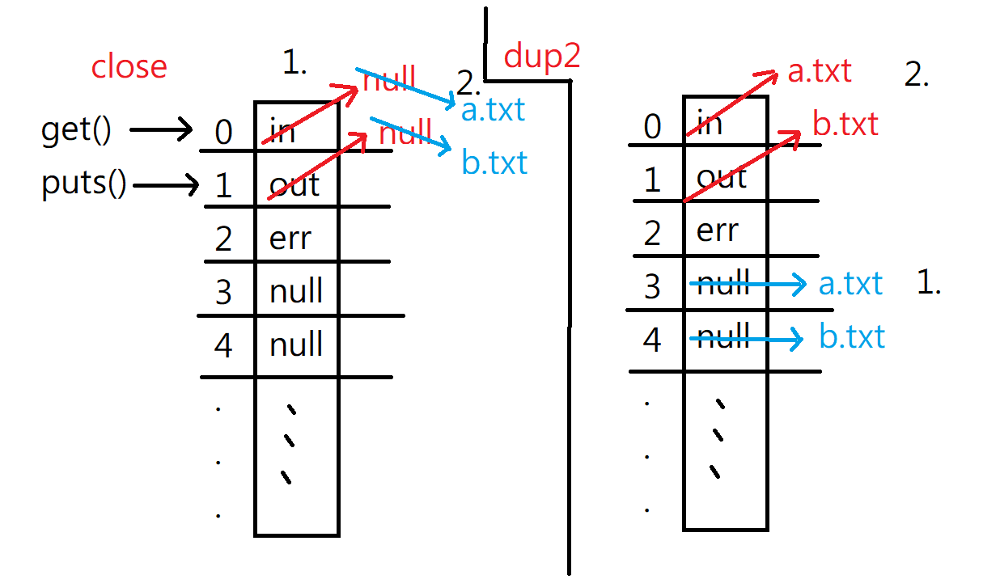

期末也可以寫作業系統的閱讀筆記!

這裡面有詳細的riscv xv6原始碼: https://github.com/riscv2os/xv6/tree/master/kernel

C語言可以直接從高階語言穿透到機器碼，是非常低階的語言

# FileSystem

下面的程式碼都要在Linux環境下執行

Linux 標準輸入: 0、標準輸出: 1、標準錯誤: 2


## IO

> io1.c

```c
#include <stdio.h>
#include <unistd.h>
#include <sys/types.h>
#include <sys/stat.h>
#include <fcntl.h>
#define SMAX 128

int main() {
  // unix 預設系統函數: open read write
  // O_CREAT檔案不存在就創造，檔案存在就開啟，O_RDWR代表檔案可讀可寫
  int a = open("a.txt", O_RDWR);  // C 語言標準函式庫 fopen()，傳回file*
  int b = open("b.txt", O_CREAT|O_RDWR, 0644); // 後面的數字代表權限 rw-r--r--
  char text[SMAX];
  int n = read(a, text, SMAX);  // 代表讀了幾個bytes // C 語言標準函式庫 fread()
  printf("n=%d\n", n);  
  write(b, text, n);
  printf("a=%d, b=%d\n", a, b);  // a=3, b=4 (0~2被IO占掉了)
}

```


## echo

> echo1.c

```c
#include <stdio.h>
#include <unistd.h>
#define SMAX 128

int main() {
  char line[SMAX];
  int n = read(0, line, SMAX); // 從 0 (標準輸入 stdin:鍵盤) 讀入一行字 line
  line[n] = '\0';              // 設定字串結尾
  write(1, line, n);           // 將 line 輸出到 1 (標準輸出 stdout)
  write(2, line, n);           // 將 line 輸出到 2 (標準錯誤 stderr)
}
// 這個程式碼會等終端輸入，再輸出輸入的字符兩次
```


> fecho1.c: 標準輸入(0)從終端轉到a.txt，標準輸出(1)從螢幕轉到b.txt

```c
#include <stdio.h>
#include <unistd.h>
#include <sys/types.h>
#include <sys/stat.h>
#include <fcntl.h>
#define SMAX 128

int main() {
  close(0);                      // 關閉標準輸入 stdin
  close(1);                      // 關閉標準輸出 stdout
  int a = open("a.txt", O_RDWR);         // 此時 open，會找沒被使用的最小檔案代號 0
  int b = open("b.txt", O_CREAT|O_RDWR, 0644); // 此時 open，會找沒被使用的最小檔案代號 1
  char line[SMAX];
  gets(line);                    // 從 0 (a.txt) 讀入一行字 line
  puts(line);                    // 輸出 line 到 1 (b.txt)
  printf("a=%d, b=%d\n", a, b);
}
```


> fecho2.c: 跟上面的有一樣的效果，不過是使用dup2()呈現

```c
#include <stdio.h>
#include <unistd.h>
#include <sys/types.h>
#include <sys/stat.h>
#include <fcntl.h>
#define SMAX 128

int main() {
  int fda = open("a.txt", O_RDWR);          // 打開檔案 a.txt 並取得代號 fda
  int fdb = open("b.txt", O_CREAT|O_RDWR, 0644);  // 打開檔案 b.txt 並取得代號 fdb
  dup2(fda, 0);                             // 複製 fda 到 0 (stdin)
  dup2(fdb, 1);                             // 複製 fdb 到 1 (stdout)
  char line[SMAX];
  gets(line);                               // 從 0 (a.txt) 讀入一行字 line
  puts(line);                               // 輸出 line 到 1 (b.txt)
}
```





## stderr

> stderr1.c

```c
#include <stdio.h>

int main() {
  // fprintf 輸出標準輸出和標準錯誤都會印到螢幕上
  fprintf(stdout, "Some message!\n");  // 1
  fprintf(stderr, "Warning: xxx\n");  // 2
  fprintf(stderr, "Error: yyy\n");
}
```


> stderr2.c: 把錯誤輸出到一個檔案裏面，可以當作log檔

```c
#include <stdio.h>
#include <unistd.h>
#include <fcntl.h>

int main() {
  // O_APPEND代表檔案會往後加入新的內容而不會取代原先內容
  int fdb = open("log.txt", O_APPEND|O_CREAT|O_RDWR, 0644);  // 打開檔案 log.txt 並取得代號 fdb
  dup2(fdb, 2); // 複製 fdb 檔案描述子到 2 (stderr)
  fprintf(stderr, "Warning: xxx\n");
  fprintf(stderr, "Error: yyy\n");
}
```


## shell

下面的兩個shell沒有使用到Linux的標準函數，都是用C得原生函數做出來的

> myshell1.c: 自己寫一個shell，類似bash的東西，不過這個程序無法使用cd指令

```c
#include "../myshell.h"

int main(int argc, char *argv[]) {
  char path[SMAX], cmd[SMAX];
  getcwd(path, SMAX-1); // 取得初始路徑
  while (1) { // 不斷等待使用者輸入命令並執行之
    printf("myshell:%s $ ", path); // 顯示提示訊息，目前路徑位置
    fgets(cmd, SMAX-1, stdin);     // 等待使用者輸入命令
    system(cmd);                   // 執行命令，在child裡面執行
  }
}

```


> myshell2.c: 可以使用cd，使用詭異的方法，用path.txt紀錄目前路徑

```c
#include "../myshell.h"

// 將檔案讀入成為字串
int readText(char *file, char *text, int size) {
  FILE *f = fopen(file, "r");
  int n = fread(text, 1, size, f);
  fclose(f);
  return n;
}

int main(int argc, char *argv[]) {
  char ipath[SMAX], path[SMAX], cmd[SMAX], fullcmd[SMAX], pathFile[SMAX];
  getcwd(ipath, SMAX-1); // 取得初始路徑
  strcpy(path, ipath);   // path = ipath
  sprintf(pathFile, "%s/path.txt", ipath); // pathFile=<ipath>/path.txt
  while (1) { // 不斷等待使用者輸入命令並執行之
    printf("myshell:%s $ ", path); // 顯示提示訊息
    fgets(cmd, SMAX-1, stdin);                     // 等待使用者輸入命令
    strtok(cmd, "\n");             // 切掉 \n
    if (strcmp(cmd, "exit")==0) break;
    sprintf(fullcmd, "cd %s;%s;pwd>%s", path, cmd, pathFile); // fullcmd = 切到 path; 使用者輸入的命令; 將路徑存入 pathFile 中。
    system(fullcmd);               // 執行 fullcmd 
    readText(pathFile, path, SMAX);// 讀 pathFile 檔取得路徑
    strtok(path, "\n");            // 切掉 \n
  }
}

```


# Net

進入網路的世界，使用C和socket達到連接的功能


## timer

> time.c: 簡單計時器，還沒有用到網路

```c
#include <stdio.h>
#include <unistd.h>
#include <time.h>   // 裡面有時間函數

int main(int argc, char *argv[]) {
  while(1) {
    time_t ticks = time(NULL);
    printf("%.24s\n", ctime(&ticks));
    sleep(1);
  }
}

```


`sprintf(str, "%s%d", name, age)`:  printf是把字串印到螢幕上，這個把字串印到str上面

`snprintf`:  跟上面的sprintf差不多，不過比較安全，會限制長度


## server

> server.c

`socket -> bind -> listen -> accept -> send/recv -> close`

```c
#include <sys/socket.h>
#include <sys/types.h>
#include <netinet/in.h>
#include <netdb.h>
#include <stdio.h>
#include <string.h>
#include <stdlib.h>
#include <unistd.h>
#include <errno.h>
#include <arpa/inet.h>
#include <time.h>
#include <assert.h>
#include <sys/wait.h>

#define PORT 8080
// 通常會把上面這些都丟到 .h檔案裏面

int main(int argc, char *argv[]) {
  // 創建socket object，可以讀取這個物件拿到client資料
  int listenfd = socket(AF_INET, SOCK_STREAM, 0); 
  assert(listenfd >= 0);
  
  // 創建結構
  struct sockaddr_in serv_addr;
  memset(&serv_addr, 0, sizeof(serv_addr));
  serv_addr.sin_family = AF_INET;  // 使用IPv4
  serv_addr.sin_addr.s_addr = htonl(INADDR_ANY);
  serv_addr.sin_port = htons(PORT);  // htonl代表轉成bit

  // bind 綁定地址
  assert(bind(listenfd, (struct sockaddr*)&serv_addr, sizeof(serv_addr)) >= 0);
  // listen 設置監聽，最多十個同時連線
  assert(listen(listenfd, 10) >= 0);
  
  // 設置文字置放區域
  char sendBuff[1025];
  memset(sendBuff, 0, sizeof(sendBuff));
    
  // send/recv
  while(1) {
    // blocking的函數，一定要有人連進來才會讀取下一行
    int connfd = accept(listenfd, (struct sockaddr*)NULL, NULL); // recv
    assert(connfd >= 0);
    // 取得時間(1970年開始到現在的秒數)，並用ctime把tick變成有形式的樣子，
    time_t ticks = time(NULL);
    snprintf(sendBuff, sizeof(sendBuff), "%.24s\r\n", ctime(&ticks));   
    assert(write(connfd, sendBuff, strlen(sendBuff)) >=0);  // send
    close(connfd);
    sleep(1);
  }
}

```


## client

`socket -> connet -> send/recv -> close`

> client.c

```c
#include <sys/socket.h>
#include <sys/types.h>
#include <netinet/in.h>
#include <netdb.h>
#include <stdio.h>
#include <string.h>
#include <stdlib.h>
#include <unistd.h>
#include <errno.h>
#include <arpa/inet.h>
#include <time.h>
#include <assert.h>
#include <sys/wait.h>

#define PORT 8080

int main(int argc, char *argv[]) {
  struct sockaddr_in serv_addr;
  memset(&serv_addr, 0, sizeof(serv_addr));  // 把特定區域的值初始化
  serv_addr.sin_family = AF_INET;
  serv_addr.sin_port = htons(PORT);
  assert(inet_pton(AF_INET, "127.0.0.1", &serv_addr.sin_addr) > 0);

  // 創建socket object，可以讀取這個物件拿到server資料
  int sockfd = socket(AF_INET, SOCK_STREAM, 0);
  assert(sockfd >=0);
  
  // connet: 連線到 server
  assert(connect(sockfd, (struct sockaddr *)&serv_addr, sizeof(serv_addr)) >= 0);
  char recvBuff[1024];
  int n;
  while ((n = read(sockfd, recvBuff, sizeof(recvBuff)-1)) > 0) {  // recv
    recvBuff[n] = 0;
    fputs(recvBuff, stdout);  // send
  }
  return 0;
}
```


## connetion

> net.c

```c
#include "net.h"

char ip[SMAX];

char *host_to_ip(char *hostname, char *ip) { // 查出 host 對應的 ip
	struct hostent *host = gethostbyname(hostname);
	/*
	char **pp;
	printf("hostname=%s\n", host->h_name);
	for (pp=host->h_aliases; *pp != NULL; pp++)
		printf("  alias:%s\n", *pp);
	for (pp=host->h_addr_list; *pp != NULL; pp++)
		printf("  address:%s\n", inet_ntop(host->h_addrtype, *pp, ip, SMAX));
	printf("  ip=%s\n", ip);
	*/
	inet_ntop(host->h_addrtype, host->h_addr_list[0], ip, SMAX); // 取第一個 IP
	return ip;
}
/* // 這個在"net.h"有定義
typedef struct net_t{
...
} net_t; // 這樣可以直接呼叫net_t，不用寫 struct net_t
*/
int net_init(net_t *net, int protocol, int side, int port, char *host) {
	memset(net, 0, sizeof(net_t));
	net->protocol = protocol; // net是struct
    //(*net).protocal = protocal;
	net->side = side;
	net->port = port;
	net->serv_ip = (side==CLIENT) ? host_to_ip(host, ip) : "127.0.0.1";
	int socketType = (protocol == TCP) ? SOCK_STREAM : SOCK_DGRAM;
	net->sock_fd = socket(AF_INET, socketType, 0);
  assert(net->sock_fd >= 0);
	net->serv_addr.sin_family = AF_INET;
	net->serv_addr.sin_addr.s_addr = (side == SERVER) ? htonl(INADDR_ANY) : inet_addr(net->serv_ip);
	net->serv_addr.sin_port = htons(net->port);
  return 0;
}

int net_connect(net_t *net) {
	int r = connect(net->sock_fd, (struct sockaddr *)&net->serv_addr, sizeof(net->serv_addr));
	// assert(r>=0);
	return r;
}

int net_bind(net_t *net) {
	int r = bind(net->sock_fd, (struct sockaddr*)&net->serv_addr, sizeof(net->serv_addr));
	assert(r>=0);
	return r;
}

int net_listen(net_t *net) {
	int r = listen(net->sock_fd, 10); // 最多十個同時連線
	assert(r>=0);
	return r;
}

int net_accept(net_t *net) {
	int r = accept(net->sock_fd, (struct sockaddr*)NULL, NULL);
	assert(r>=0);
	return r;
}

int net_close(net_t *net) {
	shutdown(net->sock_fd, SHUT_WR);
	close(net->sock_fd);
	return 0;
}
```

